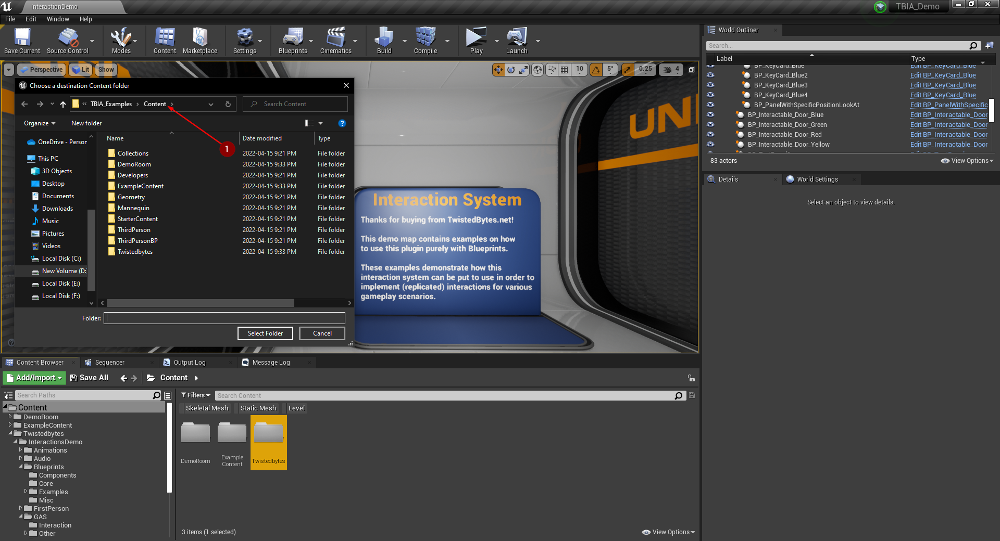
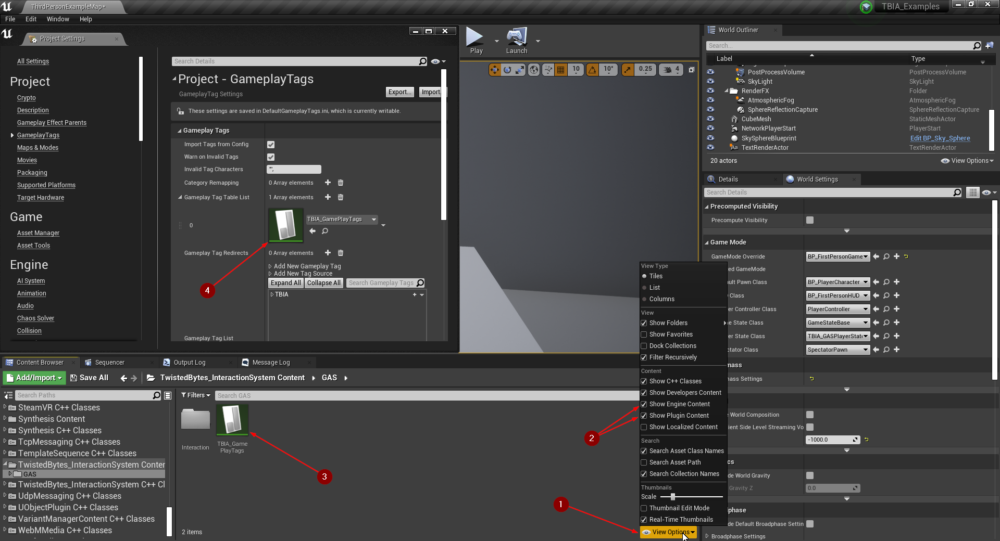
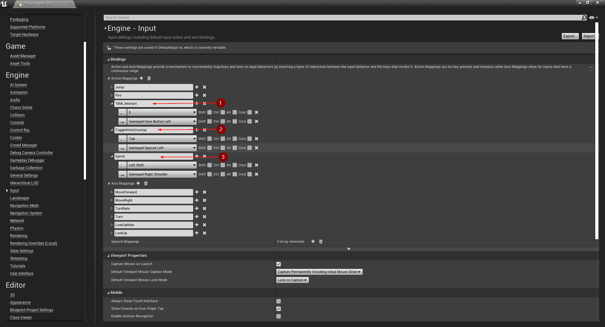

export const Step = ({children, text}) => {
    return 
        {text}
    
}

## Demo Project Migration

### Content Folder Migration:

Open `Interaction demo` project select in content folder right click on the folder `twistedbytes` <Step text="1"/> in the pop 
up menu select `migrate`, select all assets in asset report window and click ok <Step text="2"/>.

A new window will pop up, select the content folder in the project you want to migrate the demo examples to shown in <Step text="3"/>.

### Add Gameplay Tags:
In order to open the plugin conten folder you first need to click on view optins <Step text="1"/>, then make sure to check 
`Show Plugin Content` and `Show Engine Content` <Step text="2"/>. Navigate to `TwistedBytes_InteractionSystem Content` folder,
 go into `GAS` folder, there you have the `Gameplay Tag Table` <Step text="3"/>, this file should go into `GameplayTags` section inside 
 your project settings like shown in <Step text="4"/>.

You need to add more tags that are used in the `Demo project` which shows some uses cases and examples. Add these tags in project settings
by writing them as in <Step text="1"/> and <Step text="2"/>.

Instead you can copy these tags to your `DefaultGameplayTag.ini` file, you can do this by navigating to the `Demo project` in explorer, 
open `Config` folder open `DefaultGameplayTag.ini` shown in <Step text="1"/>, and copy all `GameplayTagList` as in <Step text="2"/>.

After adding the tags navigate to `BP_PlayerCharacter` and assign the tags as shown below in <Step text="1"/>, then open the macro at <Step text="2"/>
 and also here select this gameplay tag <Step text="3"/>.

### Collision Settings:
Since we used in the `Demo project` custom `Object Collision Channel`, if we want to use the same channel in the new 
project go to `project settings` -> `Collision`, Add a new 1Object Collision Channel1, name it `Interactable` and set it by default to Block. 

After adding the new collision channel, navigate to `BP_GAInteractPassive` and `BP_GAInteractActive` the trace channel 
will be shown like in <Step text="1"/> you need to change it and select the new `Interactable` channel like in <Step text="2"/>

### Input Settings:
Setting up input settings can be done by navigating to `Project Settings` -> `Input`, then you need to add 
these three action mapping and write them
as shown in <Step text="1"/>, <Step text="2"/>, and  <Step text="3"/>.

### Setting GameMode
Navigate to the folder shown in the image below and select `BP_FirstPersonGameMode` <Step text="1"/>, 
and in world settings assign it to be overridden as in <Step text="2"/>.

### PostProcess Material:
Inorder to use the PostProcess material we made in the `Demo Project`, open project settings and search for `custom depth` <Step text="1"/>,
select as in <Step text="2"/> `Enable with stencil`, then select your post process volume <Step text="3"/> add the highlight material at <Step text="4"/> to the post process materials array like in <Step text="5"/>, also make sure that the post process volume have `Infinite Extent` <Step text="5"/>.

