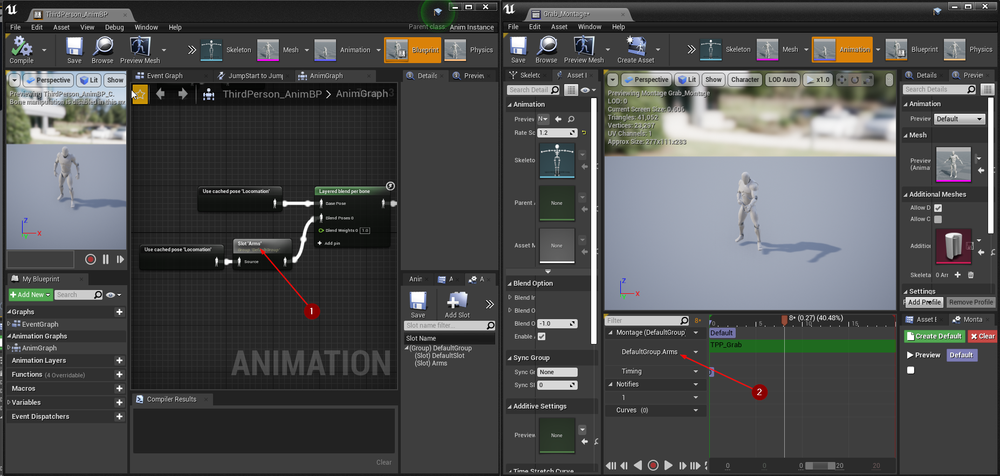

export const Step = ({children, text}) => {
    return 
        {text}
    
}

## Create Interact Animation Cosmetic

To create an *Interact Animation Cosmetic* ability, right-click in the *Content Browser*
and select `TwistedBytes | Abilities | Interact Animation Cosmetic` as shown in the image below.

## Setup Player Character

Open the `ThirdPersonCharacter` Blueprint and select `TBIA Interaction Component` in the *Components*
tab <Step text="1"/>. In the *Details* tab, add your `Interact Animation Cosmetic` ability to the
`Granted Abilities` property <Step text="2"/> as shown in the image below.

## Setup Montage

Open the montage you want to play when interacting with `GASActorBase` that we created earlier. This montage is
only *cosmetic* which means that there is no loop duration in this animation. Make sure that the slot <Step text="1"/>
you are using for your montages in the `Animation Blueprint` for the `ThirdPersonCharacter` is the same applied
on the montage <Step text="2"/> you want to play when interacting with `GASActorBase`.
Here, we are playing some kind of pickup animation.

## Interactable Actor

Open `GasActorBase` and override `Get Interaction Context`, make a struct based on `TBIA_InteractionContext`.
Then set `Primary Mesh Montage` <Step text="1"/> with the pickup animation montage that we want to play when
interacting with `GASActorBase`.

Go to the *Event Graph* and navigate to `On End Interaction`. When this event is triggered on
`Authority` <Step text="1"/>, we want to destroy <Step text="2"/> this actor as shown in the image below,
simulating an item pickup logic.

Press *Play* in the Unreal Editor, look at the cube and press the `E` key which is the Interaction button that
we configured earlier. You should now see the pickup montage being played while the `GASActorBase` was destroyed.

