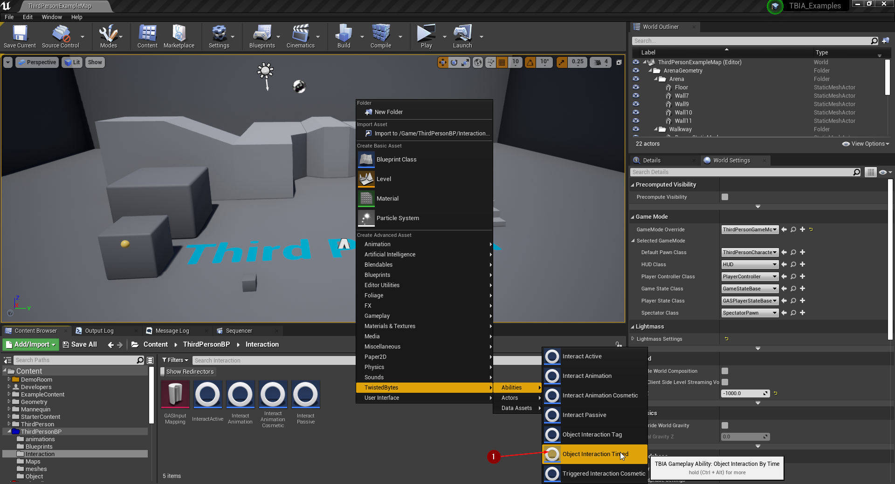
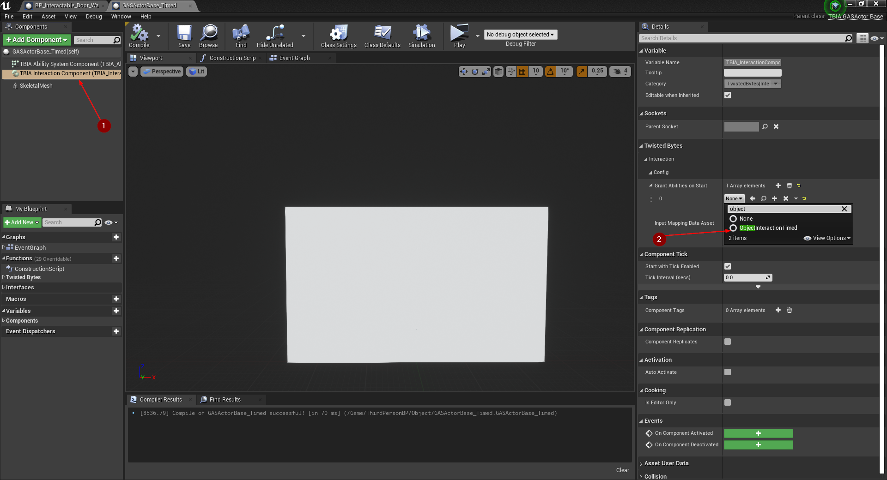
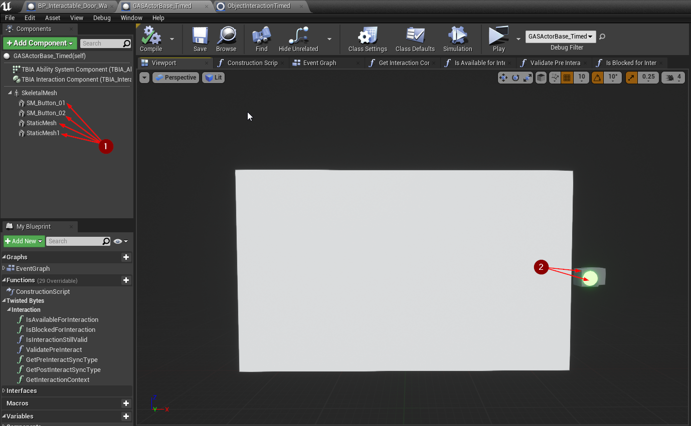
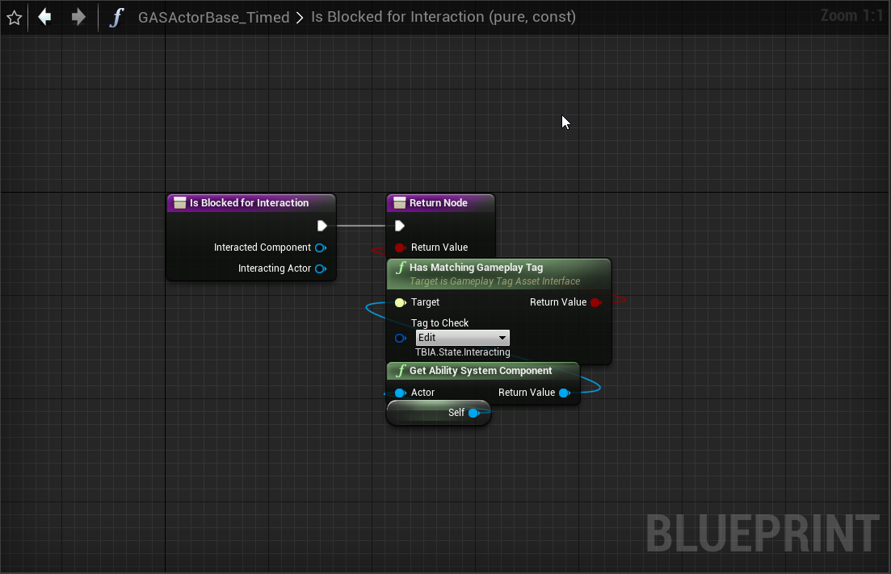

export const Step = ({children, text}) => {
    return 
        {text}
    
}

## Create Object Interaction Timed

To create an *Object Interaction Timed* ability, right-click in the *Content Browser*
and select `TwistedBytes | Abilities | Object Interaction Timed` as shown in the image below.

## Setup Interactable Actor

Create new *GAS Actor Base*, right-click in the *Content Browser* and select 
`TwistedBytes | Actors | GAS Actor Base` as shown in the image below.

Replace *Default Scene Root* with *Skeletal Mesh Component* <Step text="1"/>. Set your *Skeletal Mesh*, 
in our case we are using the *Door* mesh <Step text="2"/> that is shipped with `TBIA_Demo`. Then you can easily create 
*Animation Blueprint* for the *Door* mesh by right-clicking in the *Content Browser*, select 
`Animation | Animation Blueprint` and select the *Door* skeletal mesh, after that assign it to the *Door* Skeletal mesh 
in the newly created *GAS Actor Base* <Step text="3"/>. 

Select `TBIA_InteractionComponent` <Step text="1"/>, go to the details panel and add `Object Interaction Timed` <Step text="2"/> to the granted abilities on start.

We then add 4 static meshes <Step text="1"/> so that the door have some kind of buttons to interact with, 
and place them next to the door <Step text="2"/>.

Create new *Map* Variable <Step text="1"/>, it consists of key as <Step text="2"/> *Primitive component* and value <Step text="3"/> *Integer*.
Open `Construction Script` and add the button meshes to the *Map* variable <Step text="4"/>, <Step text="5"/> as shown in the image below.

### We will use a simple technique to play montages on *Interactable Actors*

Open the Door *AnimBP* and drag `door_open` animation sequence into the `AnimGraph` <Step text="1"/> then right-click on the animation sequence and select `Convert to single frame animation` <Step text="2"/>. Now the animation sequence will look like what you see in the image below <Step text="3"/>. Add montage slot <Step text="4"/> to specify from where the montage will override the door animation.

## Setup Door Montage

Open `door_open_Montage` make sure the *Montage Sections* <Step text="1"/>,<Step text="2"/>,<Step text="3"/> are named the same as in the `GA_ObjectInteractionTimed` as in the image below. The montage slot should match the defined slot in the *Door AnimBP* <Step text="4"/>. Also make sure that the *Interact* montage section loops on itself <Step text="5"/> as shown in the image below.

## Interactable Actor Logic

Open the new `GasActorBase` and override `Is Available for Interaction`, check if the interacted component 
"The component that the character is looking at" is a button by calling *find* on the *Map* variable to make sure the component is a button. Also make sure that the *Door* is not in the `Interacting` state. If this is true then the *Door* is available for interaction, otherwise it's not.

Override `Is Blocked for Interaction` and return true which means it's blocked so that no one can interact with the *Door* if it's state
is `Interacting`.

override `Get Interaction Context`, make a struct based on `TBIA_InteractionContext`.

`Primary Mesh Montage` <Step text="1"/> is the interaction animation montage that we want to play on the *PlayerCharacter* when interacting with the *Door*. 

`Wait for Input Trigger` <Step text="2"/> is set to `True` so that if the *Player* released the *Interaction Button* the Interaction will cancel. 

`Interaction Duration` <Step text="3"/> is `1 sec` which is the whole time needed for the *Interaction* to finish successfully.

`Animation Loop Duration` <Step text="4"/> is `0.8 sec` which is the time that you want to loop the montage on.

`Object Interaction Duration` <Step text="5"/> is the lifetime of `Object Interaction Timed` Ability that will run on the *Door*.

`Object Montage` <Step text="5"/> is the montage that the `Object Interaction Timed` Ability will try to play when it starts. 

Go to the *Event Graph* and navigate to `On Post Interact`. When this event is triggered on
`Authority` <Step text="1"/>, we want to call `Send Gameplay Event to Interacting Actor`. Pass the *Interacted Actor* as *Self*, *Interacted Component* as the *Door Skeletal Mesh Component*, set the *EventTag* to *TBIA.Object.Interaction.Timed*, *Interacting Actor* will be *Self* referenced also.

Place the *Door* actor in the world and Press *Play* in the Unreal Editor, look at the door button and press the `E` key which is the Interaction button that we configured earlier.
You will see the *PlayerCharacter* playing the interaction montage for 1 second then the door will open for 3 seconds then it will be closed.

