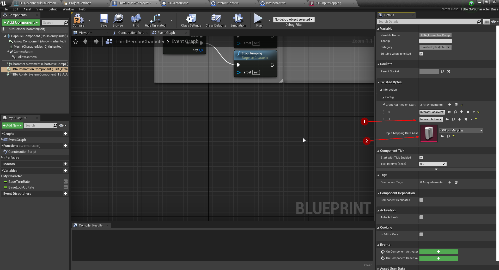
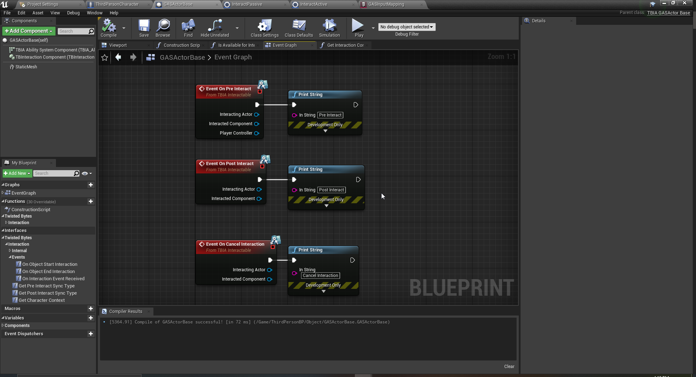

export const Step = ({children, text}) => {
    return 
        {text}
    
}

## Create Interact Active Ability

To create Interact Active Ability you just need to right click in the 
content browser and go to `TwistedBytes`->`Abilities`->`Interact Active` 
as shown in the image below.

Open the Ability you just created and set the `Trace Channel` to be `Interactable` <Step text="1"/> since the camera
 arm length is `300` which is 3 meters and we want the trace to be also 3 meters infront of the player character so 
 let's set `Max Range` to `600` <Step text="2"/>, to debug the ability set `Show Debug` to true and `Debug Show Duration` to `2.0` <Step text="3"/>.

## Notice

`Trace Start Location Type` uses two types of start locations `Center of Camera Location` 
and `Socket on Character's Mesh`, using sockets is only useful when you have stabalized head movement
or if you want to make a socket from root and set it's position next to the head bone but it's 
preferred to use the camera as start location for more stable traces.

## Setup input

Inorder to bind the input with `Interact Active Ability`, right click in the 
content browser and go to `TwistedBytes`->`Data Assets`->`GAS Input Mapping` 
as shown in the image below.

Open the data asset and add a new `Abilit Mapping`, select `Interact` <Step text="1"/> and set the 
`Interact Active` <Step text="2"/> that we created as a value for the `Interact` key.

Now Go to `Project Settings` in the `Input` section, create a new `Action Mapping` the name should be 
exactly `TBIA_Interact` and specify any key you want to use as an interacion key.

## Setup Player Character

Open the `Third Person Character`, select `TBIA Interaction Component` then add `Interact Active` 
to the granted abilities <Step text="1"/> and set the input mapping data asset you created earlier <Step text="2"/>
as you see in the image below.

Now override `Get Character Context` function, from the return value drag the pin out and make a struct
from the `TBIA_CharacterContext` then return the third person skeletal mesh as primary mesh.

## Interactable Actor

Open `GasActorBase` and override `On Pre Interact`, `On Post Interact`, `On Cancel Interact` 
and print their results to see them in action.

Press Play and look at the cube then press the Interaction button, in our case we set it to `E` and you should
see the same result printed.

