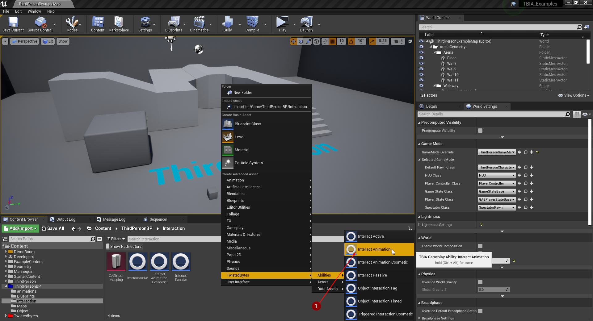
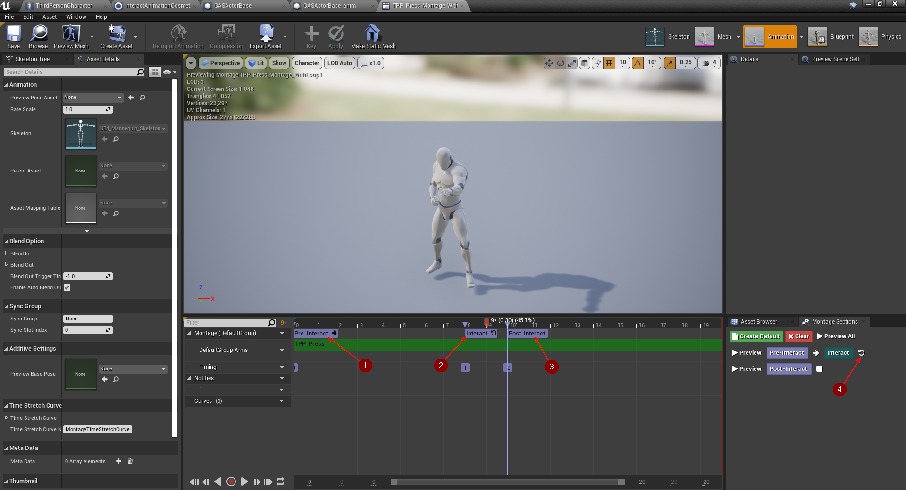
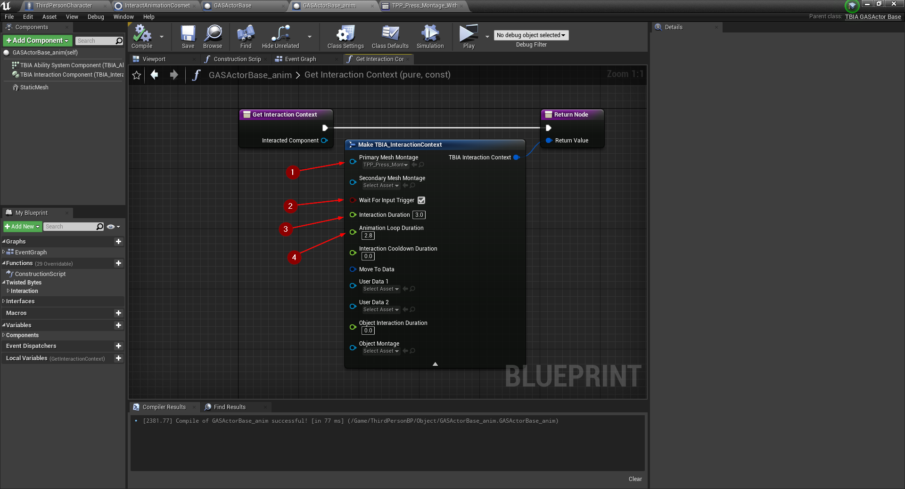
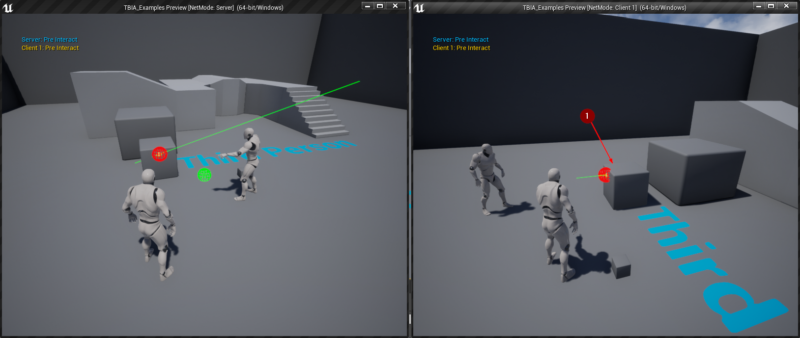

export const Step = ({children, text}) => {
    return 
        {text}
    
}

## Create Interact Animation

To create Interact Active Ability you just need to right click in the 
content browser and go to `TwistedBytes`->`Abilities`->`Interact Animation` <Step text="1"/> 
as shown in the image below.

## Setup Player Character

Open the `Third Person Character`, select <Step text="1"/> `TBIA Interaction Component` then add `Interact Animation` to the granted abilities <Step text="2"/> as you see in the image below.

## Setup Montage 

Open the montage you want to play and loop inside it, create a montage section and set it at the beginning of the montage <Step text="1"/> then name it with whatever you like, create new montage section name it and set it to the frame that you want to start the looping on <Step text="2"/> then create the last montage section and specify a name for it, this section will be the end of looping <Step text="3"/> that we are going to jump from when interaction loop ends. Make sure to set the looping section to loop <Step text="4"/> as shown in the image below.

Open `Interact Animation` the montage section names you specified in the montage, the start section <Step text="1"/> the looping section you will jump from <Step text="2"/> when interaction loop ends to the last section <Step text="3"/> these names should match in the montage and in `Interact Animation`. Make sure that `Replicate Primary Montage` is checked <Step text="4"/>.

## Interactable Actor

Duplicate `GasActorBase` to showcase the new Interaction type and customize it to differentiate it from the other actor, Go to `Get Interaction Context` set the new montage <Step text="1"/> to the `Primary Mesh Montage` check <Step text="2"/> `Wait For Input Trigger` to true, set `Interaction duration` <Step text="3"/> to `3.0` and the `Animation Loop Duration` <Step text="4"/> to `2.8`.

Place the new `GasActorBase` in the world <Step text="1"/> and click `Play` then interact with the new `Actor`, you can see the new montage is playing as long as you're holding the interaction key for 3 seconds and it's looping in the section that you specified.

