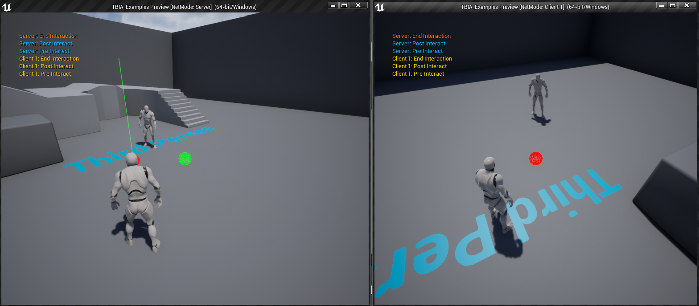

export const Step = ({children, text}) => {
    return 
        {text}
    
}

## Create Interact Animation Cosmetic

To create Interact Active Ability you just need to right click in the 
content browser and go to `TwistedBytes`->`Abilities`->`Interact Animation Cosmetic` 
as shown in the image below.

## Setup Player Character

Open the `Third Person Character`, select `TBIA Interaction Component` <Step text="1"/> then add `Interact Animation Cosmetic` 
to the granted abilities <Step text="2"/> as you see in the image below.

## Setup Montage

Open the montage you want to play when interacting with `GASActorBase` that we created earlier, this montage is 
cosmetic which means that there is no loop duration in this animation. Make sure that the slot <Step text="1"/> 
you're using for your montages in the `Animation Blueprint` for the `ThirdPersonCharacter` is the same applied
on the montage <Step text="2"/> you want to play when interacting with `GASActorBase`, here we are playing some kind of pickup animation.

## Interactable Actor

Open `GasActorBase` and override `Get Interaction Context`, make a struct based on `TBIA_InteractionContext`
then set `Primary Mesh Montage` <Step text="1"/> with the pickup animation montage that we want to play when interacting with `GASActorBase`.

Go to `Event Graph` and navigate to `On End Interaction` and on `Authority` <Step text="1"/> we want to destroy <Step text="2"/> this actor 
as shown in the image below, simulating a pickup logic.

Press Play and look at the cube then press `E` which is the Interaction button that we set, and you should
see the pickup montage playing and `GASActorBase` being destroyed.

