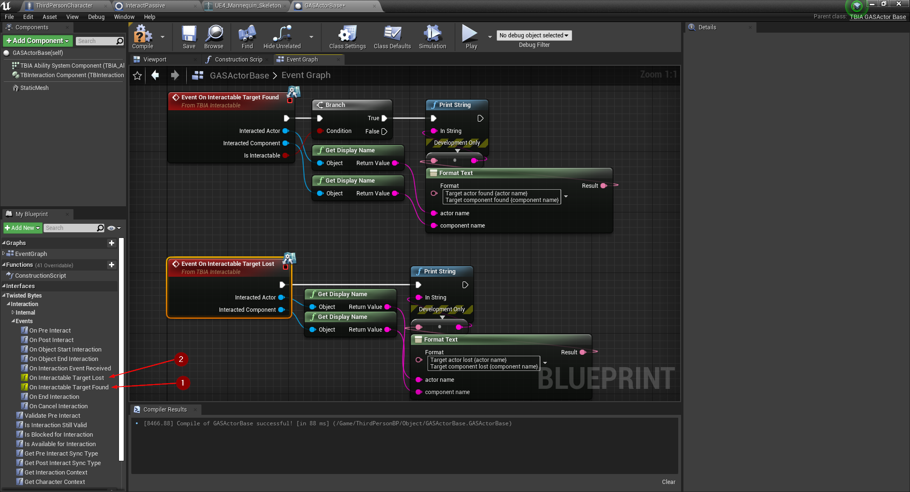
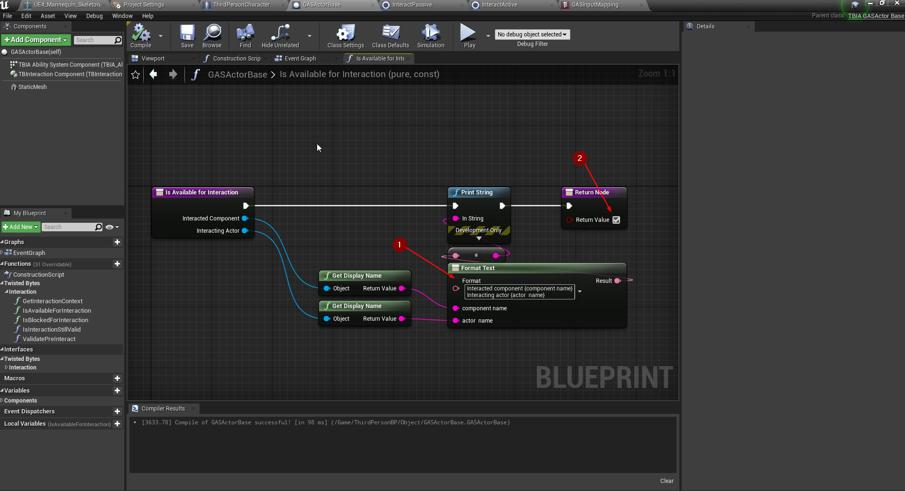

export const Step = ({children, text}) => {
    return 
        {text}
    
}

## Setting up player character
To get started, create a new project based on `Third Person Template`, open 
`Third Person Character` go to `class settings` <Step text="1"/> change the 
parent class from `Character` to `TBIA_GASCharacter` <Step text="2"/>. After changing 
the parent class you can see two new components added <Step text="3"/> and 
two interface classes are added also <Step text="4"/>.

For a better third person perspective move the camera to a location like this <Step text="1"/>.

Also create a socket on the head bone <Step text="1"/>, name it 
`headSocket` <Step text="2"/> and keep the location to default.

## Creating the Interact Passive Ability

To create Interact Passive Ability you just need to right click in the 
content browser and go to `TwistedBytes`->`Abilities`->`Interact Passive` 
like in <Step text="1"/>.

Open `Interact Passive` blueprint file and it's preferred to use your own trace 
collision channel and select it <Step text="1"/> set `Trace Start location type` 
to `Socket on Character's Mesh` <Step text="2"/>, for debugging our ability set 
`show debug` <Step text="3"/> to true.

Press play and you should see the trace as in the image below.

## Create your first interactable object

To create our first interactable object, in content browser right click and go to 
`Twistedbytes`->`Actors`->`GAS Actor Base` <Step text="1"/>.

Open the new actor we created and add static mesh component and make it the default root.

In the details panel of the static mesh component, add a cube mesh <Step text="1"/> and lower 
it's scale to 0.25 <Step text="2"/>.

Expand `TwistedBytes` interface functions and override `On Interactable Target Found` <Step text="1"/> 
and `On Interactable Target Lost` <Step text="2"/>. Add `Print string` to debug the actors 
as you can see in the image below in the `Event Graph`.

Now to test our code press play.Remember that we set the range of the interaction in the `Passive ability` 
to `300 cm`. So let's get in range and look and the cube, we should see the debug messages.

When you look away from the cube the `On Interactable Target Lost` will be triggered and
 you should see the debug messages as in the image below.

## Extending Passive Ability Functionality

Open the Interactable actor `GASActorBase` that we created and from the interface functions, 
override `Is Available For Interaction` add a print string <Step text="1"/> and 
return true <Step text="2"/> then let's press play and see what will happen.

As you can see `Is Available For Interaction` <Step text="1"/> was called 
before `On Interactable Target Found` <Step text="2"/> and all these other calls 
are happening <Step text="3"/> in the timer period as `Interact Passive` as long as 
you're looking to the interactable object.

Let's set the return value of `Is Available For Interaction` to false <Step text="1"/> then 
hit play.

The output log shows that only `Is Available For Interaction` is being called <Step text="1"/> 
and `On Interactable Target Found` is not triggered at all, this is because we are overriding 
the return value to false.

