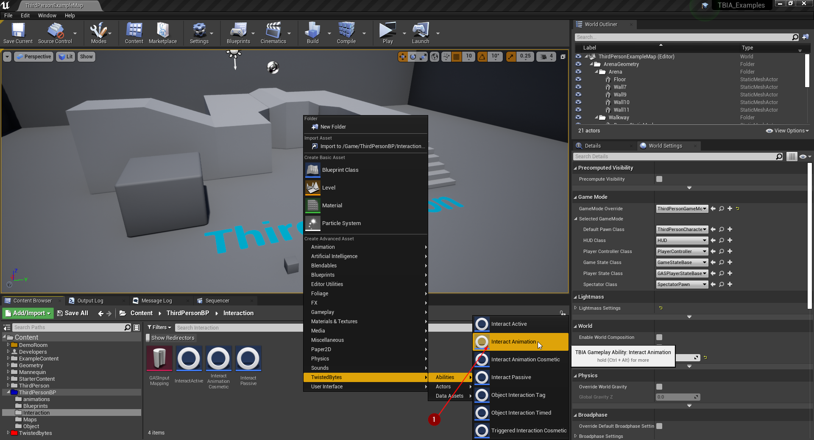
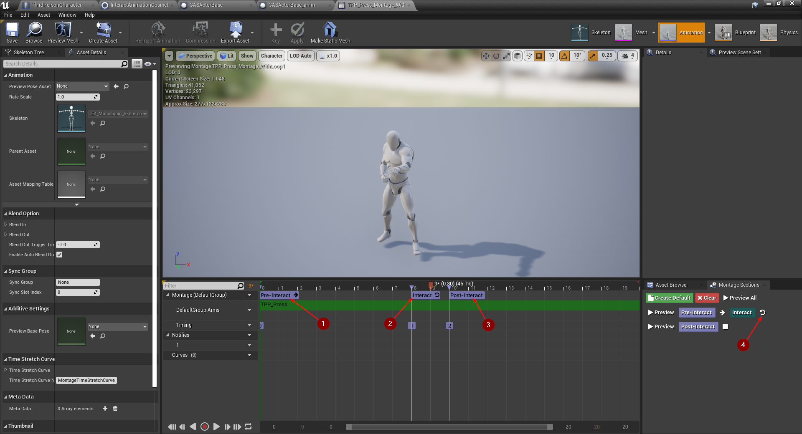

import {Step} from '@site/src/lib/utils.mdx'

## Create Interact Animation

To create an *Interact Animation* ability, right-click in the *Content Browser*
and select `TwistedBytes | Abilities | Interact Animation` <Step text="1"/>
as shown in the image below.

## Setup Player Character

Open the `ThirdPersonCharacter` Blueprint and select <Step text="1"/> `TBIA Interaction Component`
in the *Components* tab. In the *Details* tab, add your `Interact Animation` ability to the
`Granted Abilities` property <Step text="2"/> as shown in the image below.

## Setup Montage 

Open a montage you want to play during an interaction. We now want to add three montage sections which will be used
by our `Interact Animation` ability.

1. Create a new montage section, name it `Pre-Interact`, and set it to the beginning of the montage <Step text="1"/>.
2. Create second new montage section, name it `Interact`, and set it to the frame that you want to start the looped animation on <Step text="2"/>.
3. Create third new montage section, name it `Post-Interact`. This section marks the end of the looped animation <Step text="3"/>.
It will jumped to when an interaction loop ends. Make sure to set the looping montage section to *loop* <Step text="4"/> as shown in the image below.

Open `Interact Animation` ability. Here you are able to specify the section names that should be used for each animation event.
- The start section <Step text="1"/> when an interaction starts.
- The looping section the animation montage will jump from <Step text="2"/>.
- The last section <Step text="3"/> the animation montage will jump to when the loop ends.

In our example we used the default section name value on purpose to make it easy to follow but, of course, you are totally free
to choose you own section names. Just make sure that the montage section names match in both your montages and `Interact Animation` ability.

Also make sure that `Replicate Primary Montage` is enabled <Step text="4"/>.

## Interactable Actor

Duplicate `GasActorBase` to showcase the new Interaction type and customize it to differentiate
it from the other actor, Go to `Get Interaction Context` set the new montage <Step text="1"/> to
the `Primary Mesh Montage` check <Step text="2"/> `Wait For Input Trigger` to true,
set `Interaction duration` <Step text="3"/> to `3.0` seconds and the
`Animation Loop Duration` <Step text="4"/> to `2.8` seconds.

Place the new `GasActorBase` in the world <Step text="1"/> and press *Play* in the Unreal Editor.
Then, interact with the new actor. You should now see the new montage is playing as long as you are
holding down the interaction key for 3 seconds while it is also looping in the section that you specified.

