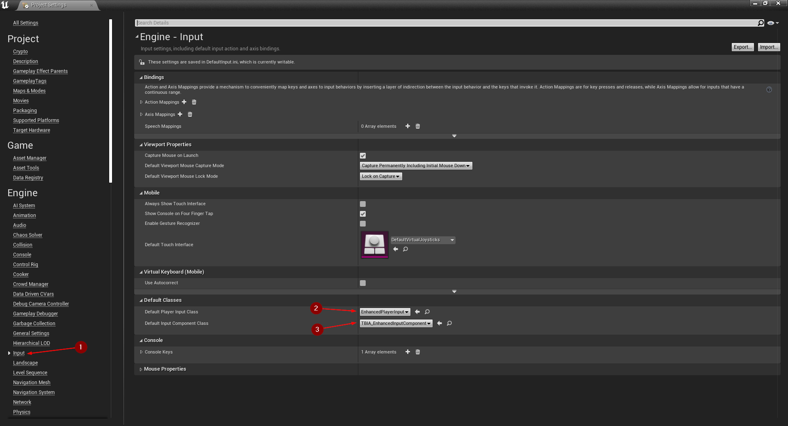
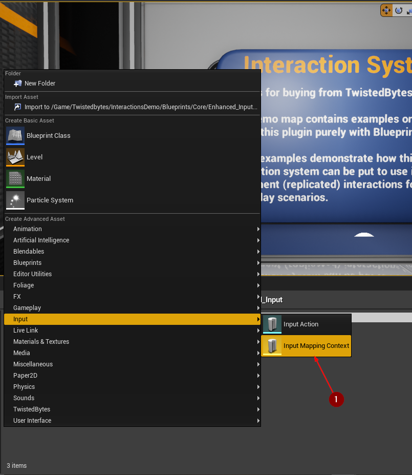
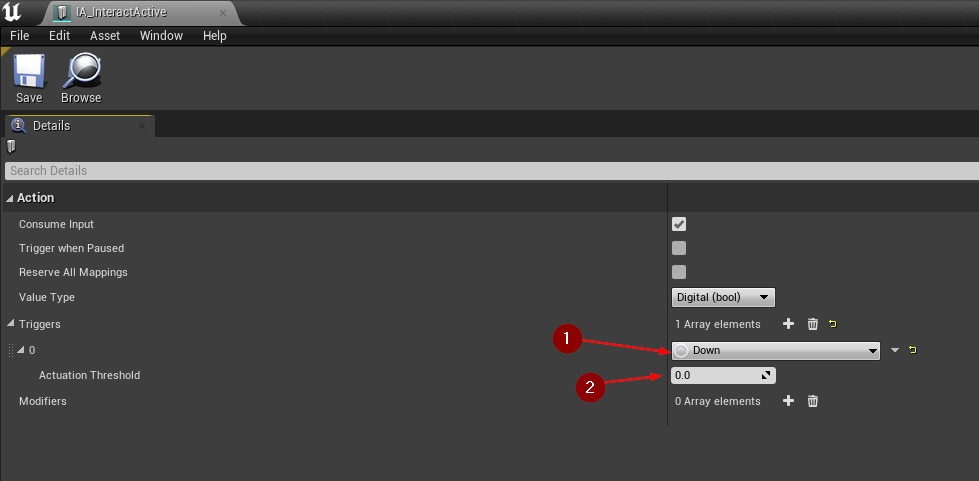
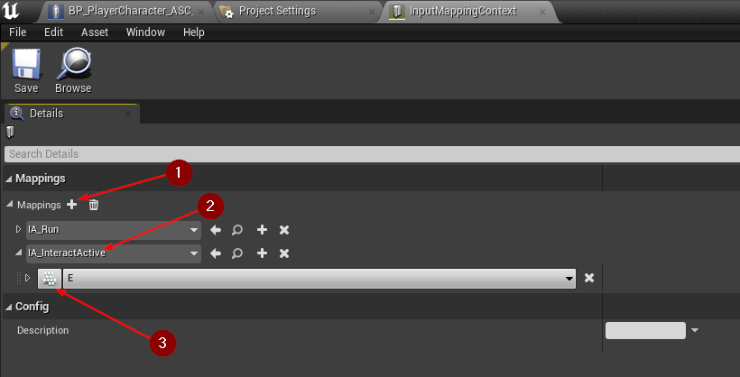
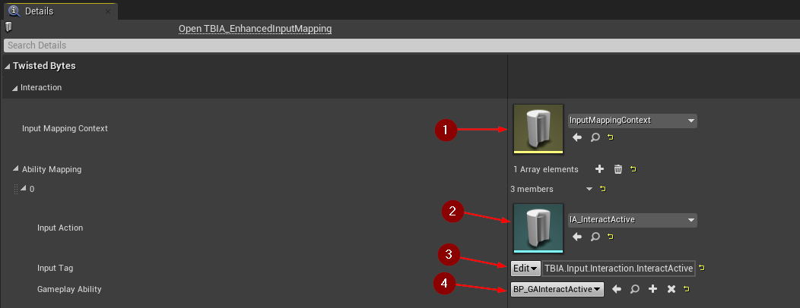

export const Step = ({children, text}) => {
    return 
        {text}
    
}

## Setting up Project

To get started, go to `Project Settings | Input` <Step text="1"/>, click on *Default Player Input Class* and select `EnhancedPlayerInput` <Step text="2"/> then click on *Default Input Component Class* and select `TBIA_EnhancedInputComponent`. 

## Creating Input Data assets

To create *Input Mapping Context*, right-click in the *Content Browser* and
select `Input | Input Mapping Context` <Step text="1"/>.

Then to create an *Input Action*, right-click in the *Content Browser* and
select `Input | Input Action` <Step text="1"/>.

Now we need to create *GAS Enhanced Input Mapping*, right-click in the *Content Browser* and
select `TwistedBytes | Data Assets | GAS Enhanced Input Mapping` <Step text="1"/>.

## Setup GAS Enhanced Input Mapping

Open the *Input Action* created add a trigger, set it to *Down* <Step text="1"/> and make sure the *Actuation Threshold* is equal to *zero* <Step text="2"/>.

Open *Input Mapping Context* and add action mapping <Step text="1"/>, select the *Input Action* that was created earlier <Step text="2"/>. After that you need to bind this *Input Action* to a key <Step text="3"/> as shown in the image below.

Now open *GAS Enhanced Input Mapping*, first set the `Input Mapping Context`, that was created earlier, to it's specific variable <Step text="1"/>, then click on *+* to add *Ability Mapping*.
Select the `Input Action` as in <Step text="2"/>, after that set `TBIA.Input.Interaction.InteractActive` as a gameplay tag <Step text="3"/> that links *GAInteractActive* to the selected *Input Action*. Lastly set `GAInterActive` ability as in <Step text="4"/>.

## Setup Player Character

Open `Player Character` select *TBIA_Interaction Component* <Step text="1"/>, go to *Details panel* and under `TwistedBytes | Interaction | Config` set *Input Consumer* <Step text="2"/> to `TBIA Enhanced Input Component` Lastly set `GAS Enhanced Input Mapping` as in <Step text="3"/>.

