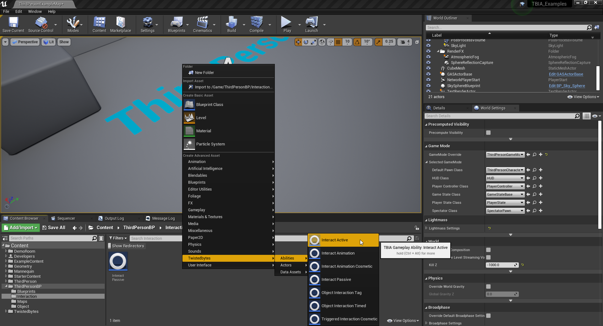
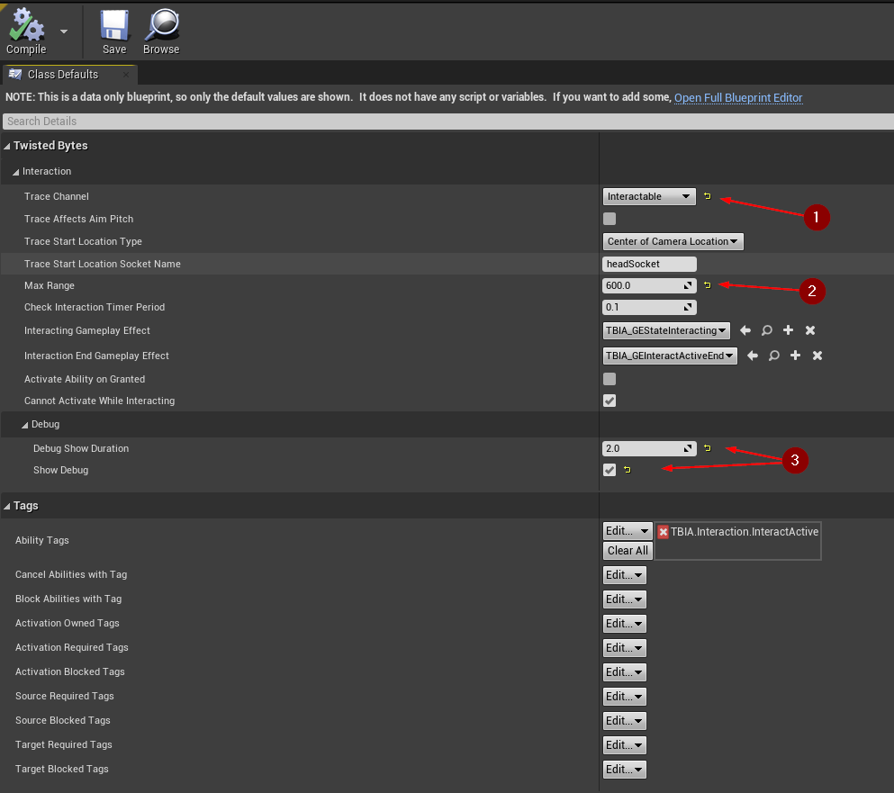

export const Step = ({children, text}) => {
    return 
        {text}
    
}

## Create Interact Active Ability

To create an *Interact Active* ability, simply right-click in the *Content Browser*
and select `TwistedBytes | Abilities | Interact Active` as shown in the image below.

Open the Ability you just created and set the `Trace Channel` to `Interactable` <Step text="1"/>.

We want the player character to be able to interact with interactable objects that are in front
of the character and within a range of 3 meters. Since the camera's arm length is also set to 3 meters (but sitting
behind our player character), we need to compensate for the additional 3 meters by setting the `Max Range` property
to `600` cm <Step text="2"/>.

For easier debugging of the *Interact Active Ability*, enable `Show Debug` and set `Debug Show Duration` to
`2.0` seconds <Step text="3"/>.

:::info
The property `Trace Start Location Type` allows you to choose the start location for when executing an interaction line trace:
- `Center of Camera Location`
- `Socket on Character's Mesh`

Using `Socket on Character's Mesh` is only useful when you have stabilized head movement, or if you want to make a
socket from root and set its position next to the head bone.

In general, it is preferred to use `Center of Camera Location` for stable line traces.
:::

## Setup input

In order to bind the input with `Interact Active Ability`, right-click in the *Content Browser* and
select `TwistedBytes | Data Assets | GAS Input Mapping` as shown in the image below.

Open the data asset and add a new `Ability Mapping`. Select `Interact` <Step text="1"/> and set the
`Interact Active` <Step text="2"/> that we created as a value for the `Interact` key.

Now, select `Edit | Project Settings ...`. In the `Input` section under `Engine`, create a new `Action Mapping`.
The name needs to be exactly written as `TBIA_Interact`. Lastly, specify any number of inputs (keys, buttons) that
you want to use to trigger interactions in your game like, for example, the `E` key on a keyboard.

## Setup Player Character

Open the `ThirdPersonCharacter` Blueprint and select `TBIA Interaction Component` in the *Components* tab.
In the *Details* tab, add your `Interact Active` ability to the `Granted Abilities` property <Step text="1"/>.
Next, set the input mapping data asset you created earlier <Step text="2"/> as shown in the image below.

Finally, override the `Get Character Context` interface function. Click and drag the `Return Value` pin of the `Return`
node and select `Make TBIA_CharacterContext`. Then, set the reference of the third-person skeletal mesh component (`Mesh`) as *Primary Mesh*
in the struct that is going to be returned.

## Interactable Actor

Open the `GASActorBase` Blueprint and override `On Pre Interact`, `On Post Interact`, `On Cancel Interact`
and print their results to see them in action.

Press *Play* in the Unreal Editor, look at the cube and press the interaction button you have configured.
In our example case we set it to the `E` key. You should now see the same debug messages as shown in the image below.

