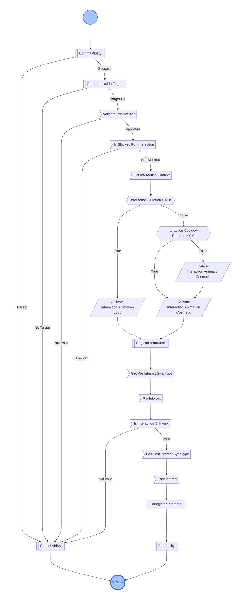
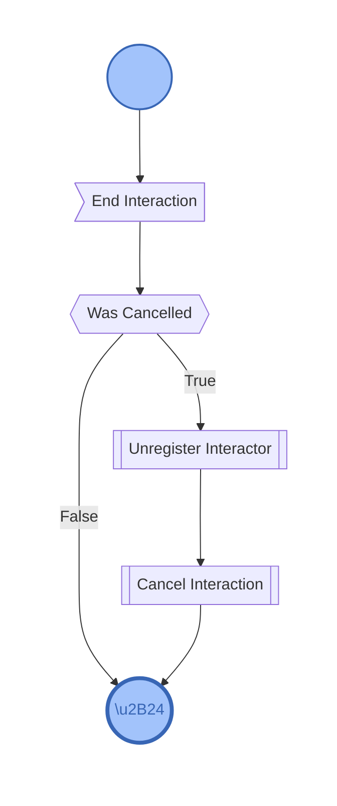

## Event ActivateAbility 

```mermaid
flowchart TB
    START(("\u2B24"))
    STOP(("\u2B24"))
    
    CANCEL_ABILITY[[Cancel Ability]]
    END_ABILITY[[End Ability]]

    B[[Commit Ability]]
    D[[Get Interactable Target]]
    F>Validate Pre Interact]
    H>Is Blocked For Interaction]
    J>Get Interaction Context]
    K[/Activate <br/> Interaction Animation <br/> Loop/]
    L[/Cancel <br/> Interaction Animation <br/> Cosmetic/]
    M[/"Activate <br/> Interaction Animation <br/> Cosmetic"/]
    N[[Register Interactor]]
    O>Get Pre Interact SyncType]
    P>Pre Interact]
    Q>Is Interaction Still Valid]
    R>Get Post Interact SyncType]
    S>Post Interact]
    T[[Unregister Interactor]]
    W{{Interaction Cooldown Duration > 0.0f}}
    X{{Interaction Duration > 0.0f}}
    
    START --> B
    
    B --> |Success| D
    B --> |Failed| CANCEL_ABILITY
    D --> |Target Hit| F
    D --> |No Target| CANCEL_ABILITY
    F --> |Not Valid| CANCEL_ABILITY
    F --> |Validated| H
    H --> |Blocked| CANCEL_ABILITY
    H --> |Not Blocked| J
    J --> X
    X --> |True| K
    X --> |False| W
    W --> |True| M
    W --> |False| L
    L --> M
    K --> N
    M --> N
    N --> O
    O --> P
    P --> Q
    Q --> |Not valid| CANCEL_ABILITY
    Q --> |Valid| R
    R --> S
    S --> T
    T --> END_ABILITY
    
    CANCEL_ABILITY --> STOP
    END_ABILITY --> STOP
    
    subgraph sub_container [ ]
        direction TB
        
        START
        
        subgraph sub_main [ ]
            direction TB

            B
            D
            F
            H
            J
            K
            
            J
            K
            L
            M
            N
            O
            P
            Q
            R
            S
            T
            W
            X
        end
        
        subgraph sub_cancel [ ]
            direction TB
    
            CANCEL_ABILITY
            END_ABILITY
        end
        
        STOP
    end
    
    classDef sty_start fill:#A2C3FB,color:#A2C3FB,stroke-width:2px,stroke:#3866B5;
    classDef sty_stop fill:#A2C3FB,color:#3866B5,stroke-width:4px,stroke:#3866B5;
    classDef sty_subgraph_transparent fill:#0000,stroke:#0000;
    
    class START sty_start;
    class STOP sty_stop;
    class sub_container sty_subgraph_transparent;
    class sub_main sty_subgraph_transparent;
    class sub_cancel sty_subgraph_transparent;
```

## Event OnEndAbility

```mermaid
flowchart TB
    START(("\u2B24"))
    STOP(("\u2B24"))
    
    B>End Interaction]
    C{{Was Cancelled}}
    D[[Unregister Interactor]]
    E[[Cancel Interaction]]
   
    subgraph sub_container [ ]
        direction TB
        
        START 
        START --> B
        B --> C
        C --> |True| D
        C --> |False| STOP
        D --> E
        E --> STOP
    end
    
    classDef sty_start fill:#A2C3FB,color:#A2C3FB,stroke-width:2px,stroke:#3866B5;
    classDef sty_stop fill:#A2C3FB,color:#3866B5,stroke-width:4px,stroke:#3866B5;
    classDef sty_subgraph_transparent fill:#0000,stroke:#0000;
    
    class sub_container sty_subgraph_transparent;
    class START sty_start;
    class STOP sty_stop;
```
