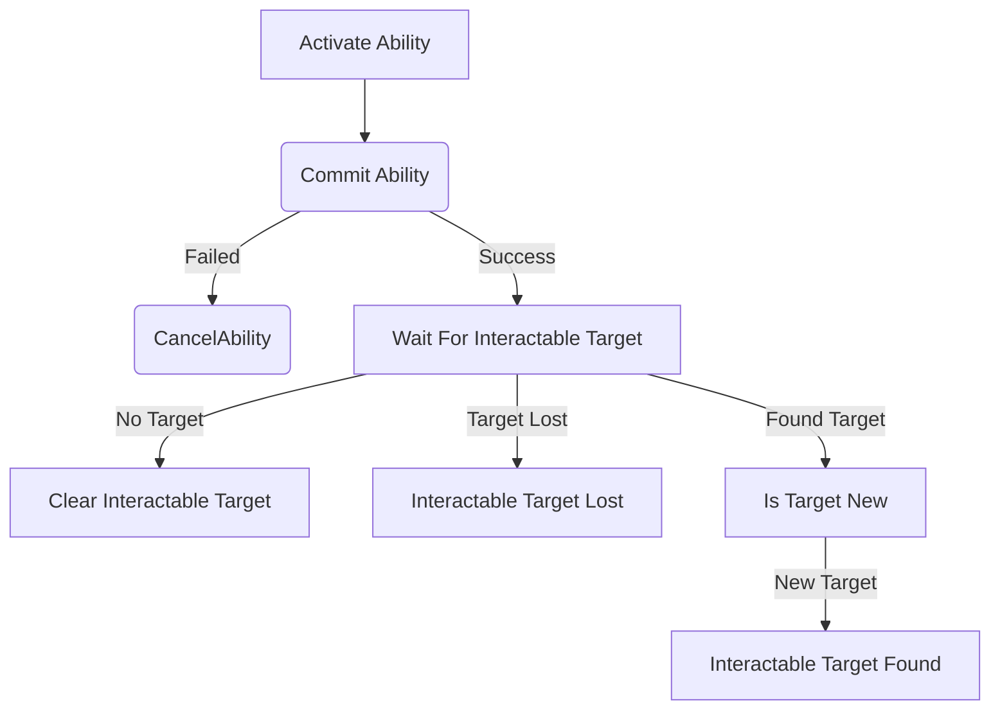

## Event ActivateAbility 

```mermaid
flowchart TD
    A[Activate Ability] -->B(Commit Ability)
    B --> |Failed| C(CancelAbility)
    B --> |Success| D[Wait For Interactable Target]
    D --> |No Target| F[Clear Interactable Target]
    D --> |Target Lost| E[Interactable Target Lost]
    D --> |Found Target| H[Is Target New]
    H --> |New Target| J[Interactable Target Found]
```
