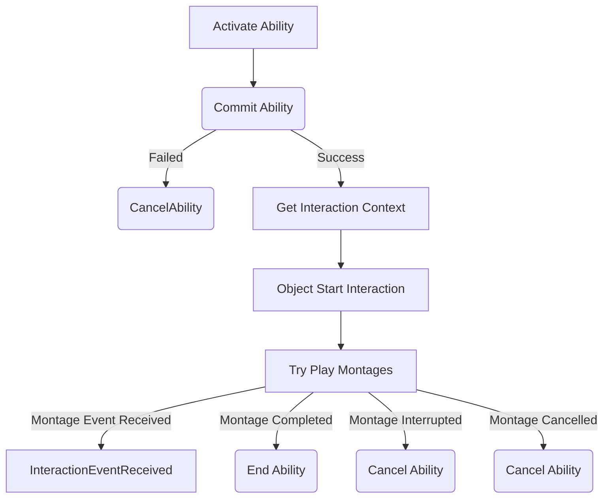
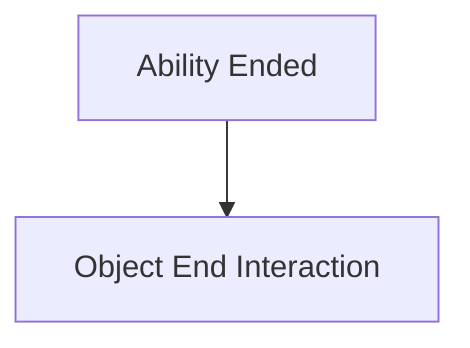

## Event ActivateAbility 

```mermaid
flowchart TD
    A[Activate Ability] -->B(Commit Ability)
    B --> |Failed| C(CancelAbility)
    B --> |Success| D[Get Interaction Context]
    D --> E[Object Start Interaction]
    E --> F[Try Play Montages]
    F --> |Montage Event Received| G[InteractionEventReceived]
    F --> |Montage Completed| H(End Ability)
    F --> |Montage Interrupted|I(Cancel Ability)
    F --> |Montage Cancelled|J(Cancel Ability)
```

## Event OnEndAbility

```mermaid
flowchart TD
    X[Ability Ended] --> Y[Object End Interaction]
```
