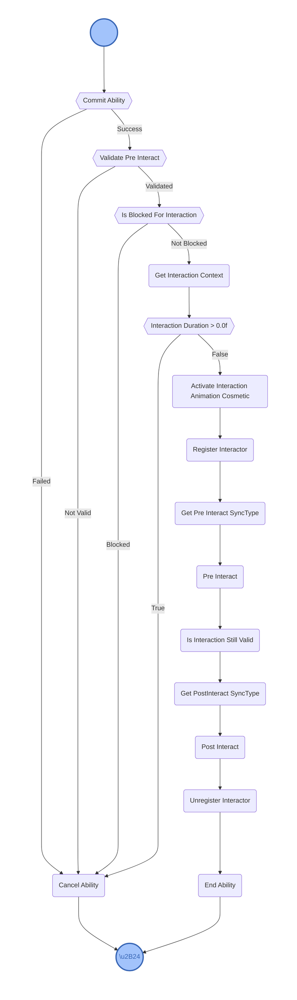
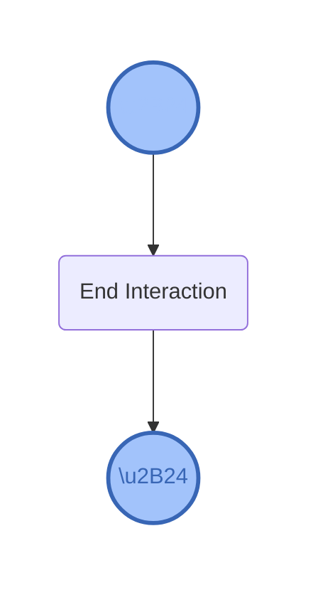

## Event ActivateAbility 

```mermaid
flowchart TB
    START(("\u2B24"))
    STOP(("\u2B24"))
    
    CANCEL_ABILITY(Cancel Ability)
    END_ABILITY(End Ability)
    
    B{{Commit Ability}}
    F{{Validate Pre Interact}}
    H{{Is Blocked For Interaction}}
    J(Get Interaction Context)
    
    M(Activate Interaction Animation Cosmetic)
    N(Register Interactor)
    O(Get Pre Interact SyncType)
    P(Pre Interact)
    Q(Is Interaction Still Valid)
    R(Get PostInteract SyncType)
    S(Post Interact)
    T(Unregister Interactor)
  
    START --> B

    B --> |Failed| CANCEL_ABILITY
    F --> |Not Valid| CANCEL_ABILITY
    H --> |Blocked| CANCEL_ABILITY
    
    B --> |Success| F
    F --> |Validated| H
    H --> |Not Blocked| J
    J --> K
    
    K{{Interaction Duration > 0.0f}}
    K --> |True| CANCEL_ABILITY
    K --> |False| M
    
    M --> N
    N --> O
    O --> P
    P --> Q
    Q --> R
    R --> S
    S --> T
    T --> END_ABILITY
    
    CANCEL_ABILITY --> STOP
    END_ABILITY --> STOP

    subgraph sub_container [ ]
        direction TB
        
        START
        
        subgraph sub_main [ ]
            direction TB
    
            B
            F
            H
            J
            K
            M
            N
            O
            P
            Q
            R
            S
            T
        end
        
        subgraph sub_cancel [ ]
            direction TB
    
            CANCEL_ABILITY
            END_ABILITY
        end
        
        STOP
    end

    classDef sty_start fill:#A2C3FB,color:#A2C3FB,stroke-width:3px,stroke:#3866B5;
    classDef sty_stop fill:#A2C3FB,color:#3866B5,stroke-width:3px,stroke:#3866B5;
    classDef sty_subgraph_transparent fill:#0000,stroke:#0000;
    
    class sub_container sty_subgraph_transparent;
    class sub_main sty_subgraph_transparent;
    class sub_cancel sty_subgraph_transparent;
    class START sty_start;
    class STOP sty_stop;
```

## Event OnEndAbility

```mermaid
flowchart TB
    START(("\u2B24"))
    STOP(("\u2B24"))
    
    A(End Interaction)

    START --> A
    A --> STOP
    
    subgraph sub_container [ ]
        direction TB
        
        START
        A
        STOP
    end
    
    classDef sty_start fill:#A2C3FB,color:#A2C3FB,stroke-width:3px,stroke:#3866B5;
    classDef sty_stop fill:#A2C3FB,color:#3866B5,stroke-width:3px,stroke:#3866B5;
    classDef sty_subgraph_transparent fill:#0000,stroke:#0000;
    
    class sub_container sty_subgraph_transparent;
    class START sty_start;
    class STOP sty_stop;
```
