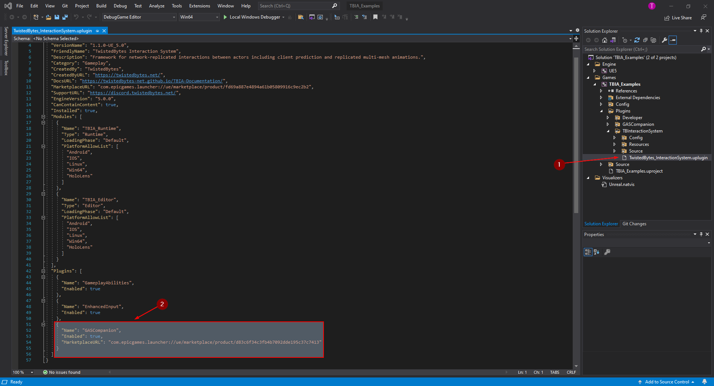
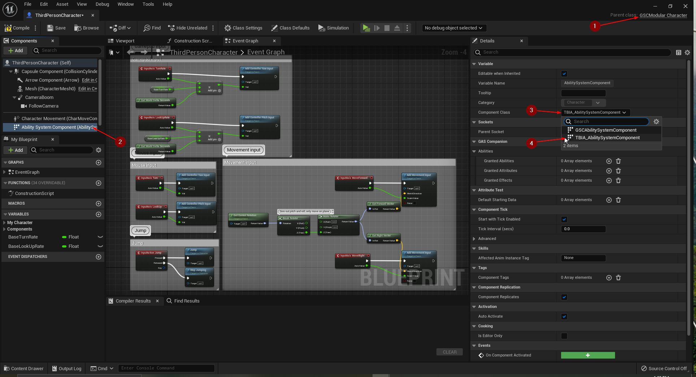

import {Step, UE} from '@site/src/lib/utils.mdx'

Only available for Unreal Engine: <UE version="5.0+"/>

## Setting up Project

To get started, go to the `Project's Folder`, create a new folder (in case you don't have it) and name it *Plugins* <Step text="1"/>. 
Copy `Gas Companion` and `TwistedBytes Interaction System` plugins to this folder. 

In your *Project* Open *Plugins* tab and go to `Gameplay`  section, make sure that `Gas Companion` <Step text="2"/> and
 `TwistedBytes Interaction System` <Step text="3"/> are enabled.

If your project is *Blueprint only*, click on `Tools | New C++ Class` <Step text="1"/>. A new window will pop-up, select 
*An Empty C++ Class* <Step text="2"/> then click on `Create Class` <Step text="3"/>. 

Wait for the project to create and compile source files needed to run in a source code editor (*Rider* or *Visual Studio*).

In explorer navigate to your project file and open the *Solution File* <Step text="1"/>.

When the *Solution File* loads, navigate to `Plugins | TwistedBytes_InteractionSystem` and open `TwistedBytes_InteractionSystem.uplugin`<Step text="1"/>.
Add `GasCompanion` <Step text="2"/> in the plugins array as shown in the image below.

Now go to `Plugins | TwistedBytes_InteractionSystem | Source | TBIA_Runtime` open the file `TBIA_Runtime.Build.cs` <Step text="1"/>. Under 
*PublicDependencyModuleNames* <Step text="2"/> add `GASCompanion` <Step text="3"/>.

Click on *Build Solution* <Step text="4"/> and wait for the project to finish building, it might take couple of minutes.

In the same directory expand `Public | GAS | Component` and open `TBIA_AbilitySystemComponent.h` <Step text="1"/>. At the top of the file 
comment (or remove) <Step text="2"/> `#include "AbilitySystemComponent.h"` and under it add `#include "Abilities/GSCAbilitySystemComponent.h"` <Step text="3"/>
then scroll down to the *Class Creation* and reparent it from `UAbilitySystemComponent` to `UGSCAbilitySystemComponent` <Step text="4"/> as shown in the image.

Then build the solution again and wait till it finishes building.

## Setup Player Character

Open your *Player Character* that you're using, as you can see here we are using `GSCModular Character` <Step text="1"/>. Go to the *Components* tab 
and click on the `Ability System Component` <Step text="2"/> and navigate the *Details Panel* then click on `Component Class` <Step text="3"/> and select
`TBIA_AbilitySystemComponent` <Step text="4"/> after that Compile and save the blueprint.

Now to add the interaction functionality to the *Player Character* click on *+ Add* <Step text="1"/> in the *Component* tab and add `TBIA_Interaction` 
component <Step text="2"/>. Then in `Class Settings` scroll down to *Interfaces* and click on *Add* <Step text="3"/> then select `TBIA_Interactable` 
interface. 

Compile and save.

