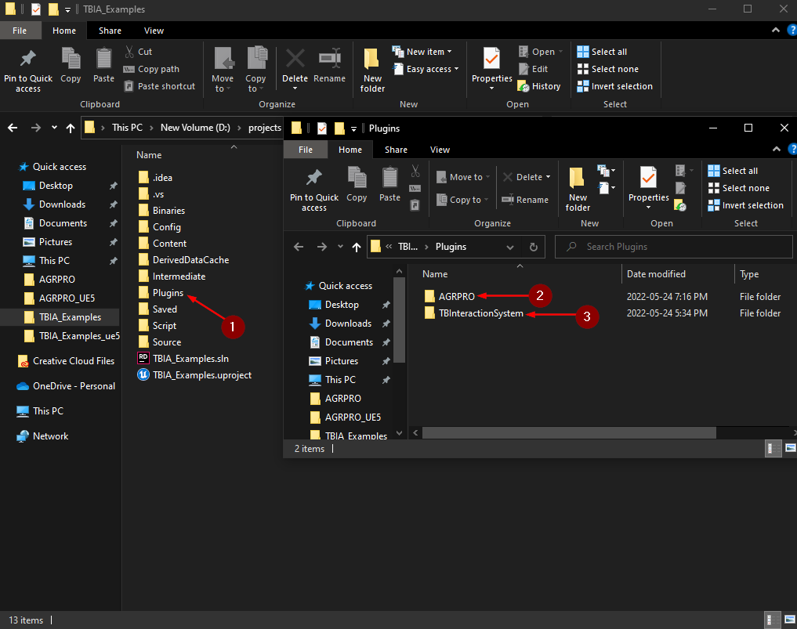

import {Step, UE} from '@site/src/lib/utils.mdx'

:::important Only available for Unreal Engine: <UE version="4.26"/> <UE version="4.27"/>
This guide is meant to be a general integration guide that you can use as reference when integrating any plugin from the
Unreal Engine Marketplace which are mainly non-GAS-based plugins.
:::

As an example, this integration guide will show you how to integrate a free plugin called
[AGR PRO](https://www.unrealengine.com/marketplace/en-US/product/agr-pro) with the
*TwistedBytes Interaction System*, so that you can use both in combination in your own projects.

All steps described here should be applicable to other non-GAS-based plugins.

## Requirements

- [Microsoft Visual Studio C/C++ IDE and Compiler](https://visualstudio.microsoft.com/) (*Free Community Edition 2019 is sufficient*)
- Unreal project must be based on Unreal Engine 4.26 or 4.27


## Adding Engine Plugins to a Project

To get started, go to your project's folder. Create a new folder called `Plugins` in case it does not exist yet <Step text="1"/>.

Copy both plugin folders `AGRPRO` <Step text="2"/> and `TBInteractionSystem` <Step text="3"/> from the *Engine Plugin* folder to your project's `Plugins` folder.

:::note
The default location of the engine plugin folder for Unreal Engine 4.26 is:

`C:\Program Files\Epic Games\UE_4.26\Engine\Plugins\Marketplace`
:::



In your project, navigate to `Edit | Plugins` to open the *Plugins* tab.

Make sure that both `AGR PRO` <Step text="1"/> and `TwistedBytes Interaction System` <Step text="2"/> show up and are enabled.


## Create Custom Character Class

To create your custom character class navigate to `File | New C++ Class...` <Step text="1"/> in the *Unreal Engine Editor*.

In the `Add C++ Class` dialog, click on `Show all Classes` <Step text="2"/> then in the search dialog look for `AGRCharacter` and 
select it <Step text="3"/> and click next <Step text="4"/>.


In the next page you can name your class <Step text="1"/>. In our case let's name it `MyAGRCharacter`.

Lastly, click on `Create class` <Step text="2"/>.


Wait for the *Editor* to create and compile all source files needed before proceeding.

:::info
The process described above is a quick way to create a new and valid C++ module that in fact turns any
*Blueprints-only Project* into a *C++ Project*.
:::

## Modifying Project Files

The next steps describe how to modify the project C++ files, so that it knows about `AGRPRO` plugin, `TwistedBytesInteractionSystem` plugin, 
`GamePlayAbilities` and their base classes to seamlessly integrate them with each other.

In Windows Explorer, navigate to your project's root folder. You should see a new file with the file extension `.sln`.

Double-click this *Solution* file <Step text="1"/> to open it in your favorite IDE (e.g. *Microsoft Visual Studio* or *JetBrains Rider*).


:::note
The initial startup will take some time. Might be a good time to grab a :coffee: ...
:::


### Modifying Project's Build.cs File

Next, navigate to `<Games>/<Project Name>/Source/` and open the file `<Project Name>.Build.cs` <Step text="1"/>.

Under *PublicDependencyModuleNames* <Step text="2"/> add :
 - `AGRPRO` <Step text="3"/> 
 - `TBIA_Runtime` <Step text="4"/> 
 - `GameplayAbilities`, `GameplayTags`, `GameplayTasks` <Step text="5"/>.

Click on *Build Solution* <Step text="6"/> and wait for the project to finish building (it might take a couple of minutes).


### Modifying MyAGRCharacter Header File

In `<Games>/<Project Name>/Source/Public/`,
open the file `MyAGRCharacter.h` <Step text="1"/>.

At the top of the file, add the following lines (see <Step text="2"/>):

```cpp
#include "AbilitySystemInterface.h"
#include "Interface/TBIA_Interactable.h"
#include "Component/TBIA_InteractionComponent.h"
#include "GAS/Component/TBIA_AbilitySystemComponent.h"
```

After this, go to the *Class Declaration* of `AMyAGRCharacter` and add these two interfaces <Step text="3"/> as shown in the image below.

```cpp
public IAbilitySystemInterface, public ITBIA_Interactable
```

Then scroll down and inside `AMyAGRCharacter`, we want add the components `TBIA_AbilitySystemComponent` and `TBIA_InteractionComponent`.
You can do that by copying and pasting the code <Step text="4"/> as shown in the image below.

```cpp
protected:
    /**
     * The Ability System Component provided by TwistedBytes Interaction System.
     */
    UPROPERTY(VisibleDefaultsOnly, BlueprintReadOnly, Category = "TwistedBytes|Interaction")
        UTBIA_AbilitySystemComponent* TBIA_AbilitySystemComponent = nullptr;

    /**
     * The Interaction Component provided by TwistedBytes Interaction System.
     */
    UPROPERTY(VisibleDefaultsOnly, BlueprintReadOnly, Category = "TwistedBytes|Interaction")
        UTBIA_InteractionComponent* TBIA_InteractionComponent = nullptr;
```

And under that we need to add the constructor and also override the inteface function `GetAbilitySystemComponent`
which is needed to get a reference to the *Ability System Component* used by *GAS*.

Copy and paste the following code as shown in <Step text="5"/>

```cpp
public:
    AMyAGRCharacter();
    //~ IAbilitySystemInterface
    virtual UAbilitySystemComponent* GetAbilitySystemComponent() const override;
    //~ IAbilitySystemInterface
```


### Modifying MyAGRCharacter CPP File

In `<Games>/<Project Name>/Source/Private/`,
open the file `MyAGRCharacter.cpp` <Step text="1"/>.

At the top of the file, add the following lines (see <Step text="2"/>):

```cpp
#include "AbilitySystemComponent.h"
#include "GAS/Component/TBIA_AbilitySystemComponent.h"
```

Under that we want to define the constructor to create the components we declared in the header file. You
can do that by adding the following code as shown in <Step text="3"/>.

```cpp
AMyAGRCharacter::AMyAGRCharacter()
{
    PrimaryActorTick.bCanEverTick = true;

    TBIA_InteractionComponent = CreateDefaultSubobject<UTBIA_InteractionComponent>("TBIA_InteractionComponent");
    TBIA_AbilitySystemComponent = CreateDefaultSubobject<UTBIA_AbilitySystemComponent>("TBIA_AbilitySystemComponent");
    TBIA_AbilitySystemComponent->SetIsReplicated(true);
}
```

Then we want to add the implementation for the overridden interface function `GetAbilitySystemComponent` as shown
below in <Step text="4"/>.

```cpp
UAbilitySystemComponent* AMyAGRCharacter::GetAbilitySystemComponent() const
{
    return TBIA_AbilitySystemComponent;
}
```


## Setting up the Player Character

Open your *Player Character* Blueprint (e.g. `AGRPRO_Character`). As you can see here in our
example, we are using `AGR Character` as the parent class.

Go to the `Class Settings` <Step text="1"/> and click on *Parent Class* <Step text="2"/> select the 
`MyAGRCharacter` class <Step text="3"/> like shown in the image below.


Finally, you can go to `TBIA_InteractionComponent` <Step text="1"/> add your interaction abilities <Step text="2"/> 
then setup your input <Step text="3"/> regarding the default input component you're using.


:::note 
For more info on how to configure interaction abilities you can start from [here](/docs/quick-start/using-passive) 
:::

Finally you can press *Play* and test.


