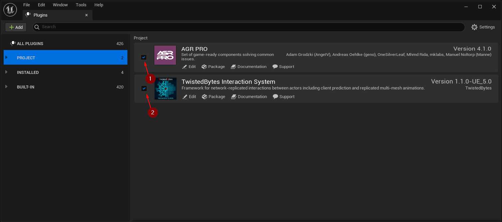
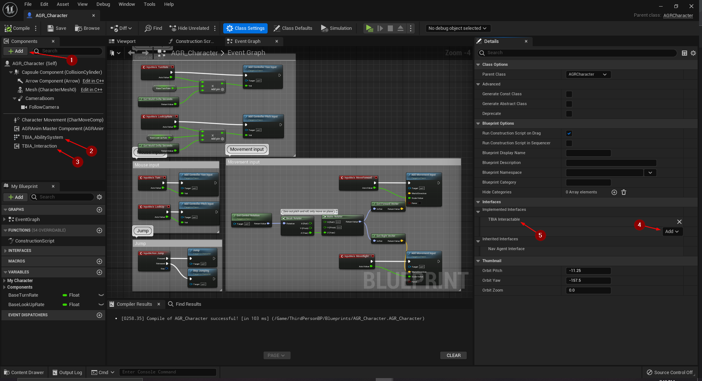
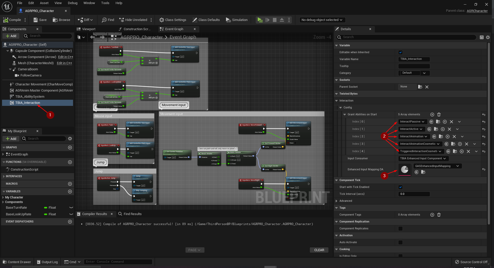
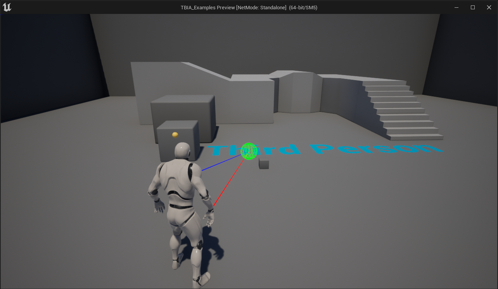

import {Step, UE} from '@site/src/lib/utils.mdx'

:::important Only available for Unreal Engine: <UE version="5.0"/>
This guide is meant to be a general integration guide that you can use as reference when integrating any plugin from the
Unreal Engine Marketplace which are mainly non-GAS-based plugins.
:::

As an example, this integration guide will show you how to integrate a free plugin called
[AGR PRO](https://www.unrealengine.com/marketplace/en-US/product/agr-pro) with the
*TwistedBytes Interaction System*, so that you can use both in combination in your own projects.

All steps described here should be applicable to other non-GAS-based plugins.

## Enable Plugins in Project

In your project, navigate to `Edit | Plugins` to open the *Plugins* tab.

Make sure that both `AGR PRO` <Step text="1"/> and `TwistedBytes Interaction System` <Step text="2"/> show up and are enabled.

## Setting up the Player Character

Open your *Player Character* Blueprint (e.g. `AGRPRO_Character`). As you can see here in our example, we are using `AGR Character` as the parent class.

Now, to add the interaction functionality to the *Player Character*, click on *Add* <Step text="1"/> in the
*Components* tab and select the `TBIA_AbilitySystem` component <Step text="2"/> and `TBIA_interaction` component <Step text="3"/>.

Switch to the `Class Settings` and scroll down to the *Interfaces* category. Click on *Add* <Step text="4"/> and
select the `TBIA_Interactable` interface. It should now look like it is shown in <Step text="5"/>.

Finally, compile and save the Blueprint.

Now you can go to `TBIA_InteractionComponent` <Step text="1"/> add your interaction abilities <Step text="2"/> 
then setup your input <Step text="3"/> regarding the default input component you're using.

:::note 
For more info on how to configure interaction abilities you can start from [here](/docs/quick-start/using-passive) 
:::

Finally you can press *Play* and test.

