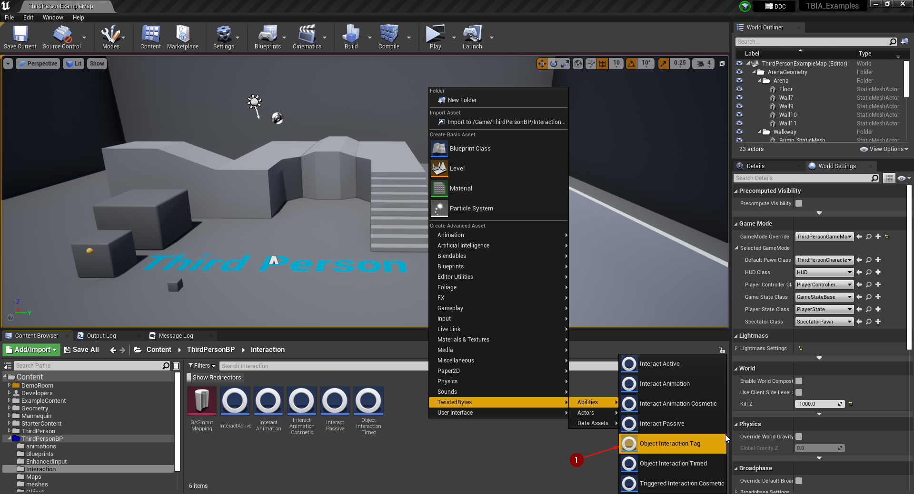
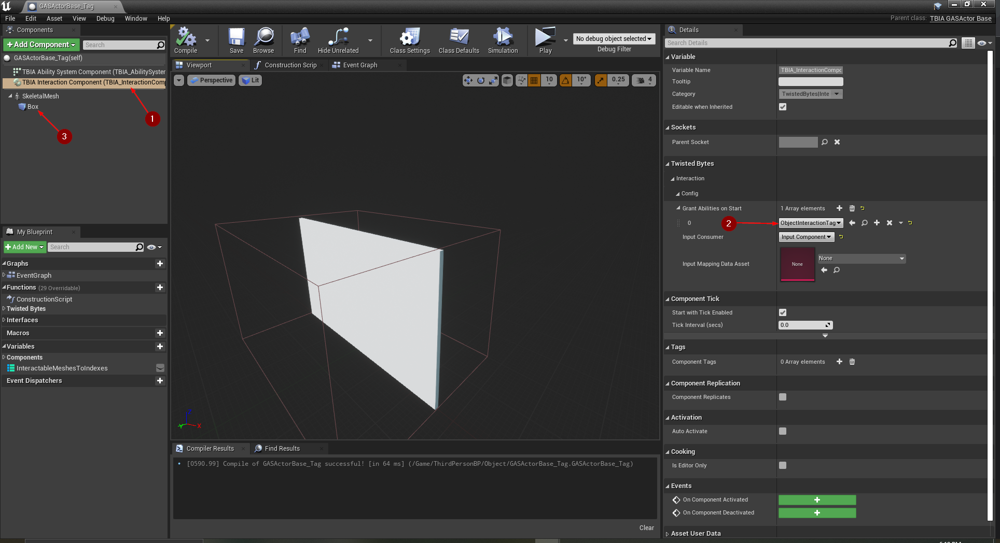
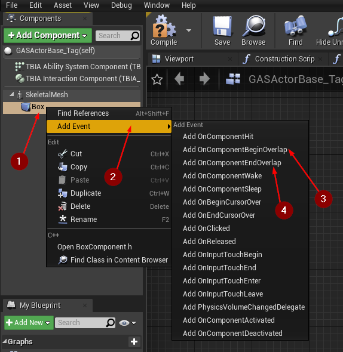
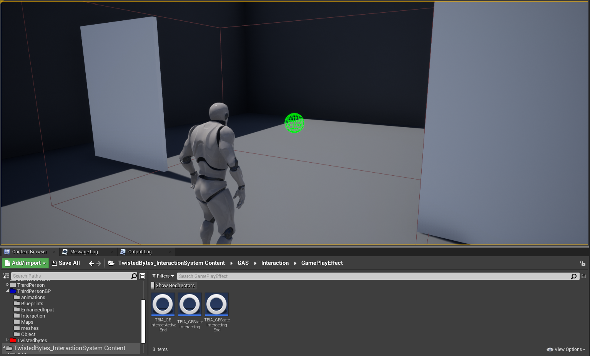

import {Step} from '@site/src/lib/utils.mdx'

## Create Object Interaction Tag Ability

To create an *Object Interaction Tag* ability, right-click in the *Content Browser*
and select `TwistedBytes | Abilities | Object Interaction Tag` <Step text="1"/> as shown in the image below.

Name the newly created asset `ObjectInteractionTag`.

## Create Interactable Actor

For an easier implementation, we are going to duplicate the `GASActorBase_Timed` that we created earlier [here](/docs/quick-start/using-object-timed) to make use 
of what we setup before.

:::note
We are going to create a door that opens when a *Player Character* overlaps with a box collision that we will add in the next steps.
:::

To do that, navigate to `GASActorBase_Timed` <Step text="1"/> and *right-click* then click on *Duplicate* <Step text="2"/>.

Name this newly created asset `GASActorBase_Tag`.

## Setup Interactable Actor

Open `GASActorBase_Tag` delete the static meshes <Step text="1"/> that we added before in `GASActorBase_Timed` which were serving as buttons for the *Door*. 
Then click on `+Add Component` and add `Box Collision` component <Step text="2"/> and name it `Box`.

Now we need to grant `ObjectInteractionTag` to this actor, we can do it by clicking on `TBIA Interaction Component` <Step text="1"/> then navigate to 
*details panel* and under `TwistedBytes | Interaction | Config` add `ObjectInteractionTag` <Step text="2"/> to the array named `Grant Abilities on Start`.

:::info
We are not modifying `ObjectInteractionTag` Ability and using defaults only. Setup is the same as we did in the previous tutorial that you can find [here](/docs/quick-start/using-object-timed)
:::

Then you can scale the `Box` <Step text="3"/> and place it to let the character easily overlap with it.

After you go to the *Event Graph*, *right-click* on `Box` <Step text="1"/> then click on *Add Event* <Step text="2"/>, and from the list add 
`OnComponentBeginOverlap` <Step text="3"/> also add `OnComponentEndOverlap` <Step text="4"/>.

First on execution of `OnComponentBeginOverlap` we need to cast the *Other Actor* to *Character* to make sure that the actor that overlapped with the `Box`
is a *Character*, and if the cast succeeded we will call a function named `Send Gameplay Event to Interacting Actor`. 

We pass to this function the *Blueprint Self* reference to `Interacted Actor` argument, *Skeletal Mesh*(Door Skeletal Mesh) to the argument `Interacted Component` then set the `Event Tag`to `TBIA.Object.Interaction.Tag` <Step text="1"/>. Lastly pass the *Character* reference from the casting function to the `Interacting Actor` argument.

:::note
This function will activate the ability `ObjectInteractionTag` which have the *Gameplay Tag* `TBIA.Object.Interaction.Tag` and it will play the montage specified 
in the `Interaction Context` on the *Skeletal Mesh* that is passed as `Interacted Component`.

The activated ability will have a reference to a *Gameplay Effect* which the ability will wait for it to be applied in order cancel itself.
:::

Now to close the *Door* when the *Character* exits the collision box. On execution of `OnComponentEndOverlap` we cast *OtherActor* to *Character* to check
if the actor ended overlap is actually the *Character*, if true we call `Switch Has Authority` *Macro* and on `Authority` call `ApplyGameplayEffectToSelf`
function and pass to the `Target` argument the `AbilitySystemComponent` from *Blueprint Self* reference. 

Then in `Gameplay Effect Class` we pass as an argument the class `TBIA_GEStateInteractingEnd` <Step text="2"/> that you can find in the plugin content `TBInteractionSystem Content | GAS | Interaction | Gameplay Effect`.

## Test Interactable Actor

Press play and the moment you overlap with the *Box* collision, the interaction will start and the *Door* will open.

