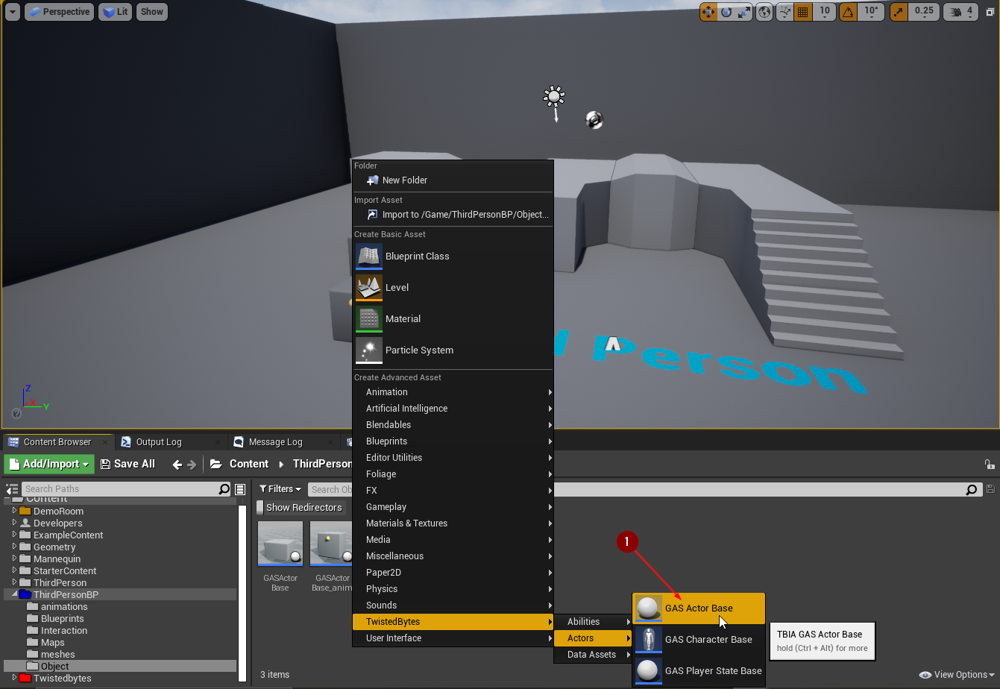
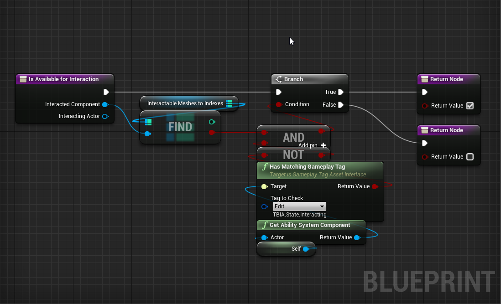
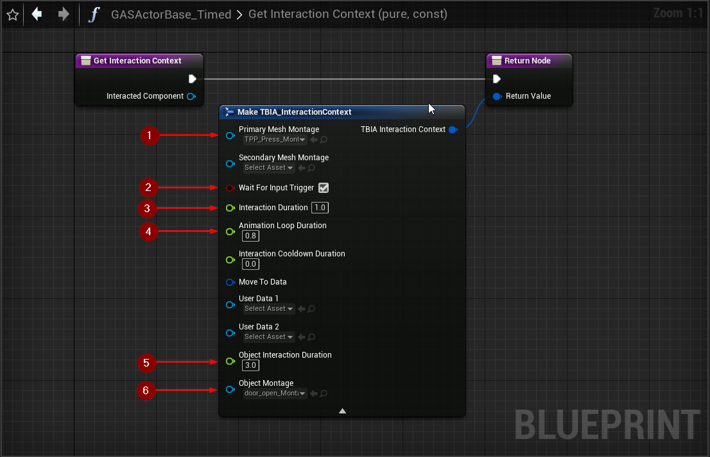
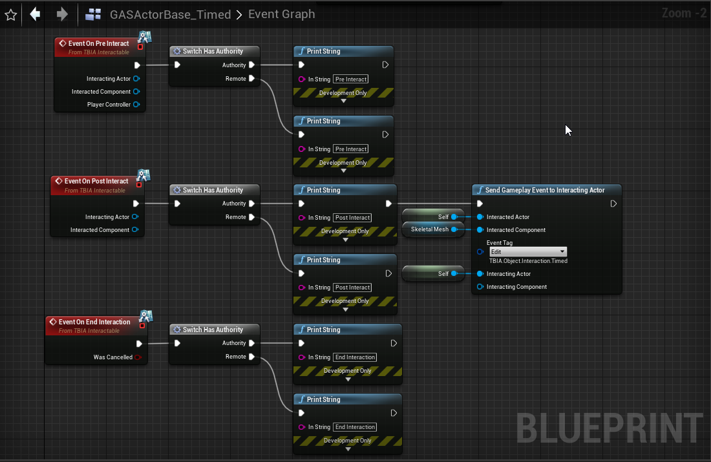

import {Step} from '@site/src/lib/utils.mdx'

## Create Object Interaction Timed

To create an *Object Interaction Timed* ability, right-click in the *Content Browser*
and select `TwistedBytes | Abilities | Object Interaction Timed` as shown in the image below.

## Setup Interactable Actor

Create new *GAS Actor Base*, right-click in the *Content Browser* and select 
`TwistedBytes | Actors | GAS Actor Base` as shown in the image below.

Replace *Default Scene Root* with *Skeletal Mesh Component* <Step text="1"/>. Next, select a *Skeletal Mesh* you want to use.
In this example, we will use the *Door* static mesh <Step text="2"/> that is shipped with `TBIA_Demo`. Then you can easily create
an *Animation Blueprint* for the *Door* mesh by right-clicking in the *Content Browser*. Select
`Animation | Animation Blueprint` and then select the *Door* skeletal mesh. After that, assign it to the *Door* Skeletal mesh
in the newly created *GAS Actor Base* <Step text="3"/>. 

Select `TBIA_InteractionComponent` <Step text="1"/>, go to the *Details Panel* and add `Object Interaction Timed` <Step text="2"/> to the *Granted Abilities on Start* property.

We then add four static mesh components <Step text="1"/> so that the door has some kind of buttons that can be interacted with.
Place the static mesh components next to the door mesh as shown in <Step text="2"/>.

Create a new *map* variable `InteractableMeshesToIndexes` <Step text="1"/>. As variable types, choose `Primitive Component` for the key <Step text="2"/> and `Integer` for the value <Step text="3"/>.

Switch to the `Construction Script` tab and add both button static mesh components to the *map* variable `InteractableMeshesToIndexes` <Step text="4"/>, <Step text="5"/> as shown in the image below.

### Playing montages on Interactable Actors

We will use a simple technique to play montages on *Interactable Actors*.

Open the *Door AnimBP* and drag the `door_open` animation sequence into the `AnimGraph` <Step text="1"/>.
Then, right-click on the animation sequence and select `Convert to Single Frame Animation` <Step text="2"/>.

Now, the animation sequence will look like what you see in the image below <Step text="3"/>. Add a montage slot <Step text="4"/> to be able to specify
from where the montage will override the door's animation.

## Setup Door Montage

Open `door_open_Montage` (shipped with the demo project) and make sure the *Montage Sections* <Step text="1"/>,<Step text="2"/>,<Step text="3"/> are named the same as in the `GA_ObjectInteractionTimed`
as in the image below. The montage slot should match the defined slot in the *Door AnimBP* <Step text="4"/>.

Also make sure that the *Interact* montage section loops on itself <Step text="5"/> as shown in the image below.

## Interactable Actor Logic

Open the new `GasActorBase` and override `Is Available for Interaction`. We want to check if the interacted component
(the component that the character is looking at) is the static mesh component of the button.

To do this, we simply call *Find* on the *map* variable `Interactable Meshes to Indexes` holding all references to our static mesh components.

Also make sure that the *Door* is **not** in the `Interacting` state. If both checks evaluate to `true`, then the *Door* is available for potential interactions.

Override `Is Blocked for Interaction` and return `true` which means it's blocked so that no one can interact with the *Door* if its state
is `Interacting`.

Override `Get Interaction Context` and add a new *Make `TBIA_InteractionContext`* node.

`Primary Mesh Montage` <Step text="1"/> is the interaction animation montage that we want to play on the *PlayerCharacter* when interacting with the *Door*.

`Wait for Input Trigger` <Step text="2"/> is set to `True` so that if the *Player* releases the *Interaction Button* the interaction will be cancelled.

`Interaction Duration` <Step text="3"/> is `1 sec` which is the whole time needed for the *Interaction* to finish successfully.

`Animation Loop Duration` <Step text="4"/> is `0.8 sec` which is the time that you want to loop the montage on.

`Object Interaction Duration` <Step text="5"/> is the lifetime of `Object Interaction Timed` Ability that will run on the *Door*.

`Object Montage` <Step text="6"/> is the montage that the `Object Interaction Timed` Ability will try to play when it starts.

Go to the *Event Graph* and navigate to `On Post Interact`. When this event is triggered on
`Authority` <Step text="1"/>, we want to call `Send Gameplay Event to Interacting Actor`.

Pass the `Interacted Actor` as `Self`, `Interacted Component` as the Door Skeletal Mesh Component, set the *EventTag*
to `TBIA.Object.Interaction.Timed`, *Interacting Actor* will be *Self* referenced also.

Place the *Door* actor in the world and Press *Play* in the Unreal Editor, look at the door button and press the `E` key which is the Interaction button that we configured earlier.
You will see the *PlayerCharacter* playing the interaction montage for 1 second then the door will open for 3 seconds then it will be closed.

