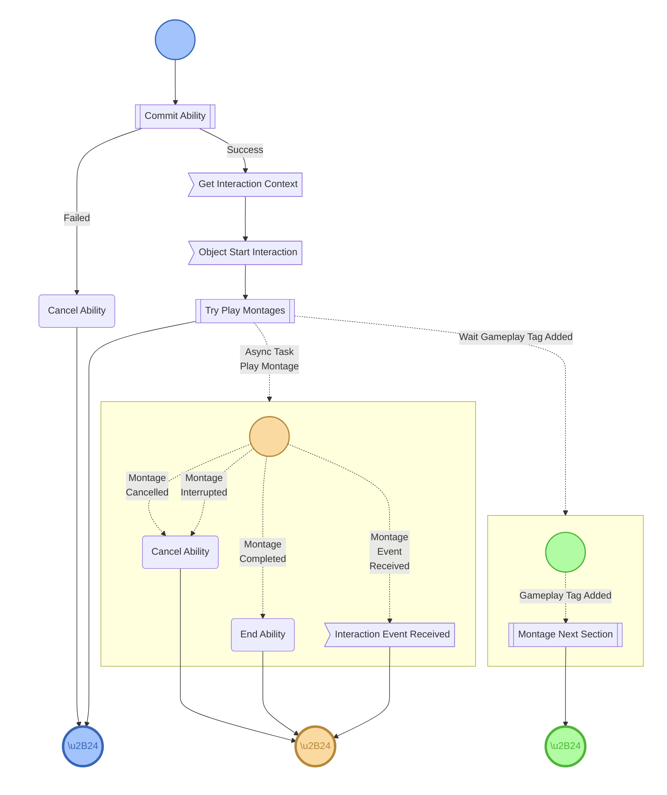
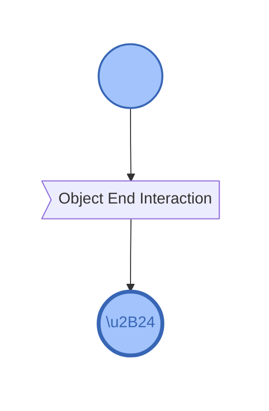

## Event ActivateAbility 

```mermaid
flowchart TD
    START(("\u2B24"))
    STOP(("\u2B24"))
    
    START_ASYNC1(("\u2B24"))
    STOP_ASYNC1(("\u2B24"))

    START_ASYNC2(("\u2B24"))
    STOP_ASYNC2(("\u2B24"))
    
    CANCEL_ABILITY(Cancel Ability)
    
    CANCEL_ABILITY_ASYNC1(Cancel Ability)
    END_ABILITY_ASYNC1(End Ability)
    
    COMMIT_ABILITY[[Commit Ability]]
    GET_INTERACTION_CONTEXT>Get Interaction Context]
    OBJECT_START_INTERACTION>Object Start Interaction]
    TRY_PLAY_MONTAGES[[Try Play Montages]]
    INTERACTION_EVENT_RECEIVED>Interaction Event Received]
    MONTAGE_NEXT_SECTION[[Montage Next Section]]
    
    START --> COMMIT_ABILITY
    
    COMMIT_ABILITY --> |Success| GET_INTERACTION_CONTEXT
    COMMIT_ABILITY --> |Failed| CANCEL_ABILITY
    GET_INTERACTION_CONTEXT --> OBJECT_START_INTERACTION
    OBJECT_START_INTERACTION --> TRY_PLAY_MONTAGES

    TRY_PLAY_MONTAGES -.-> |Async Task <br/> Play Montage| sub_async1
    TRY_PLAY_MONTAGES -.-> |Wait Gameplay Tag Added| sub_async2
    TRY_PLAY_MONTAGES --> STOP
    
    CANCEL_ABILITY --> STOP
    


    START_ASYNC1 -..-> |Montage <br/> Event <br/> Received| INTERACTION_EVENT_RECEIVED
    START_ASYNC1 -.-> |Montage <br/> Completed| END_ABILITY_ASYNC1
    START_ASYNC1 -.-> |Montage <br/> Interrupted| CANCEL_ABILITY_ASYNC1
    START_ASYNC1 -.-> |Montage <br/> Cancelled| CANCEL_ABILITY_ASYNC1
    INTERACTION_EVENT_RECEIVED --> STOP_ASYNC1
    END_ABILITY_ASYNC1 --> STOP_ASYNC1
    CANCEL_ABILITY_ASYNC1 --> STOP_ASYNC1

    START_ASYNC2 -.-> |Gameplay Tag Added| MONTAGE_NEXT_SECTION
    MONTAGE_NEXT_SECTION --> STOP_ASYNC2
    
    subgraph sub_container [ ]
        direction TB
        
        START
        
        subgraph sub_main [ ]
            direction TB

            COMMIT_ABILITY
            GET_INTERACTION_CONTEXT
            OBJECT_START_INTERACTION
            TRY_PLAY_MONTAGES

            CANCEL_ABILITY
        end
        
        subgraph sub_async1 [ ]
            direction TB
            
            START_ASYNC1
            INTERACTION_EVENT_RECEIVED
            CANCEL_ABILITY_ASYNC1
            END_ABILITY_ASYNC1

        end

        subgraph sub_async2 [ ]
            direction TB
            
            START_ASYNC2
           
            MONTAGE_NEXT_SECTION
        end
    end
    
    subgraph sub_stop [ ]
        STOP
        STOP_ASYNC1
        STOP_ASYNC2
    end

    classDef sty_start fill:#A2C3FB,color:#A2C3FB,stroke-width:2px,stroke:#3866B5;
    classDef sty_stop fill:#A2C3FB,color:#3866B5,stroke-width:4px,stroke:#3866B5;
    classDef sty_start_async1 fill:#FBDAA2,color:#FBDAA2,stroke-width:2px,stroke:#B58738;
    classDef sty_stop_async1 fill:#FBDAA2,color:#B58738,stroke-width:4px,stroke:#B58738;
    classDef sty_start_async2 fill:#B1FBA2,color:#B1FBA2,stroke-width:2px,stroke:#4DB538;
    classDef sty_stop_async2 fill:#B1FBA2,color:#4DB538,stroke-width:4px,stroke:#4DB538;
    classDef sty_subgraph_transparent fill:#0000,stroke:#0000;
    
    class sub_container sty_subgraph_transparent;
    class sub_main sty_subgraph_transparent;
    %%class sub_async1 sty_subgraph_transparent;
    %%class sub_async2 sty_subgraph_transparent;
    class sub_stop sty_subgraph_transparent;
    
    class START sty_start;
    class STOP sty_stop;
    class START_ASYNC1 sty_start_async1;
    class STOP_ASYNC1 sty_stop_async1;
    class START_ASYNC2 sty_start_async2;
    class STOP_ASYNC2 sty_stop_async2;

```

## Event OnEndAbility

```mermaid
flowchart TD
    START(("\u2B24"))
    STOP(("\u2B24"))
    
    B>Object End Interaction]
   
    subgraph sub_container [ ]
        direction TB
        
        START 
        START --> B
        B --> STOP
    end
    
    classDef sty_start fill:#A2C3FB,color:#A2C3FB,stroke-width:2px,stroke:#3866B5;
    classDef sty_stop fill:#A2C3FB,color:#3866B5,stroke-width:4px,stroke:#3866B5;
    classDef sty_subgraph_transparent fill:#0000,stroke:#0000;
    
    class sub_container sty_subgraph_transparent;
    class START sty_start;
    class STOP sty_stop;
```
