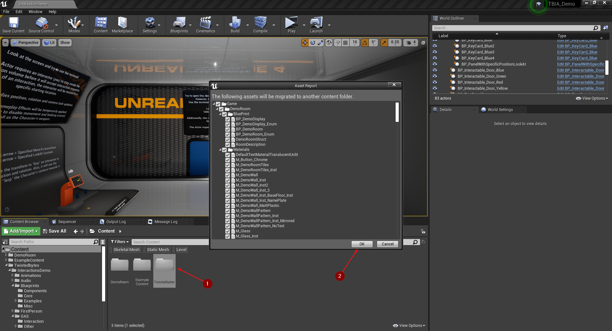
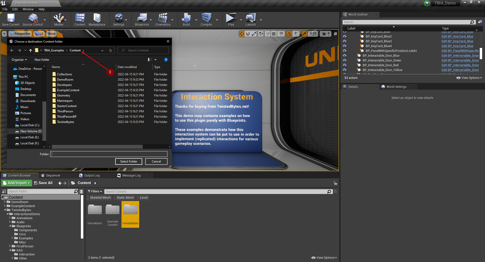
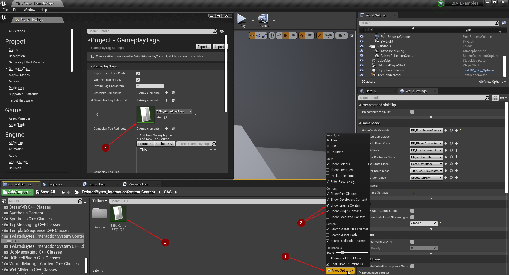
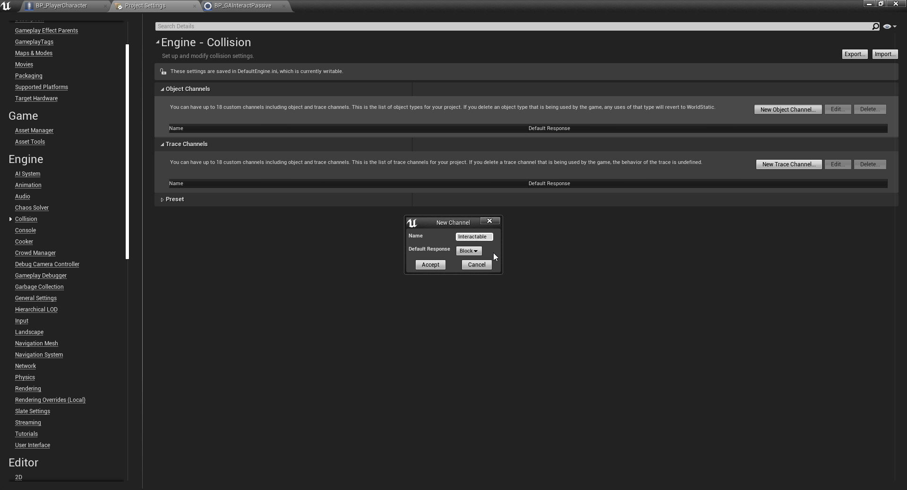
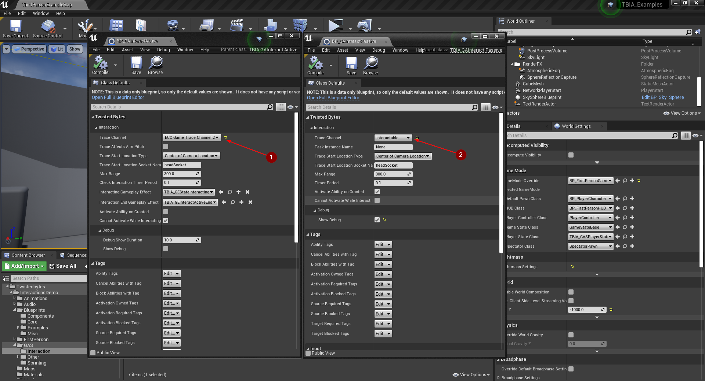
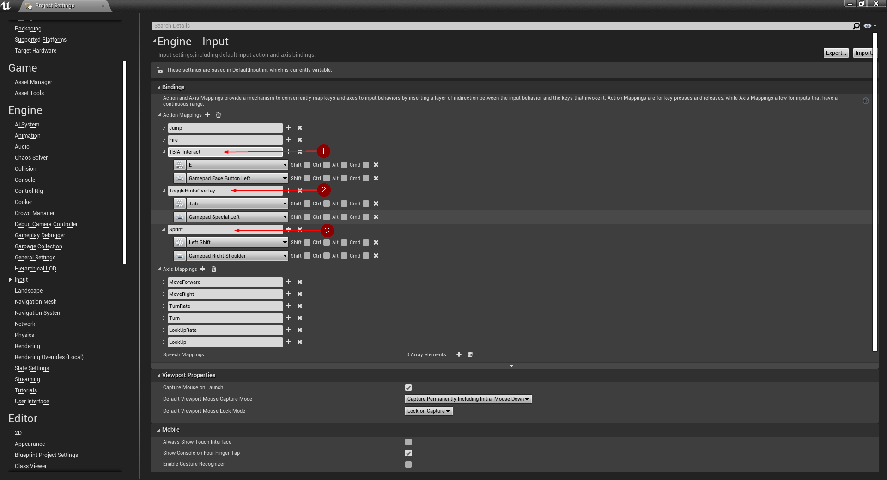
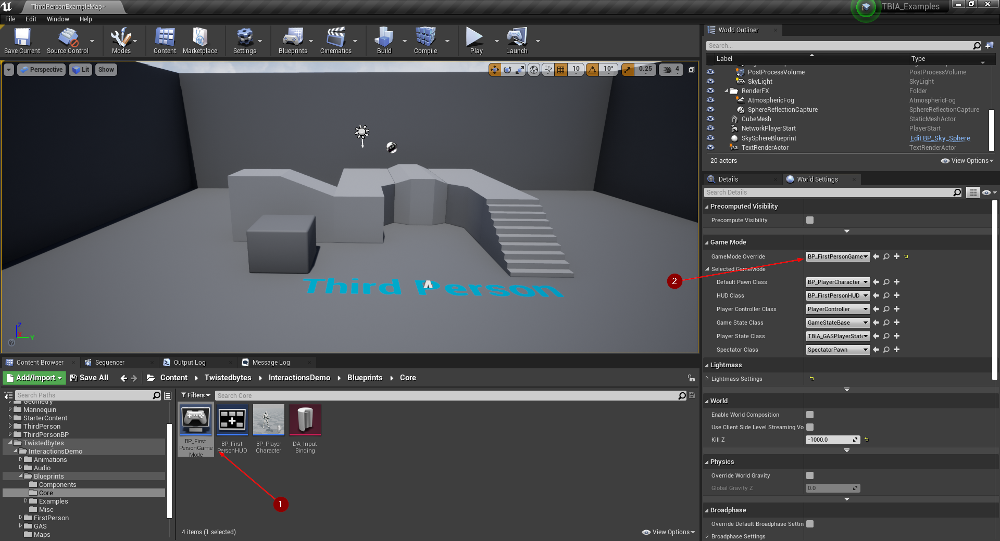
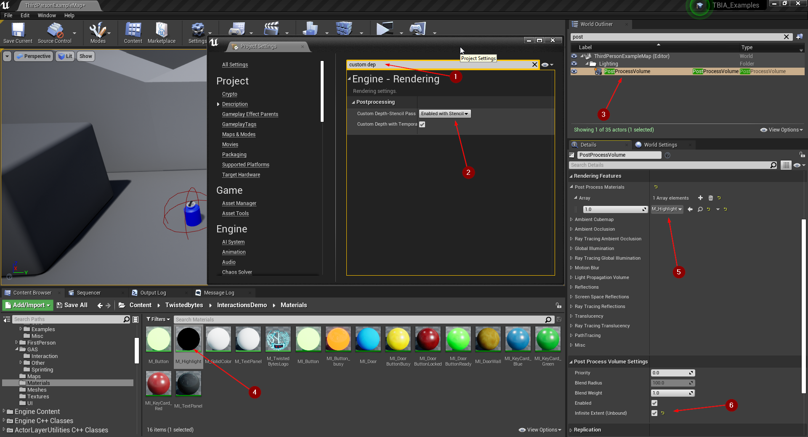

import {Step} from '@site/src/lib/utils.mdx'

## Demo Project Migration
After you have checked out the [`TBIA_Demo`](https://static.twistedbytes.net/downloads/7a42299c-6047-e1e8-5b98-c16ab1868b89/TBIA%20Demo%20Project/) project you might want to use its example setup as a base for your own project.

This migration guide will help you with the process of correctly transferring all necessary files as well as making important changes to your own project.

### Content Folder Migration
Open the `TBIA_Demo` project and select the folder `TwistedBytes` <Step text="1"/> in the *Content Browser*. Right-click this folder and
select `Migrate...`. Then, select all assets in the *Asset Report* window and confirm by clicking on the OK button <Step text="2"/>.

A new window will pop up where you need to specify the `Content` <Step text="1"/> folder of the project you want to migrate the `TwistedBytes` demo files to.

### Add Gameplay Tags
Our plugin uses a *Gameplay Tag Data Table* asset that holds all mandatory tags needed for its core functionalities to work correctly in any project.
Unfortunately, the previous migration action you executed within Unreal Editor does not migrate Gameplay Tags.

The following steps will explain in detail how to add all required Gameplay Tags to your own project.

In the *Content Browser*, select the plugin folder named `TwistedBytes_InteractionSystem Content` and navigate further into the `GAS` sub-folder.
In this folder you will find the mentioned *Gameplay Tag Data Table* asset called `TBIA_GamePlayTags` <Step text="3"/>.

This asset file needs to be added to the `GameplayTags` section of your project settings as shown in <Step text="4"/>.

:::note
In order to find the *Gameplay Tag Data Table* asset, you might first need to make the plugin folder visible by clicking on
*View Options* <Step text="1"/> in the bottom right corner of the *Content Browser*.

Make sure to check both `Show Plugin Content` and `Show Engine Content` <Step text="2"/>.
:::

You are now all set regarding Gameplay Tags!

However, in the demo project we also set up some *Gameplay Tags*, so that we can demonstrate to you how to
implement certain gameplay mechanics using our plugin. So, it is totally up to you if you want to follow the rest of the instructions in this subsection.

Add these tags in project settings by writing them as shown in <Step text="1"/> and <Step text="2"/>.

Alternatively, you can save yourself some typing work and just copy these tags from the demo project.
Use your file manager of choice (e.g. Explorer) and navigate to `<TBIA_Demo Project Root Folder>/Config/`.

Open the file `DefaultGameplayTag.ini` <Step text="1"/> in a text editor and copy all lines starting with `+GameplayTagList=` as shown in <Step text="2"/>
to your project's `DefaultGameplayTag.ini`.

:::note
You will need to restart the Unreal Editor after modifying `DefaultGameplayTag.ini` before your newly added Gameplay Tags will become available in your project.
:::

After adding these tags, open the Blueprint `BP_PlayerCharacter` that is located in `InteractionsDemo/Blueprints/Core/`. Since Gameplay Tags are not migrated
by Unreal Editor, any tags that are not found in the target project will be removed in all Blueprint nodes.

Reassign the tag as shown below in <Step text="1"/>. Next, open the macro `Check Controller` at <Step text="2"/> and reassign the Gameplay Tag as
shown in <Step text="3"/>.

### Collision Settings
The demo project uses a custom *Object Collision Channel* that needs to be set up in the project settings.

Go to `Edit | Project Settings ...` and select `Collision` under the `Engine` section.

Add a new *Object Collision Channel*, name it `Interactable` and set the *Default Response* to `Block`.

After adding the new *Object Collision Channel*, navigate to `BP_GAInteractPassive` and `BP_GAInteractActive`. The value of the *Trace Channel*
property will be `ECC Game Trace Channel 2` as shown in <Step text="1"/>.

Change the value to the new `Interactable` channel as shown in <Step text="2"/> in both Blueprints.

### Input Settings
Go to `Edit | Project Settings ...` and select  `Input` under the `Engine` section.

Add three *Action Mappings* with the exact same names as shown in <Step text="1"/>, <Step text="2"/>, and <Step text="3"/>.

### Setting GameMode
Navigate to the folder shown in the image below and select `BP_FirstPersonGameMode` <Step text="1"/>.
In the *World Settings* tab, assign the *GameMode Override* property with the selected *Game Mode* asset as shown in <Step text="2"/>.

:::note
In case you cannot find the *World Settings* tab in Unreal Editor, go to `Window | World Settings` to open it.
:::

### PostProcess Material
The demo project uses a custom *PostProcess Material* so that objects focused by a player can be highlighted.
In order to make the highlighting feature work, change *Custom Depth-Stencil Pass* to `Enabled with Stencil` in your project settings.
The easiest way to find it is by searching for `Custom Depth` in the *Project Settings* search field <Step text="1"/>.

Then, select your *PostProcessVolume* in the *World Outliner* tab <Step text="3"/> and add our custom *PostProcess Material* `M_Highlight`
at <Step text="4"/> to the `Post Process Materials` array as shown in <Step text="5"/>. Also make sure that
`Infinite Extent (Unbound)` <Step text="6"/> is enabled in your *PostProcessVolume*.

