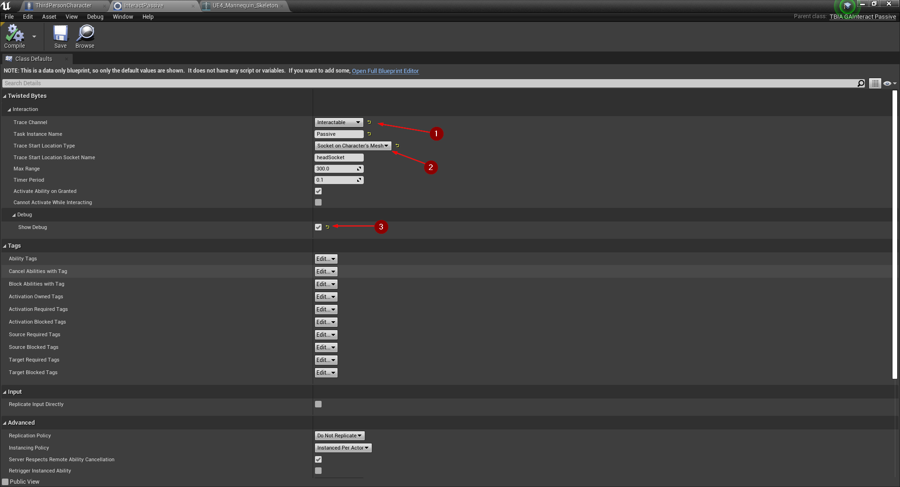
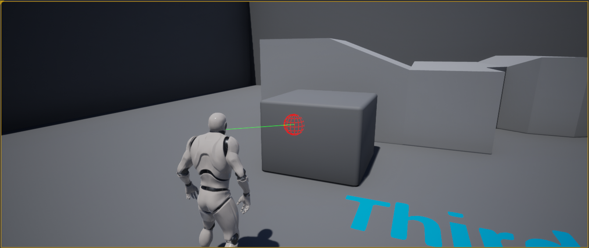

import {Step} from '@site/src/lib/utils.mdx'

## Setting up player character

To get started, create a new project based on Unreal Engine's *Third Person Template*.

Open the `ThirdPersonCharacter` Blueprint and go to *Class Settings* <Step text="1"/>.
Change the *Parent Class* <Step text="2"/> from `Character` to `TBIA_GASCharacter`.
After changing the *Parent Class*, two new components `TBIA Interaction Component` and
`TBIA Ability System Component` will appear <Step text="3"/>.

Also note that your Character Blueprint now inherits two interfaces <Step text="4"/>
`Ability System Interface` and `TBIA Interactable` that we will make use of in a moment.

For a better third-person perspective move the camera's location a bit to the side, e.g.
`(0.0, 80.0, 60.0)` <Step text="1"/>.

Next, create a socket on the head bone <Step text="1"/> and name it
`headSocket` <Step text="2"/>. Keep the location at its default.

## Create Interact Passive Ability

To create an *Interact Passive* ability, right-click in the *Content Browser* and
select `TwistedBytes | Abilities | Interact Passive` as shown in <Step text="1"/>.

Name the newly created asset `InteractPassive`.

Open your newly created `InteractPassive` Blueprint and change the *Trace Channel* property to your
own *Collision Channel*, e.g. `Interactable` <Step text="1"/> (see [Migration Guide](../getting-started/migration-guide#collision-settings)).

Set `Trace Start Location Type` to `Socket on Character's Mesh` <Step text="2"/>.

For easier debugging of our *Interact Passive Ability* we also want to enable `Show Debug` <Step text="3"/>.

:::note
The max interaction range defaults to 3 meters. For this example, the default value will work just fine.
:::

Press *Play* in the Unreal Editor. You should now see a debug line trace that starts from your character's head
as shown in the image below which means your *Interact Passive Ability* is set up correctly.

## Create your first interactable object

To create your first interactable object, right-click in the *Content Browser* and select
`TwistedBytes | Actors | GAS Actor Base` <Step text="1"/>.

Open the newly created Actor Blueprint and add a *Static Mesh Component*. Make this component the default root
component by dragging and dropping it onto `DefaultSceneRoot` as shown in the image below.

Select the `StaticMesh` in the *Components* tab. Then, in the *Details* tab, assign `1M_Cube_Chamfer` to the
`Static Mesh` property <Step text="1"/> and lower its scale to `0.25` for all three axis <Step text="2"/>.

In the `My Blueprint` tab in the lower-left, expand the `TwistedBytes` interface functions and override
`On Interactable Target Found` <Step text="1"/> and `On Interactable Target Lost` <Step text="2"/>.

Add `Print String` nodes to print some debug information about interactable actors as shown in the *Event Graph* in
the image below.

This concludes the initial set up of our interactable cube. Now, place one or more instances of it in the level and
then let's test our implementation. Press *Play* in the Unreal Editor.

:::note
Remember that we did not modify the max range for interactions in our `PassiveAbility` Blueprint.
This means we can only interact within 3 meters between the player character and an interactable object.
:::

Walk up to an interactable cube so that the player character is in range for interactions.
You should now see debug messages being printed whenever you look at the cube.

When you look away from the cube the `On Interactable Target Lost` event will be triggered. You should see
debug messages as shown in the image below.

## Extending Passive Ability Functionality

Open the Blueprint of our interactable test cube (`GASActorBase`) again. In the interface functions,
override `Is Available for Interaction`. Add a `Print String` node as shown in  <Step text="1"/> and
set the `Return Value` to `true` <Step text="2"/>.

Now press *Play* in the Unreal Editor and see what will happen when you try to interact with our test cube.

As you can see the `Is Available for Interaction` interface function <Step text="1"/> was called
before the `On Interactable Target Found` event was fired <Step text="2"/>. This is because the
`Interact Passive` ability periodically executes a line trace to check for potential interactable objects
in view and range.

If an interactable actor (i.e. an actor implementing the `TBIA_Interactable` interface) has been found,
the passive ability will first call `Is Available for Interaction` <Step text="3"/> to determine whether this
interactable actor is currently available for interactions or not. Only if the interactable is indeed available,
the `On Interactable Target Found` event will be fired in order to notify all potential interactors.

Let's set the return value of `Is Available For Interaction` to ``false` <Step text="1"/> and then
press *Play* again.

The debug messages show that only the `Is Available For Interaction` interface function is now being
called <Step text="1"/> and that the `On Interactable Target Found` event is not triggered at all.

This is because our implementation for the test cube now always answers *"No, I'm not available at the moment"*
whenever our passive ability asks for the cube's current availability status.

