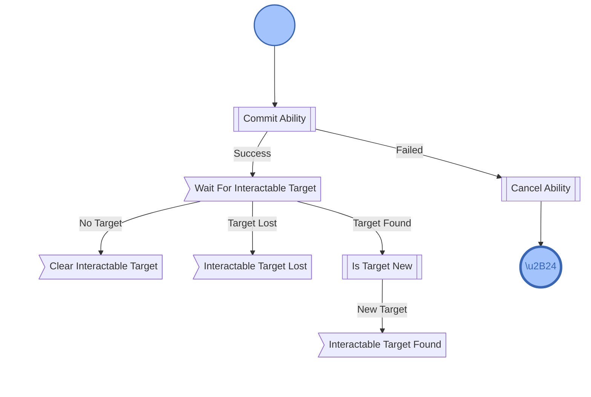

## Event ActivateAbility 

```mermaid
flowchart TD

    START(("\u2B24"))
    STOP(("\u2B24"))

    CANCEL_ABILITY[[Cancel Ability]]

    B[[Commit Ability]]
    D>Wait For Interactable Target]
    F>Clear Interactable Target]
    H>Interactable Target Lost]
    J[[Is Target New]]
    K>Interactable Target Found]

    START --> B

    B --> |Success| D
    B --> |Failed| CANCEL_ABILITY
    D --> |No Target| F
    D --> |Target Lost| H
    D --> |Target Found| J
    J --> |New Target| K
    
    CANCEL_ABILITY --> STOP
    
    subgraph sub_container [ ]
        direction TB

        subgraph sub_main [ ]
            direction TB
        
            B
            D
            F
            H
            J
            K
        end
            
    end

    classDef sty_start fill:#A2C3FB,color:#A2C3FB,stroke-width:2px,stroke:#3866B5;
    classDef sty_stop fill:#A2C3FB,color:#3866B5,stroke-width:4px,stroke:#3866B5;
    classDef sty_subgraph_transparent fill:#0000,stroke:#0000;
    
    class START sty_start;
    class STOP sty_stop;
    class sub_container sty_subgraph_transparent;
    class sub_main sty_subgraph_transparent;


```
