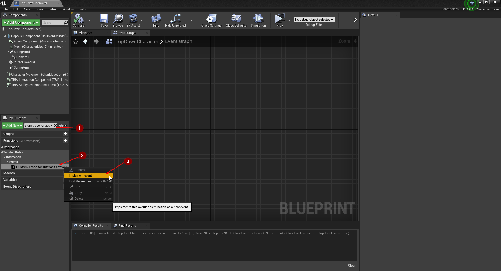

import {Step, UE} from '@site/src/lib/utils.mdx'

:::info
This is a sequel of the previous *Custom Trace In Passive Ability* guide where you can find [here](https://twistedbytes-net.github.io/TBIA-Documentation/docs/features/passive-custom-trace)
:::

## Active Ability Setup

Open the Active ability inherited from *TBIA_GAInteractActive* and go to `Trace Start Location Type` and set it to `Custom Trace`<Step text="1"/>, 
as shown in the image below.

## Character Setup

Now open your *Player Character* class that should be inherited from *TBIA_GASCharacter*.

In *MyBlueprint* panel on the left side <Step text="1"/>, search for *Custom Trace for Interact Active Ability* it will appear
under `Twisted Bytes | Interaction | Events`<Step text="2"/>. Right click on the function and click on *Implement Event* <Step text="3"/>.

A new *Blueprint* graph will open to implement the custom logic for this function.

Here we will copy the same logic from what we did previously in [*Custom Trace In Passive Ability*](https://twistedbytes-net.github.io/TBIA-Documentation/docs/features/passive-custom-trace#character-setup).

## Play

Click on *Play* and hover your mouse over the *Interactable Actors* in the map, Click the interaction button which you're binding it to your *Active ability*.
You will see that the *Interactable Actor* will be picked up.

