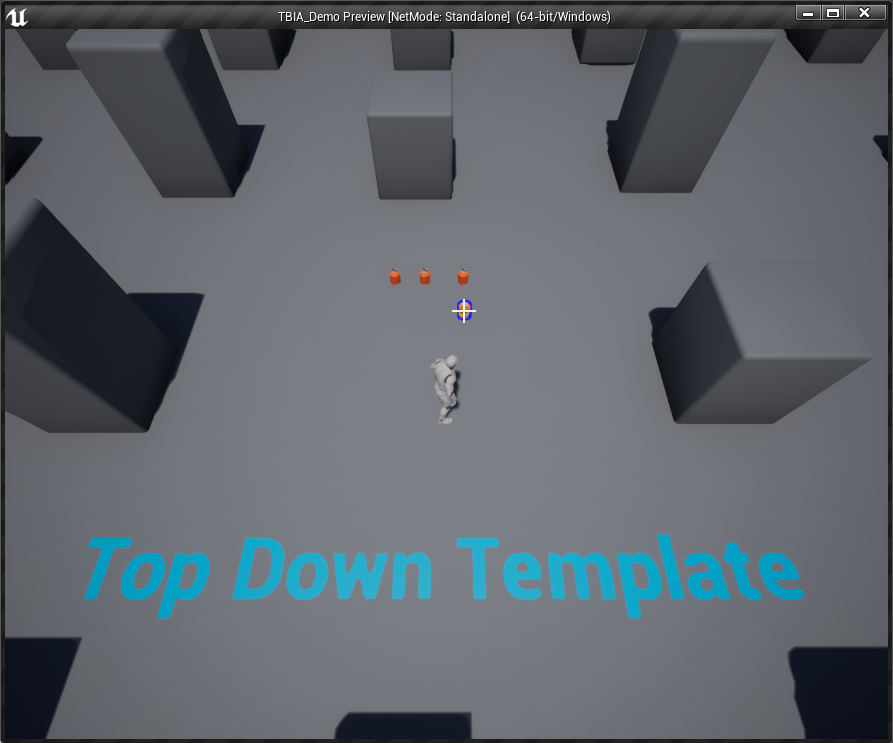

import {Step, UE} from '@site/src/lib/utils.mdx'

## Project Setup

In order to show a use case for the custom trace functionality, we will create a new project based on Unreal Engine's *Top Down Template*.

:::info
To shorten this guide, you can refer to the *Quick Start* guide for initial setup [here](https://twistedbytes-net.github.io/TBIA-Documentation/docs/quick-start/using-passive).
:::

## Passive Ability Setup

Open the passive ability inherited from *TBIA_GAInteractPassive* and go to `Trace Start Location Type` and set it to `Custom Trace`<Step text="1"/>, 
as shown in the image below.

## Character Setup

Now open your *Player Character* class that should be inherited from *TBIA_GASCharacter*.

:::note
If you are using GASCompanion [this guide](https://twistedbytes-net.github.io/TBIA-Documentation/docs/integration_guides/gas-companion) can help you with integration. Or take a look at [this guide](https://twistedbytes-net.github.io/TBIA-Documentation/docs/integration_guides/unreal-engine-5-plugins) which works with UE5 only.
:::

In *MyBlueprint* panel on the left side <Step text="1"/>, search for *Custom Trace for Interact Passive Ability* it will appear
under `Twisted Bytes | Interaction | Events`<Step text="2"/>. Right click on the function and click on *Implement Event* <Step text="3"/>.

A new *Blueprint* graph will open to implement the custom logic for this function.

In this example we will trace for *Interactable Actors* under the cursor by querying the object type `Interactable`. Then return the hit result of the trace and if the *Interactable Actor* that we hit is available for interaction or not. All logic can be seen in the image below.

## Interactable Actor

Here we will use from our [demo project](https://drive.google.com/drive/folders/1I7TXOPM-9tHABdhWqy58TAR6-lenSy1E?usp=sharing)
*BP_ShieldCell_item* which is inherited from `TBIA_GASActorBase`. Just place couple of these *Actors* in the level to test the interaction.

## Play

Click on *Play* and hover your mouse over the *Interactable Actors* in the map, Then you will see that the custom trace worked as intended.

