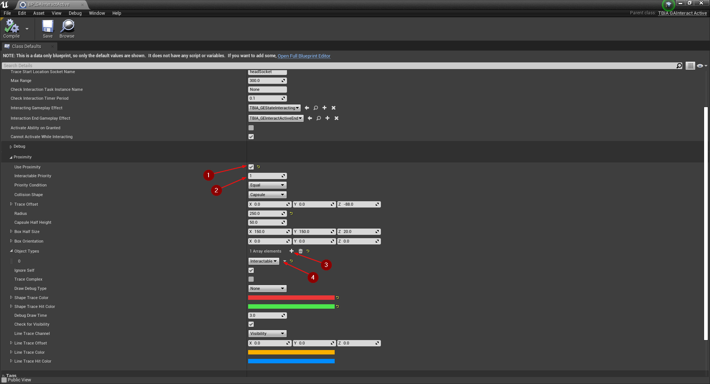
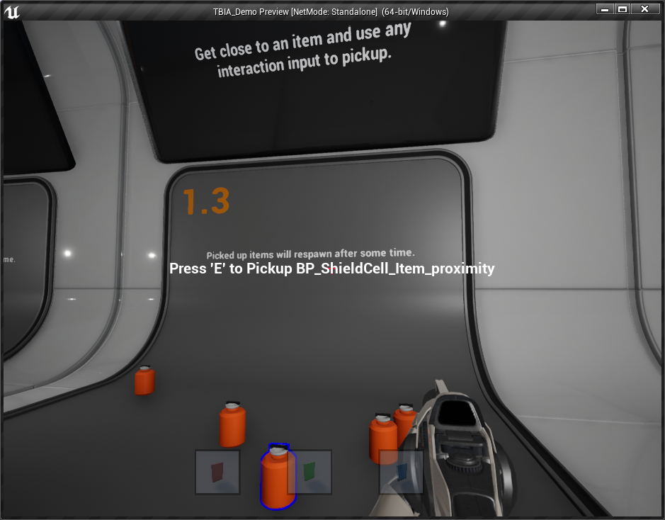

import {Step, UE} from '@site/src/lib/utils.mdx'

## What Is Proximity Interactions

*Proximity Interactions* is the ability to interact with an interactable object(weapon pickup) without looking directly towards it. 
But you can interact with the interactable object when you are close enough to it. This functionality is added to `TBIA_GAInteractPassive` and 
`TBIA_GAInteractActive` but if you would like to added it to your custom abilities you can find the functions
`ProximityTraceForInteractables` and `GetNearestInteractableObject` inside `TBIA_InteractionFunctionLibrary`.

Proximity interactions are added to `TBIA_GAInteractPassive` and `TBIA_GAInteractActive` which can be activated when *Use Proximity* is set to true, here
are some explanation for what you can customized for this functionality:

 * `InteractablePriority`: Integer that hold the priority of the interactable objects to interact with.
 * `PriorityCondition`: Select the condition of what are the prioritized interactable objects to return.
 * `ProximityTimerPeriod`: How long to wait in seconds before executing the proximity interaction again.
 * `CollisionShape`: The collision shape of the proximity trace.
 * `TraceOffset`: Offset the start location of the proximity trace which is the world location of the capsule in the character class.
 * `Radius`: Radius for the circle of sphere shape selected in the *CollisionShape*.
 * `CapsuleHalfHeight`: Capsule half height when the *CollisionShape* is capsule.
 * `BoxHalfSize`: Box size when the *CollisionShape* is box.
 * `BoxOrientation`: Box orientation when the *CollisionShape* is box.
 * `ObjectTypes`: Array of object types to trace *CollisionShape*.
 * `bIgnoreSelf`: Ignore self on *CollisionShape*.
 * `bTraceComplex`: True to test against complex collision, false to trace against simplified collision for the *CollisionShape*. 
 * `DrawDebugType`: Draw debug type for the *CollisionShape*. 
 * `ShapeTraceColor`: Trace color for the *CollisionShape*.
 * `ShapeTraceHitColor`: Trace hit color for the *CollisionShape*
 * `DrawTime`: Draw time of the trace.
 * `bCheckForVisibility`: Check if the objects we are tracing for are behind other meshes.
 * `LineTraceChannel`: Trace channel for the visibility check trace.
 * `LineTraceOffset`: Offset of the start location for the visibility check.
 * `LineTraceColor`: Trace color for the visibility check. 
 * `LineTraceHitColor`: Trace hit color for the visibility check. 

## Interact Passive Ability Setup

In order to use the *Proximity Interactions* in the *Passive Ability*, open your passive ability that is inherited from `TBIA_InteractPassive`.
Under `Twisted Bytes | Interactions` set *Use Proximity* to true <Step text="1"/>, for *Interactable Priority* set it to *2* <Step text="2"/> (or whatever you want). Scroll down to *Object Types* and click on the add icon *+* <Step text="3"/> then select *Interactable* <Step text="4"/>.

:::note
The `Interactable` object type we selected here is what we already defined in previous setup, you can see [here](https://twistedbytes-net.github.io/TBIA-Documentation/docs/getting-started/migration-guide#collision-settings).
:::

## Interact Active Ability Setup

Open your *Interact Active* ability that is inherited from `TBIA_InteractActive`, and under `Twisted Bytes | Interactions` set *Use Proximity* to true 
<Step text="1"/>. Then set *Interactable Priority* <Step text="1"/> the same as you set in *Interact Passive* ability. After that scroll down to *Object Types*
and click on the add icon *+* <Step text="3"/> then select *Interactable* <Step text="4"/>.

:::info
In order to visualize the proximity tracing, set `Draw Debug Type` to *For Duration*. For the *Passive Ability* set *Draw Time* equal to *Proximity Timer Period*.
:::

## Interactable Object Setup

Here we are using *BP_ShieldCell_Item* from the [`TBIA_Demo`](https://drive.google.com/drive/folders/1I7TXOPM-9tHABdhWqy58TAR6-lenSy1E?usp=sharing).
This *Blueprint* class is inherited from `TBIA_GASActorBase` which have the *ASC* and the *Interaction Component* added, where in UE5 it is not essential anymore to have the *ASC* implemented in C++ and you can add it directly in *Blueprints*.

Open the *Blueprint* file and select the *SkeletalMesh* <Step text="1"/> go to *Details Panel* and under *Collision* set the `Object Type` to *Interactable* <Step text="2"/>, and make sure that the `Visibility` trace channel is set to *Blocked* <Step text="3"/>. Then open the overridden function *GetInteractionContext* and set the `Object Interaction Priority` <Step text="4"/> to what you set in the abilities above.

## Play

Place the *Interactable Actor* in level and press *Play*, get close to the placed *Actor* as you can see in the image below you can interact with it.

