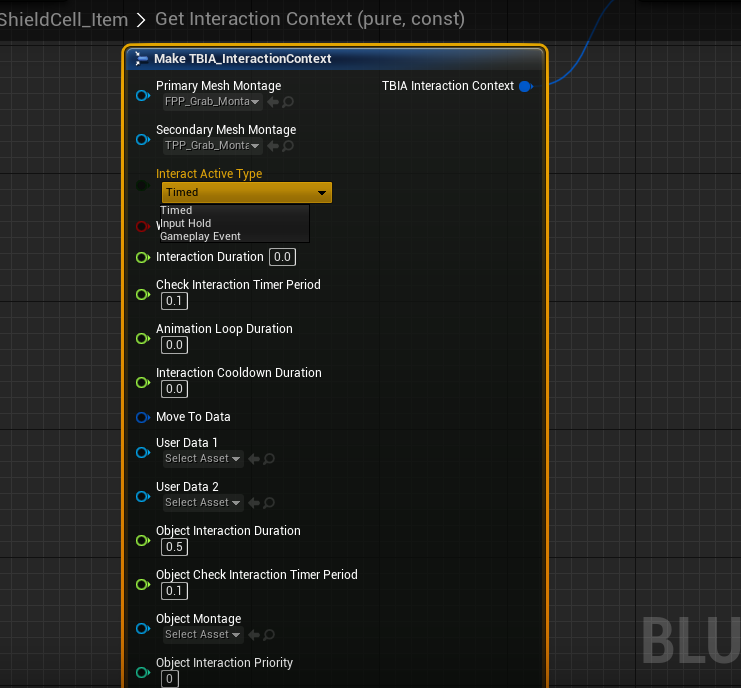

import {Step, UE} from '@site/src/lib/utils.mdx'

## Interaction Types for Interact Active

The struct `TBIA_InteractionContext` now have an enum that you can specify for each *Interactable Actor*
how you can handle interactions on them.

The Types that are available now are:
 * Timed Interaction.
 * Input Hold Interaction.
 * Gameplay Event Interaction.

### Timed Interaction

Using `Timed interaction` is the default type of interactions where `TBIA_GAInteractActive` will wait for
a specific duration set in the *Interaction Context* struct and when time ends the interaction will be finished.

### Input Hold Interaction

Setting *Interact Active Type* variable in the *Interaction Context* to `Input Hold Interaction` will define interaction
logic as follows:

When the *Input Key* bound to `TBIA_GAInteractActive` is triggered, The interaction logic will flow till `Pre-Interact`
and then `IsInteractionStillValid` is being called as long as we are holding the input key.
When the input key is *Released* `Post-Interact` is called and the interaction will end.

### Gameplay Event Interaction

In this type of interaction, when activating `TBIA_GAInteractActive` by triggering the *Input Key* that is already
bound to it, it will start the interaction and call `Pre-Interact`. After that `IsInteractionStillValid` is being called
on timer from the value of `CheckInteractionWhileWaiting` and will be kept triggered and waiting until a gameplay event
is being called on the interacting actor with the gameplay tag `TBIA.Event.Interaction.InteractActiveEnd`.

