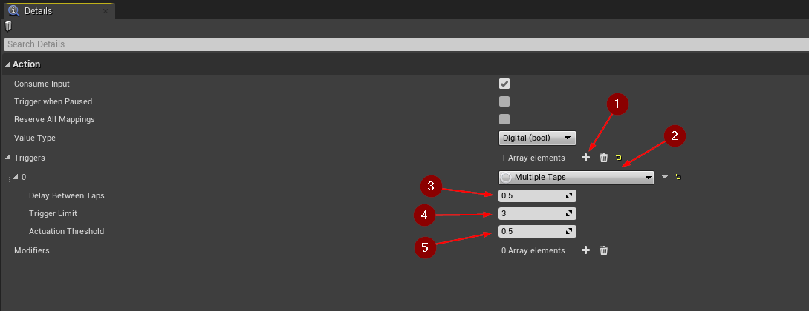

import {Step, UE} from '@site/src/lib/utils.mdx'

:::important Only available for Unreal Engine: <UE version="4.27"/> <UE version="5.0+"/>
your project should be using [TBIA_EnhancedInputComponent](/docs/features/using-enhanced-input).
:::

## Multiple Tap Input Action

This type of input action allows the developer to create custom interactions that needs multiple taps in short amount of time on
the specified input key to call "Triggered" action and start the interaction.

## Creating Input Action

Create a new *Input Action*, right-click in the *Content Browser* and
select `Input | Input Action` <Step text="1"/>.

## Setup Input Action

Now open the newly created *Input Action*. Add a *Trigger* by clicking on the `+` icon <Step text="1"/>, then
select from the dropdown menu `Multiple Taps` as an input trigger <Step text="2"/>.

You can customize your input action with the options below:
* <Step text="3"/> `Delay Between Taps` is the max delay time between taps.
* <Step text="4"/> `Trigger Limit` How many times to tap to trigger the input action.
* <Step text="5"/> `Actuation Threshold` Point at which this trigger fires.

