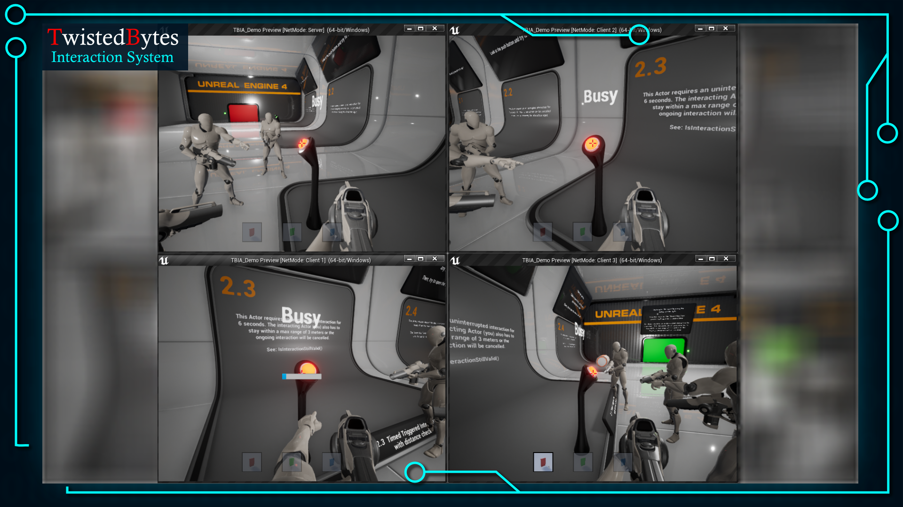

## Download

You can download the playable demo: [here](https://static.twistedbytes.net/downloads/6fb3c34c-e6fd-7275-7388-574abc6389a1/TBIA%20Playable%20Demo/)

After downloading, simply unpack the archive file and run `TBIA_Demo.exe` to run the demo as a single-player game.

## Testing in Multiplayer

You can also easily try out the demo in a multiplayer scenario on one or more computers.

To make it as easy as possible, we prepared two batch files:
- `run-server.bat`: Starts a **listen-server instance** of the demo game.
- `run-client.bat`: Starts a **client instance** of the demo game that will automatically try to connect to a running
  server at the IP address `127.0.0.1`.

:::note
There is more documentation inside the batch files in case you want to test it on multiple computers on your LAN.
:::
