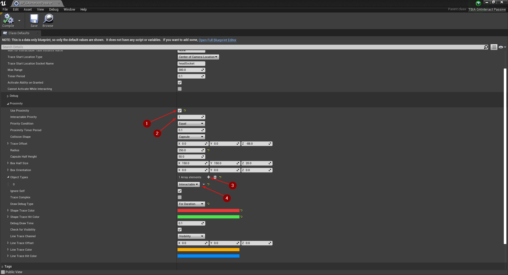
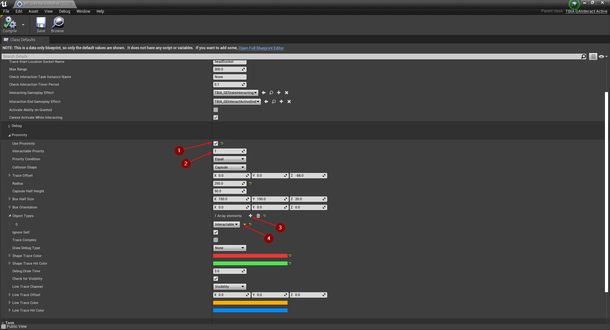
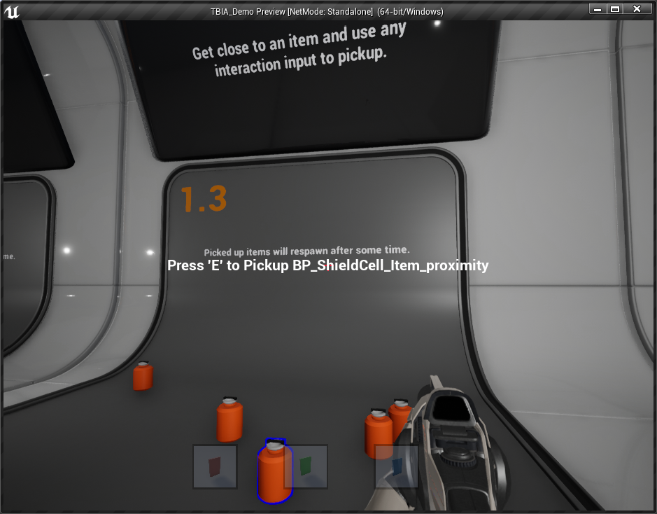

import {Step, UE} from '@site/src/lib/utils.mdx'

## What Is Proximity Interactions?

*Proximity Interactions* is the ability to interact with an interactable object (e.g. weapon pickup) without looking directly towards it. Instead,
you can interact with an interactable object when you are close enough to it. This functionality is added to `TBIA_GAInteractPassive` and
`TBIA_GAInteractActive` but if you would like to added it to your custom abilities you can find the functions
`ProximityTraceForInteractables` and `GetNearestInteractableObject` inside `TBIA_InteractionFunctionLibrary`.

Proximity interactions are added to `TBIA_GAInteractPassive` and `TBIA_GAInteractActive` which can be activated by setting *Use Proximity* to `true`.

Once you enable this feature in the **Details** panel, you will see several extra parameters appear which allow you to
customize the way proximity interactions should work.

 * `InteractablePriority`: Integer that holds the priority of the interactable objects to interact with.
 * `PriorityCondition`: Prioritized interactable objects are filtered by priority using this condition.
 * `ProximityTimerPeriod`: How long to wait in seconds before executing the proximity interaction again.
 * `CollisionShape`: The collision shape of the proximity trace.
 * `TraceOffset`: Offset the start location of the proximity trace which is the world location of the capsule in the character class.
 * `Radius`: Radius for the circle of sphere shape selected in the *CollisionShape*.
 * `CapsuleHalfHeight`: Capsule half height when the *CollisionShape* is set to *Capsule*.
 * `BoxHalfSize`: Box size when the *CollisionShape* is set to *Box*.
 * `BoxOrientation`: Box orientation when the *CollisionShape* is set to *Box*.
 * `ObjectTypes`: Array of object types to trace *CollisionShape*.
 * `bIgnoreSelf`: Ignore self on *CollisionShape*.
 * `bTraceComplex`: If `true`, the trace will use complex collision for the *CollisionShape*. Otherwise, simplified collision is used.
 * `DrawDebugType`: Draw debug type for the *CollisionShape*. 
 * `ShapeTraceColor`: Trace color for the *CollisionShape*.
 * `ShapeTraceHitColor`: Trace hit color for the *CollisionShape*
 * `DebugDrawTime`: Draw time of the trace debug visualization.
 * `bCheckForVisibility`: Check for unblocked Line of Sight (LoS) to potentially interactable objects.
 * `LineTraceChannel`: Trace channel for the visibility check trace.
 * `LineTraceOffset`: Offset of the start location for the visibility check.
 * `LineTraceColor`: Trace color for the visibility check. 
 * `LineTraceHitColor`: Trace hit color for the visibility check. 

## Interact Passive Ability Setup

In order to use *Proximity Interactions* in the *Passive Ability*, open your *Interact Passive* ability Blueprint that is inherited from `TBIA_InteractPassive`.
Under `Twisted Bytes | Interactions`, set *Use Proximity* to `true` <Step text="1"/> and the *Interactable Priority* to `1` <Step text="2"/>
(or whatever might make sense in your case). Scroll down to *Object Types* and click on the add icon *+* <Step text="3"/>.
Then, select *Interactable* <Step text="4"/>.

:::note
The `Interactable` object type we selected here is what we already defined in a [previous setup step](/docs/getting-started/migration-guide#collision-settings).
:::

## Interact Active Ability Setup

Open your *Interact Active* ability Blueprint that is inherited from `TBIA_InteractActive`. Under `Twisted Bytes | Interactions`, set *Use Proximity*
to `true` <Step text="1"/>. Then set *Interactable Priority* <Step text="1"/> to the same value as you set it in your *Interact Passive* ability.
After that, scroll down to *Object Types* and click on the add icon *+* <Step text="3"/>. Then, select *Interactable* <Step text="4"/>.

:::info
In order to visualize the proximity tracing, set `Draw Debug Type` to *For Duration*. For the *Passive Ability* set *Draw Time* equal to *Proximity Timer Period*.
:::

## Interactable Object Setup

Here we are using *BP_ShieldCell_Item* from the [`TBIA_Demo`](https://drive.google.com/drive/folders/1I7TXOPM-9tHABdhWqy58TAR6-lenSy1E?usp=sharing).
This *Blueprint* class is inherited from `TBIA_GASActorBase` which has the *ASC* and the *Interaction Component* added, where in UE5 it is not essential anymore
to have the *ASC* implemented in C++ and you can add it directly in *Blueprints*.

Open the *Blueprint* file and select the *SkeletalMesh* component <Step text="1"/>. In the *Details* panel under *Collision*, set the `Object Type`
to *Interactable* <Step text="2"/> and make sure that the `Visibility` trace channel is set to *Blocked* <Step text="3"/>.
Then open the overridden function *GetInteractionContext* and set `Object Interaction Priority` <Step text="4"/> to the same value that you chose in
your ability *Blueprints* earlier.

## Play

Place the *Interactable Actor* in your level and press *Play* and get close to the placed *Actor*.

As you can see in the image below you are now able to interact with actors just by standing close next to them.

