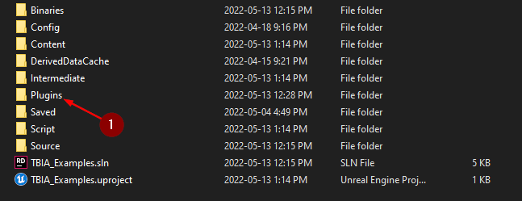
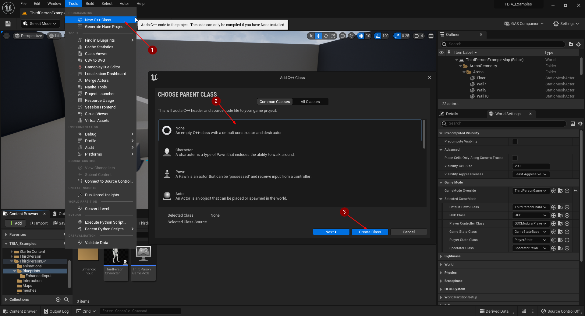
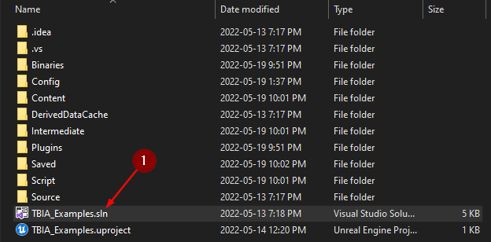
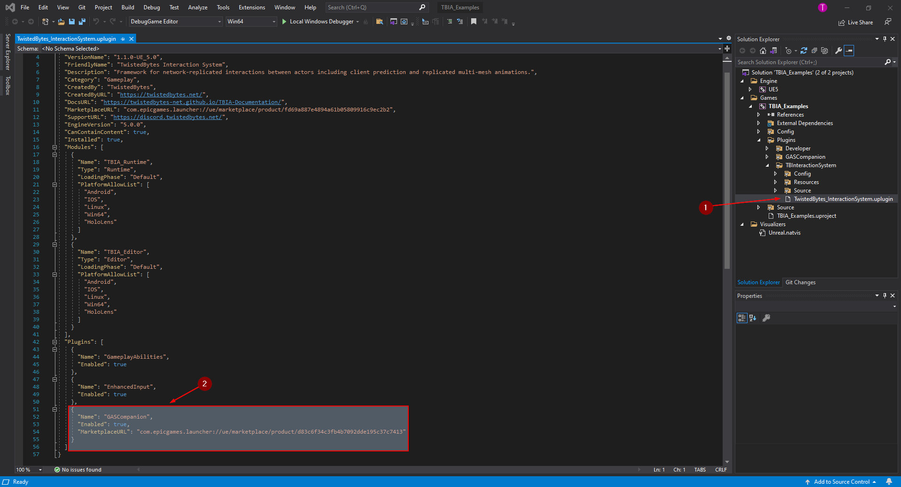
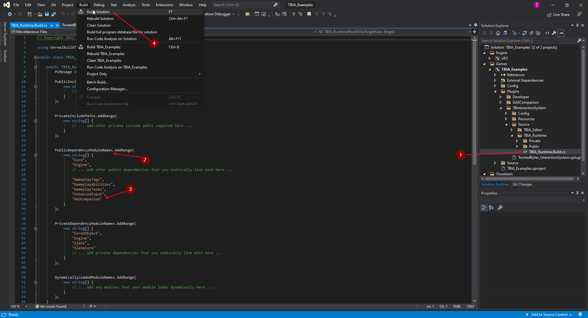
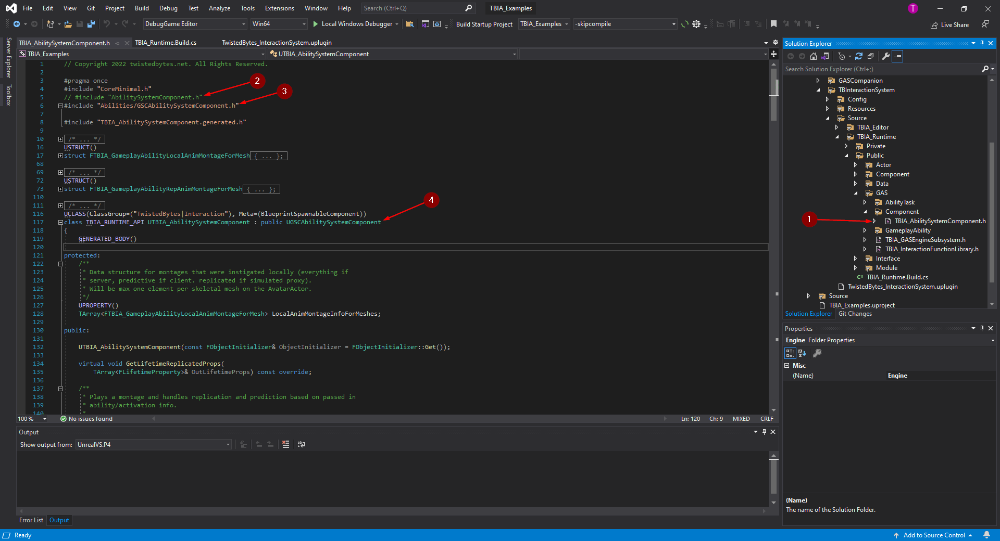
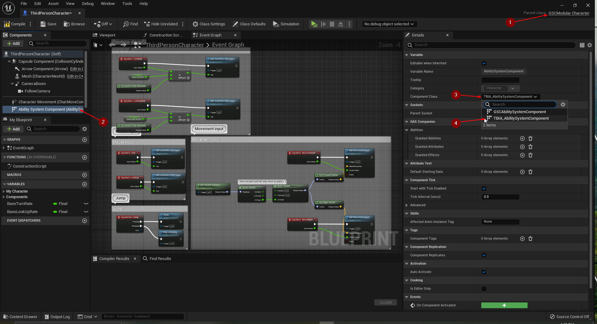
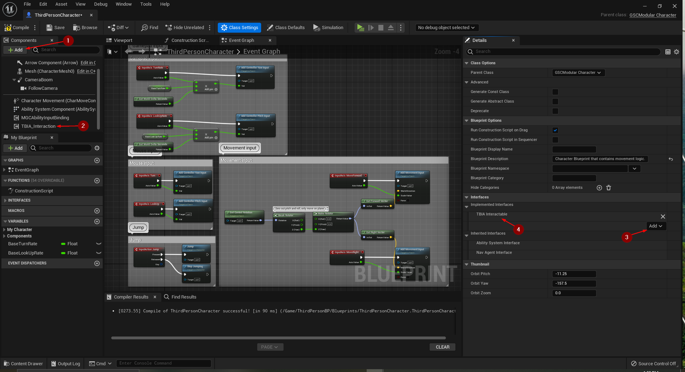

import {Step, UE} from '@site/src/lib/utils.mdx'

:::important Only available for Unreal Engine: <UE version="5.0+"/>
:::

This integration guide will show you how to integrate *GAS Companion* with *TwistedBytes Interaction System*, so that
you can use both in combination in your own projects.

## Requirements

- [Microsoft Visual Studio C/C++ IDE and Compiler](https://visualstudio.microsoft.com/) (*Free Community Edition 2019 is sufficient*)
- Unreal project must be based on Unreal Engine 5 or higher


## Adding Engine Plugins to a Project

To get started, go to your project's folder. Create a new folder called `Plugins` in case it does not exist yet <Step text="1"/>.

Copy both plugin folders `GASCompanion` and `TBInteractionSystem` from the *Engine Plugin* folder to your project's `Plugins` folder.

:::note
The default location of the engine plugin folder for Unreal Engine 5.0 is:

`C:\Program Files\Epic Games\UE_5.0\Engine\Plugins\Marketplace`
:::



In your project, navigate to `Edit | Plugins` to open the *Plugins* tab.

Select `Gameplay` as plugin category filter on the left side and make sure that both `GAS Companion` <Step text="2"/> and
 `TwistedBytes Interaction System` <Step text="3"/> show up and are enabled.


## Convert a Blueprint-only into a C++ Project

:::note
You can skip this step if your project is a C++ project already.
:::

In case you started your work on a project with a *Blueprints-only Project* you need to first convert it to a
C++ project before continuing with the next steps.

Navigate to `Tools | New C++ Class...` <Step text="1"/> in the *Unreal Engine Editor*.

In the `Add C++ Class` dialog, select `None - An empty C++ class` <Step text="2"/> and confirm by clicking on `Create Class` <Step text="3"/>.

Wait for the *Editor* to create and compile all source files needed before proceeding.



:::info
The process described above is a quick way to create a new and valid C++ module that in fact turns any
*Blueprints-only Project* into a *C++ Project*. The new C++ class we created is not actually needed and could now be
deleted if you so wish.
:::

## Modifying TwistedBytes Interaction System

The next steps describe how to modify the interaction plugin, so that it knows about the GAS Companion plugin and its
base classes to seamlessly integrate with each other.

In Windows Explorer, navigate to your project's root folder. You should see a new file with the file extension `.sln`.

Double-click this *Solution* file <Step text="1"/> to open it in your favorite IDE (*Microsoft Visual Studio* or *JetBrains Rider*).



:::note
The initial startup will take some time. Might be a good time to grab a :coffee: ...
:::

### Adding `GASCompanion` to `.uplugin`

After your IDE has fully initialized, navigate to `<Games>/<Project Name>/Plugins/TBInteractionSystem` and open
`TwistedBytes_InteractionSystem.uplugin` <Step text="1"/>.

Add the following JSON object <Step text="2"/> to the `Plugins` JSON array as shown in the image below.

```json
    {
        "Name": "GASCompanion",
        "Enabled": true,
        "MarketplaceURL": "com.epicgames.launcher://ue/marketplace/product/d83c6f34c3fb4b7092dde195c37c7413"
    }
```



:::caution
Be careful not to miss a separating comma (`,`) between the existing JSON objects and the newly added one for `GASCompanion`.
:::

### Modifying `TBIA_AbilitySystemComponent`

Next, navigate to `<Games>/<Project Name>/Plugins/TBInteractionSystem/Source/TBIA_Runtime` and open the file
`TBIA_Runtime.Build.cs` <Step text="1"/>.

Under *PublicDependencyModuleNames* <Step text="2"/> add `GASCompanion` <Step text="3"/>.

Click on *Build Solution* <Step text="4"/> and wait for the project to finish building (it might take a couple of minutes).



In `<Games>/<Project Name>/TBInteractionSystem/Source/TBIA_Runtime/Public/GAS/Component`,
open the file `TBIA_AbilitySystemComponent.h` <Step text="1"/>.

At the top of the file, comment (or remove) the following line (see <Step text="2"/>):

```cpp
#include "AbilitySystemComponent.h"
```

Then, add a new line directly under the previous line (see <Step text="3"/>):

```cpp
#include "Abilities/GSCAbilitySystemComponent.h"
```

After this, scroll down to the *Class Declaration* of `UTBIA_AbilitySystemComponent` and reparent it from
`UAbilitySystemComponent` to `UGSCAbilitySystemComponent` <Step text="4"/> as shown in the image below.

Then build the solution again and wait till it finishes building.



## Setting up the Player Character

Open your *Player Character* Blueprint (e.g. `BP_PlayerCharacter`) that you are using. As you can see here in our
example, we are using `GSCModular Character` <Step text="1"/> as the parent class.

Go to the *Components* tab and select `Ability System Component` <Step text="2"/>. In the *Details* panel, click on
*Component Class* <Step text="3"/> and select `TBIA_AbilitySystemComponent` <Step text="4"/>.

Finally, compile and save the Blueprint.



Now, to add the interaction functionality to the *Player Character*, click on *Add* <Step text="1"/> in the
*Components* tab and select the `TBIA_Interaction` component <Step text="2"/>.

Switch to the `Class Settings` and scroll down to the *Interfaces* category. Click on *Add* <Step text="3"/> and
select the `TBIA_Interactable` interface. It should now look like it is shown in <Step text="4"/>.

Finally, compile and save the Blueprint.



