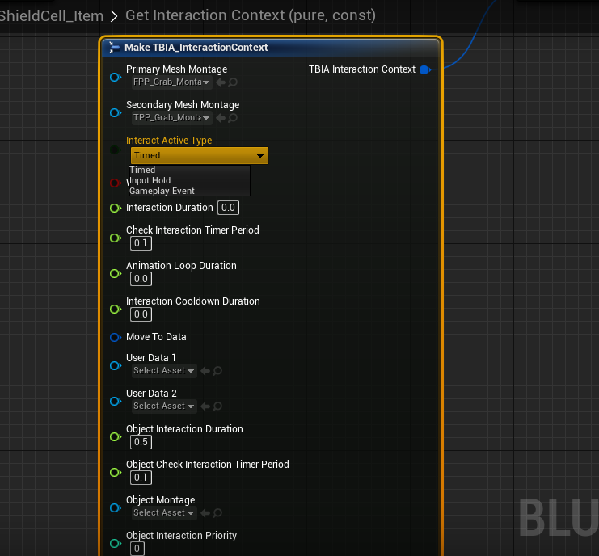

import {Step, UE} from '@site/src/lib/utils.mdx'

## Interaction Types for Interact Active
The struct `TBIA_InteractionContext` now allows you to specify for each *Interactable Actor*
how you want interactions to be handled.

You can choose between the following types:
 * Timed Interaction
 * Input Hold Interaction
 * Gameplay Event Interaction

### Timed Interaction
The `Timed Interaction` is the default interaction type where the Gameplay Ability `TBIA_GAInteractActive`
will wait for a specific duration set in the *Interaction Context*. When the wait time is over, the interaction
is finished.

### Input Hold Interaction
The `Input Hold Interaction` changes the interaction logic as follows:

When the *Input Key* that is bound to `TBIA_GAInteractActive` is triggered, the interaction logic will
flow till `Pre-Interact` and then `IsInteractionStillValid` will be called as long as the input key is still held.

After releasing the *Input Key*, `Post-Interact` will be called and the interaction ends.

### Gameplay Event Interaction
In this type of interaction, when activating `TBIA_GAInteractActive` by triggering the *Input Key* that is already
bound to it, it will start the interaction and call `Pre-Interact`. After that `IsInteractionStillValid` is being called
on timer from the value of `CheckInteractionWhileWaiting` and will be kept triggered and waiting until a gameplay event
is being called on the interacting actor with the gameplay tag `TBIA.Event.Interaction.InteractActiveEnd`.

