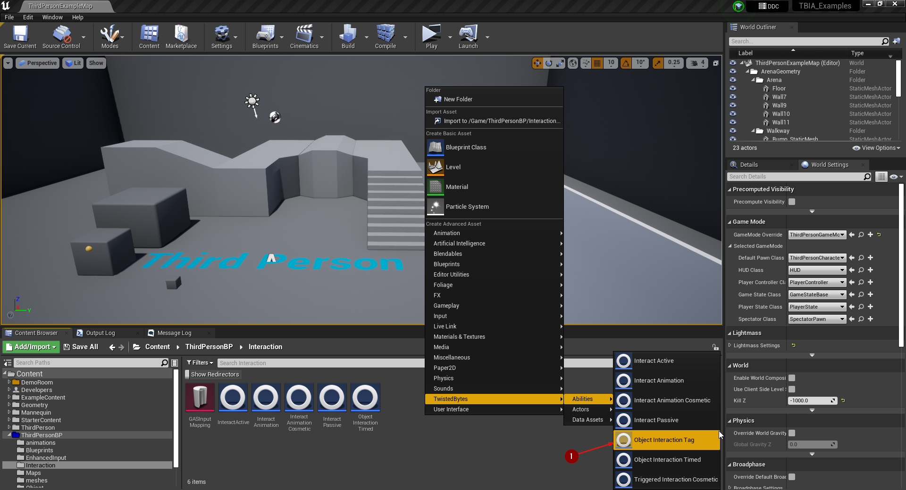

import {Step} from '@site/src/lib/utils.mdx'

## Creating the Object Interaction Tag Ability

To create an *Object Interaction Tag* ability, right-click in the *Content Browser*
and select `TwistedBytes | Abilities | Object Interaction Tag` <Step text="1"/> as shown in the image below.

Name the newly created asset `ObjectInteractionTag`.

## Creating the Interactable Actor

For an easier implementation, we are going to duplicate the `GASActorBase_Timed` that we created earlier
[here](/docs/quick-start/using-object-timed) to make use of what we setup before.

:::note
We are going to create a door that opens when a *Player Character* overlaps with a box collision that we will add in
the next steps.
:::

To do that, navigate to `GASActorBase_Timed` <Step text="1"/> and right-click then click on
*Duplicate* <Step text="2"/>.

Name this newly created asset `GASActorBase_Tag`.

## Setting up the Interactable Actor

Open `GASActorBase_Tag` and delete the static meshes <Step text="1"/> that we added before in `GASActorBase_Timed`
which were serving as buttons for the *Door*.

Then click on *Add Component*, add a *Box Collision* component <Step text="2"/> and name it `Box`.

Now we need to grant the `ObjectInteractionTag` *Gameplay Ability* to this actor. We can do this by clicking on
`TBIA Interaction Component` <Step text="1"/>. Then navigate to *Details* panel and under
`TwistedBytes | Interaction | Config` add `ObjectInteractionTag` <Step text="2"/> to the array
named *Grant Abilities on Start*.

:::note
We can use the default settings of `ObjectInteractionTag` *Gameplay Ability* so there is no need to modify it.
The setup is the same as we did in [Using Object Interaction Timed](/docs/quick-start/using-object-timed).
:::

Then you can scale the `Box` <Step text="3"/> and place it to let the character easily overlap with it at the front
and back side of the door mesh.

In the *Components* panel, right-click on the `Box` component <Step text="1"/> and select *Add Event* <Step text="2"/>.
Then, select `OnComponentBeginOverlap` <Step text="3"/> and `OnComponentEndOverlap` <Step text="4"/> to add these event
handlers to the *Event Graph*.

First on execution of `OnComponentBeginOverlap` we need to cast the `Other Actor` to `Character` to make sure that the
actor that overlapped with the `Box` is a valid instance of a `Character`.

If the cast is successful we then want to call a function named `Send Gameplay Event to Interacting Actor`.
We pass to this function the following arguments:
- `Interacted Actor`: *Blueprint* `Self` reference
- `Interacted Component`: `Skeletal Mesh` (this is the Door Skeletal Mesh)
- `Event Tag`: `TBIA.Object.Interaction.Tag` <Step text="1"/>

Lastly, we pass the `Character` reference from the previous cast-function as `Interacting Actor` argument.

:::note
This function will activate the ability `ObjectInteractionTag` which has the *Gameplay Tag*
`TBIA.Object.Interaction.Tag` and it will play the montage specified in the `Interaction Context` on the
*Skeletal Mesh* that is passed as `Interacted Component`.

The activated ability will have a reference to a *Gameplay Effect* which the ability will wait for to be applied
in order cancel itself.
:::

What is still left to do is to make the door close again when the `Character` exits the collision box.

On execution of `OnComponentEndOverlap` we cast `OtherActor` to `Character` to check if the actor which ended this
overlap is actually a valid instance of a `Character`.

If true, we use the `Switch Has Authority` *Macro* to make sure this code is only run on the server.

So, on `Authority`, we call `ApplyGameplayEffectToSelf` function and pass `AbilitySystemComponent` from *Blueprint*
`Self` reference to the `Target` argument.

Then in we pass the class `TBIA_GEStateInteractingEnd` as argument for `Gameplay Effect Class` <Step text="2"/>
that you can find in the plugin content `TwistedBytes_InteractionSystem Content/GAS/Interaction/GamePlayEffect`.

## Testing the Interactable Actor

Press play and walk up to the door actor. The moment you overlap with the *Box Collision` component, the interaction
will be triggered and result in opening the door.

