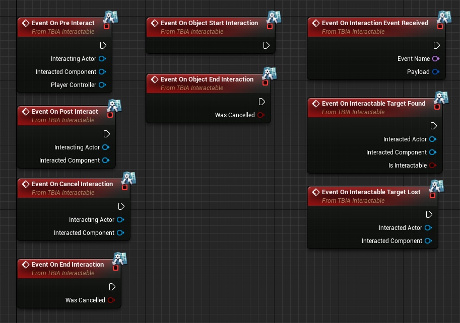

* The plugin uses GAS(Gameplay ability system)
    * ASC (Ability system component)
    * Gameplay tags 
* Implemented custom interaction component(UTBIA_InteractionComponent)
    * Grant abilities to Actor's ASC.
    * Bind input with specific abilities.
* Interaction system comes with predefined base classes that make the ASC available in Blueprints.
    * needed for UE4.26,UE4.27.
    * ATBIA_GASActorBase, ATBIA_GASCharacterBase, ATBIA_GASPlayerStateBase.
    * base classes implements neccessary interfaces:  IAbilitySystemInterface, ITBIA_Interactable.

    
