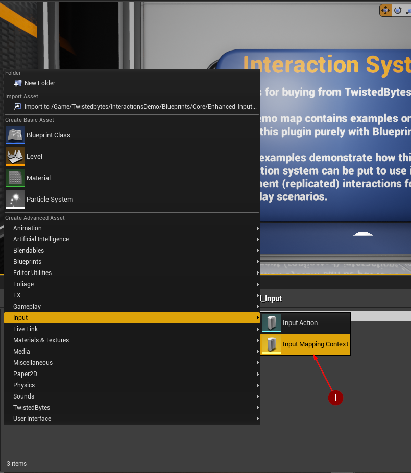
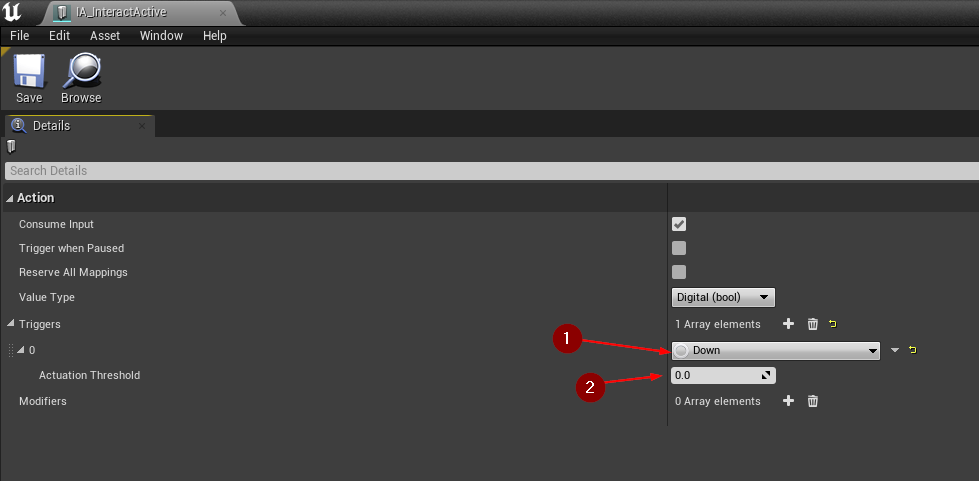
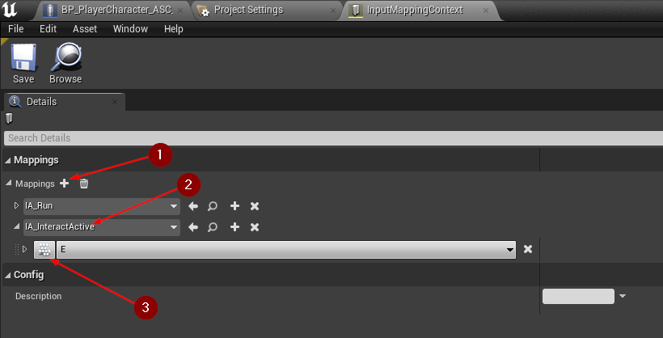
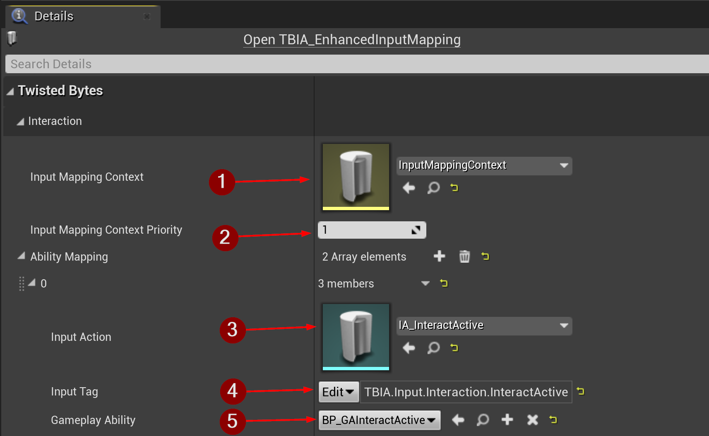
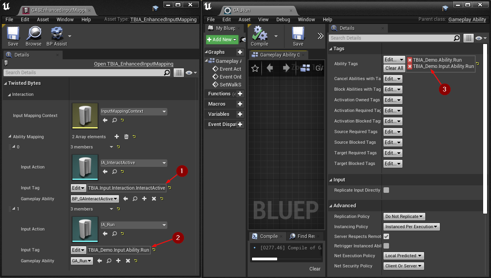

import {Step, UE} from '@site/src/lib/utils.mdx'

:::important Only available for Unreal Engine: <UE version="4.27"/> <UE version="5.0+"/>
:::

The Enhanced Input plugin provides a new and more flexible input framework. It implements features like *chorded actions*,
*contextual input*, *radial dead zones*, etc. Its core design is a data-driven configuration approach and therefore this
page will guide you through the creation and the setup process of all those required data assets.

:::note
To learn more about the Enhanced Input plugin, please check out the official documentation page [here](https://docs.unrealengine.com/5.0/en-US/input/#enhancedinputplugin).
:::

## Regular Implementation

In order to use the Enhanced Input plugin together with the *TwistedBytes Interaction Plugin*, you simply need to
follow the instructions of this subsection.

At the end, you will be able to trigger interactions using the Enhanced Input system. Input events will then be passed
to the *TwistedBytes Interaction Plugin* which in turn will activate/cancel the corresponding *Gameplay Abilities*.

### Enabling Enhanced Input in your Project

In order to enable Enhanced Input you need to change two input-related default classes in your project settings.

Go to `Project Settings | Engine | Input` <Step text="1"/> and select the following classes from the corresponding dropdown menu:
- Default Player Input Class: `EnhancedPlayerInput` <Step text="2"/>
- Default Input Component Class: `TBIA_EnhancedInputComponent` <Step text="3"/>

### Creating Enhanced Input data assets

Next, we need to create two new data assets; a so-called *Input Mapping Context* and at least one *Input Action*.
You can think of the *Input Mapping Context* as "glue" that allows you to bind physical inputs (i.e. keyboard keys,
mouse/gamepad buttons) to specific *Input Action* data assets that should be triggered whenever a physical input is
pressed or released.

To create an *Input Mapping Context*, right-click in the *Content Browser* and
select `Input | Input Mapping Context` <Step text="1"/>.

Name this newly created asset `InputMappingContext`.

Then, to also create a new *Input Action*, right-click in the *Content Browser* and
select `Input | Input Action` <Step text="1"/>.

Name this newly created asset `IA_InteractActive` so that it reflects the
intended purpose in its asset name accordingly.

### Setup Enhanced Input data assets

Open the *Input Action* you created earlier and add a trigger. Set it to *Down* <Step text="1"/>.

Also make sure the *Actuation Threshold* is equal to *zero* <Step text="2"/>.

Now, open the *Input Mapping Context* data asset `InputMappingContext` you created earlier and add a new action mapping
by clicking on *+* <Step text="1"/>.

Set `IA_InteractActive` as the *Input Action* <Step text="2"/> for the new entry.

After that you need to bind the *Input Action* to a physical input <Step text="3"/>, e.g. the `E` key on your keyboard,
as shown in the image below.

### Creating GAS Enhanced Input data asset

Now that we have finished the initial Enhanced Input setup, we need to also prepare one more data asset, a so-called
*GAS Enhanced Input Mapping*, that enables us to connect the *Enhanced Input* system with *Gameplay Abilities* from
the *TwistedBytes Interaction Plugin*.

To create a *GAS Enhanced Input Mapping*, right-click in the *Content Browser* and
select `TwistedBytes | Data Assets | GAS Enhanced Input Mapping` <Step text="1"/>.

Name this newly created asset `GASEnhancedInputMapping`.

### Setup GAS Enhanced Input data asset

Now, open the *GAS Enhanced Input Mapping* data asset `GASEnhancedInputMapping`.

Set the *Input Mapping Context* to the `InputMappingContext` data asset <Step text="1"/> that was created earlier.
Optionally, adjust the *Input Mapping Context Priority* <Step text="2"/> to your needs in case you are using multiple input mappings.

Then, click on *+* to add a new *Ability Mapping* entry and set all variables as follows:
- Input Action: `IA_InteractActive` <Step text="3"/>
- Input Tag: `TBIA.Input.Interaction.InteractActive` <Step text="4"/> (See [this](/docs/getting-started/migration-guide#add-gameplay-tags) if this tag does not exist in your project)
- Gameplay Ability: `InteractActive` <Step text="5"/> (See [this](/docs/quick-start/using-active) if you haven't created it yet)

### Setup Player Character

Open your *Player Character* Blueprint (e.g. `BP_PlayerCharacter`) and select the `TBIA_Interaction`
component <Step text="1"/> in the *Components* panel.

In the *Details* panel under `TwistedBytes | Interaction | Config`, set the following properties:
- Input Consumer: `TBIA Enhanced Input Component` <Step text="2"/>
- Enhanced Input Mapping DA: `GAS Enhanced Input Mapping` <Step text="3"/>

## Custom Implementation

### Setup Custom Abilities

In order to add more Gameplay Abilities, you can simply add additional entries to the *GAS Enhanced Input Mapping*.
Each new entry requires to specify its own *Input Action* (e.g. `IA_Run`), a *Gameplay Tag*, and a
*Gameplay Ability* (e.g. `GA_Run`).

:::note
The `InteractActive` *Gameplay Ability* already has the *Gameplay Tag* `TBIA.Input.Interaction.InteractActive` added
to its *Ability Tags* property. This is the same tag we are referring to in the
*GAS Enhanced Input Mapping* <Step text="2"/>.
:::

You want to create a new *Gameplay Tag* (in this example: `TBIA_Demo.Input.Ability.Run`) for each ability which then needs to be set in two locations:
1. *Input Tag* in the *GAS Enhanced Input Mapping* entry <Step text="2"/>
2. *Ability Tags* in the *Gameplay Ability* <Step text="3"/>

