import {Step, UE} from '@site/src/lib/utils.mdx'
import ReactPlayer from 'react-player'

:::important Only available for Unreal Engine: <UE version="5.0+"/>
:::

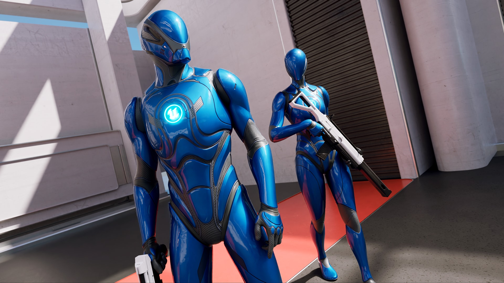

This integration guide will show you how to integrate *Lyra* with *TwistedBytes Interaction System*, so that
you can use both in combination in your own projects.

We would like to highlight the aim of this integration guide is make the **TwistedBytes Interaction** plugin become
part of the **Lyra** project and not the other way around.

## Requirements

- Unreal Engine 5.0 or higher
- [`Lyra Starter Game`](https://www.unrealengine.com/marketplace/en-US/product/lyra/) project or your own project based on it
- An IDE (e.g. [Visual Studio](https://visualstudio.microsoft.com/) or [Rider](https://www.jetbrains.com/rider/))

## Project preparation

:::note
In this guide, we are going to use **Unreal Engine 5.1**.

Please adjust mentioned paths accordingly if your project is using a different engine version.
:::

First, copy the installed **TwistedBytes Interaction** plugin from Unreal Engine
(e.g. `C:\Program Files\Epic Games\UE_5.1\Engine\Plugins\Marketplace\TBInteractionSystem\`) ...

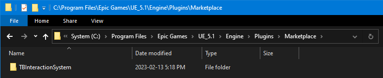

... to your project's `Plugins` directory.

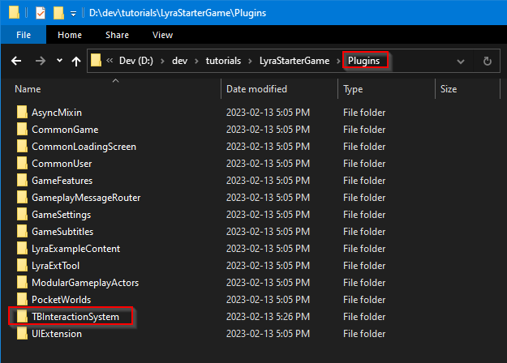

Next, go to the root directory of your project.

Right-click on the file `LyraStarterGame.uproject` and select `Generate Visual Studio project files`.

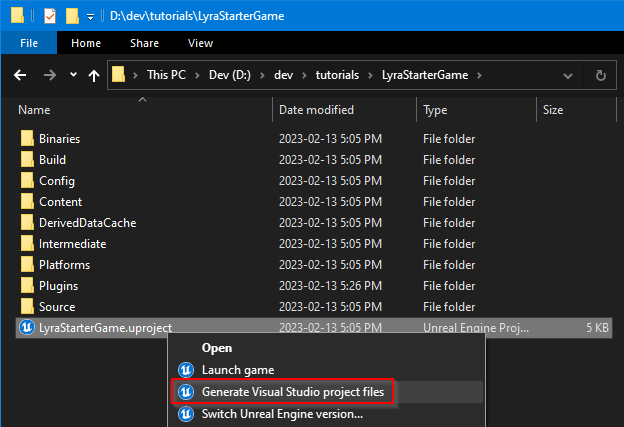

This will generate all necessary files for you to be able to open and compile the project successfully.

Now, open the generated solution file called `LyraStarterGame.sln` in your IDE of choice.

## Modifying the TBIA plugin

You will need to modify a few files of the **TwistedBytes Interaction** plugin.

### Step 1: `TBIA_Runtime.Build.cs`

In order to successfully integrate TBIA with Lyra we will need to set up a new dependency in the TBIA plugin.

Open the file `Plugins/TBInteractionSystem/Source/TBIA_Runtime/TBIA_Runtime.Build.cs` and add `LyraGame` to
the `PublicDependencyModuleNames` <Step text="1" /> like this:

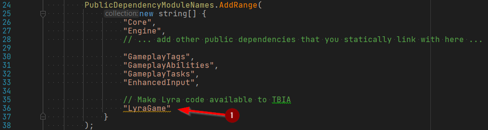

After this change, you will need to re-generate files again like before:

### Step 2: `TBIA_GASEngineSubsystem.cpp`

TBIA manages the initialization of the **Gameplay Ability System** for you in the background. However, Lyra does this
already, so we want to disable it in the TBIA plugin.

- Open the file `Plugins/TBInteractionSystem/Source/TBIA_Runtime/Private/GAS/TBIA_GASEngineSubsystem.cpp`.
- Comment out the lines where we include `AbilitySystemGlobals.h` <Step text="1"/> and where we call the `InitGlobalData()` function  <Step text="2"/>.
- After the change your source code should look similar to this:

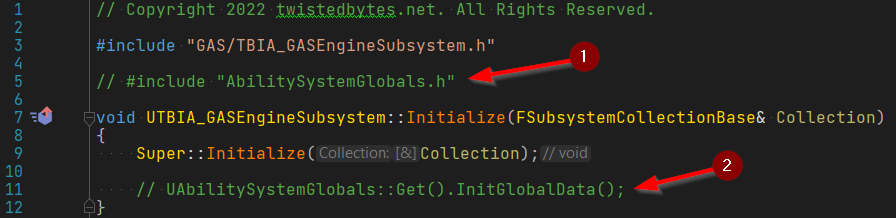

### Step 3: `TBIA_AbilitySystemComponent.h`

TBIA sub-classes the **Gameplay Ability System**'s `ASC` (Ability System Component). Since Lyra has its own sub-classesd `ASC`
we need to reparent TBIA's `ASC` to integrate it correctly into all systems.

- Open the file `Plugins/TBInteractionSystem/Source/TBIA_Runtime/Public/GAS/Component/TBIA_AbilitySystemComponent.h`.
- Find the declaration of the `UTBIA_AbilitySystemComponent` class and change its base class of from `UAbilitySystemComponent`
to `ULyraAbilitySystemComponent` <Step text="1" />.
- Also include the corresponding header `AbilitySystem/LyraAbilitySystemComponent.h` <Step text="2" />.
- Lastly, let's comment out the inclusion of the `AbilitySystemComponent.h` header file <Step text="3" />.

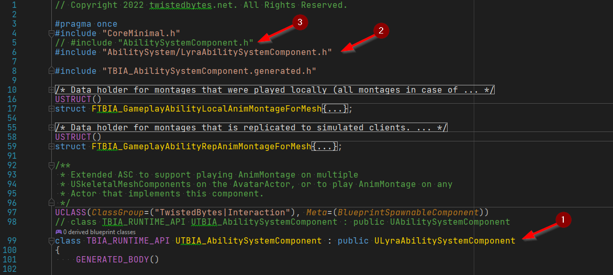

### Step 4: `TBIA_GameplayAbility.h`

Similar to step 3, we need to take care of the same sub-classing situation for the **Gameplay Ability** base class.

- Open the file `Plugins/TBInteractionSystem/Source/TBIA_Runtime/Public/GAS/GameplayAbility/TBIA_GameplayAbility.h`.
- Find the declaration of the `UTBIA_GameplayAbility` class and change its base class of from `UGameplayAbility`
to `ULyraGameplayAbility` <Step text="1" />.
- Also include the corresponding header `AbilitySystem/Abilities/LyraGameplayAbility.h` <Step text="2" />.
- Lastly, let's comment out the inclusion of the `Abilities/GameplayAbility.h` header file <Step text="3" />.

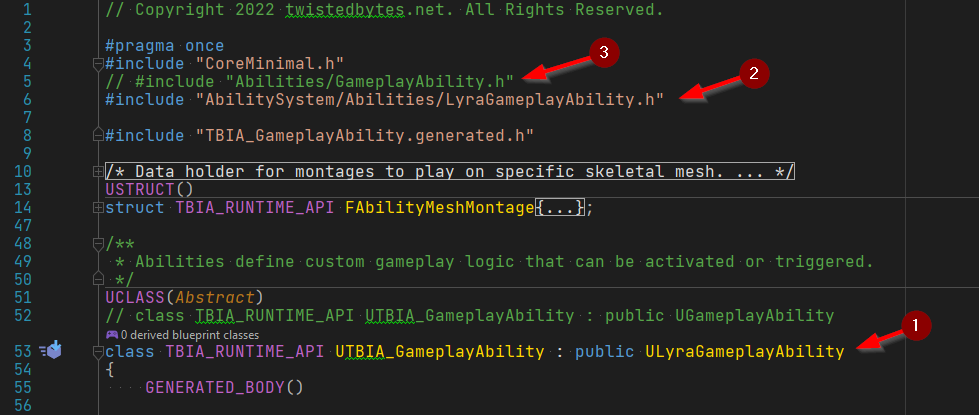

## Preparing Lyra's Hero Blueprint for usage with TBIA

Now that we have integrated both source codes of TBIA plugin and Lyra's, we can continue and prepare Lyra's
Hero Blueprint which represents our player character in Lyra-based projects.

- Open the project in the Unreal Engine editor.
- In the *Content Browser* panel, go to `Content/Characters/Heroes` <Step text="1" /> and open the asset `B_Hero_Default` <Step text="2" />.

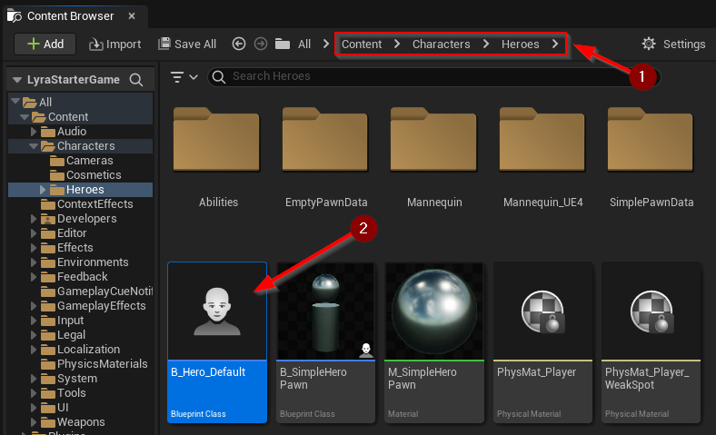

- Click *Add* <Step text="1" /> to add new component `TBIA Interaction` <Step text="2" />.

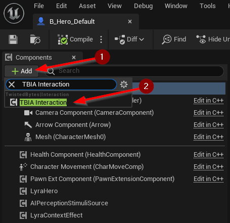

- In the *Components* panel, select the `TBIA_Interaction` <Step text="1" /> component.
- In the *Details* panel, navigate to `Twisted Bytes | Interaction` and set `Initialize ASC` <Step text="2" /> to `false`.

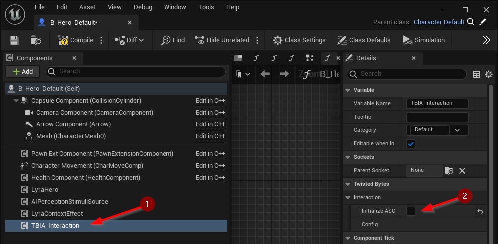

- Go to the *Class Settings*.
- In the *Details* panel, navigate to `Interfaces | Implemented Interfaces`.
- Click the *Add* button <Step text="1" /> and add the `TBIA Interactable` <Step text="2" /> interface.

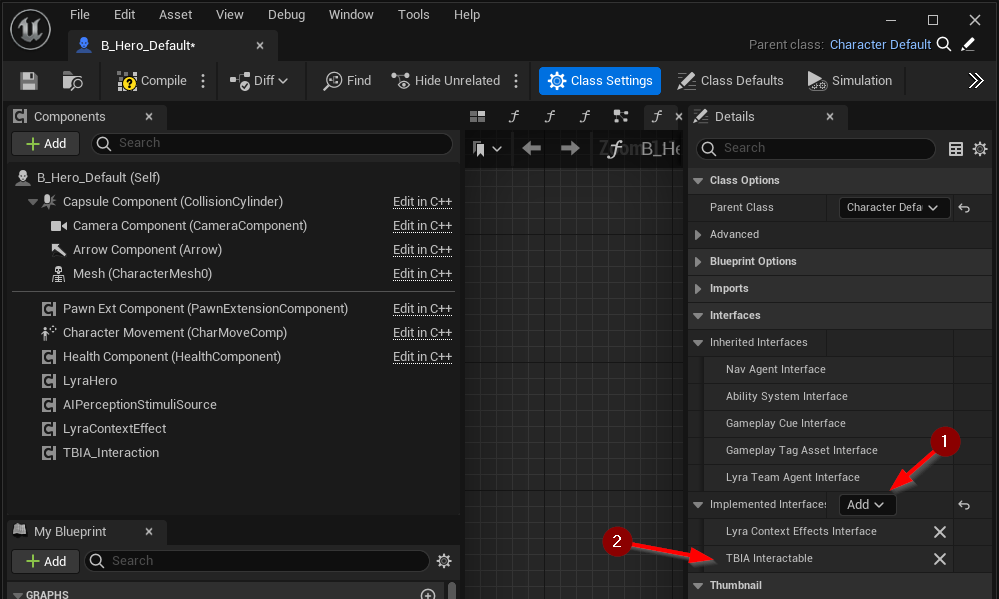

- In the *My Blueprint* panel, navigate to `Interfaces | Twisted Bytes` and double-click on `Get Character Context` <Step text="1" /> to implement this interface function.
- Create a `Make TBIA_CharacterContext` <Step text="2" /> node and connect the output pin to the `Return Value` <Step text="3" /> of the *Return Node*.
- Drag the `Mesh` <Step text="4" /> component from the *Components* panel onto the `Primary Mesh` <Step text="5" /> input pin of the `Make TBIA_CharacterContext` node.

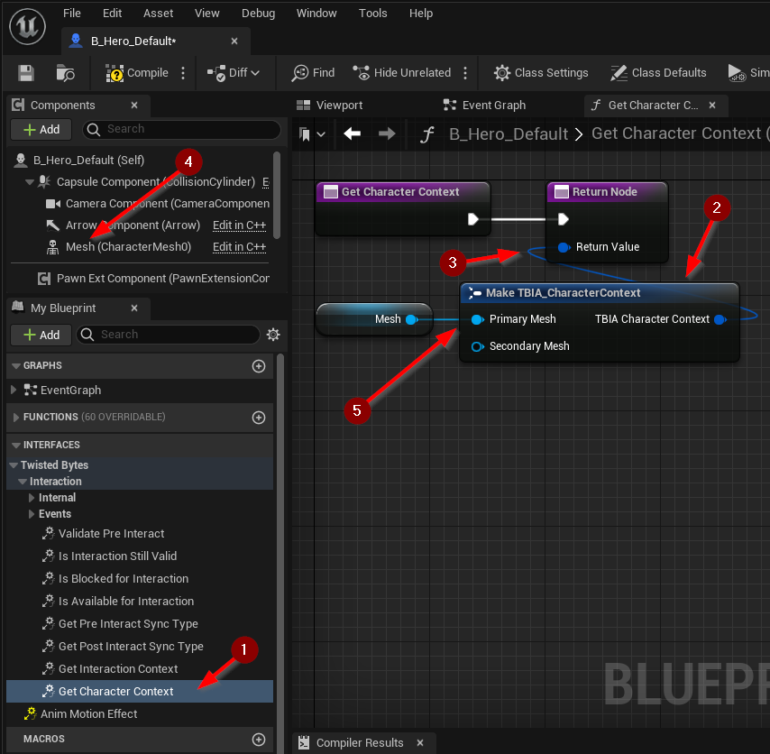

Congratulations! You just completed the integration of TBIA into your Lyra-based project.

## Showcase: Lyra `ShooterCore` Experience

This section is meant to showcase on how you would now use TBIA in any "experience" like Lyra's `ShooterCore`.

- In the *Content Browser* panel, go to `Plugins/Shooter Core Content` and create a new folder `TwistedBytesInteraction`.
- Inside that new folder, create a new `Interact Passive` <Step text="1" /> *Gameplay Ability* for use in the `ShooterCore` experience and name it `GAInteractPassive`.

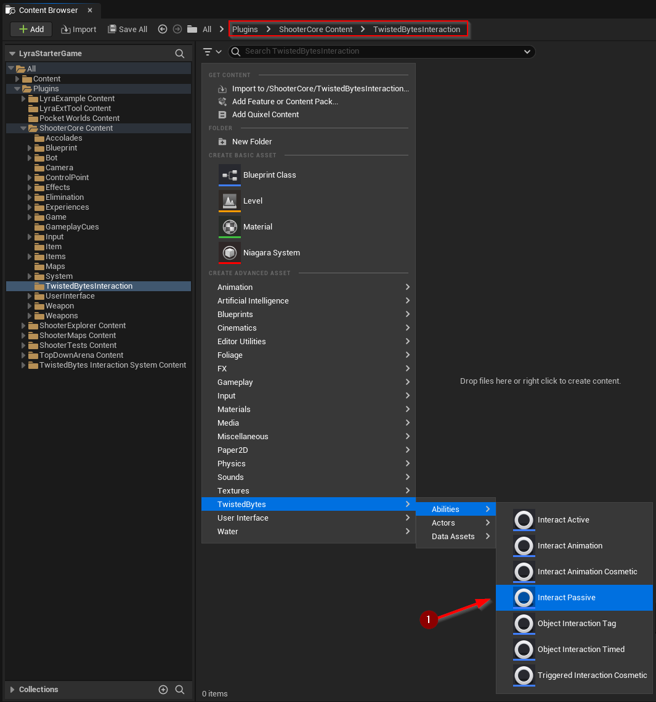

Now, for demonstration purposes, we would like to enable the debug visualization and also change the maximum trace length for this ability to make it
easier for us to verify that everything works fine.

- Open the newly created `GAInteractPassive` *Gameplay Ability*.
- In the *Details* panel, navigate to `Twisted Bytes | Interaction` and set `Max Range` <Step text="1" /> to `600`.
- In the *Details* panel, navigate to `Twisted Bytes | Interaction | Debug` and set `Show Debug` <Step text="2" /> to `true`.

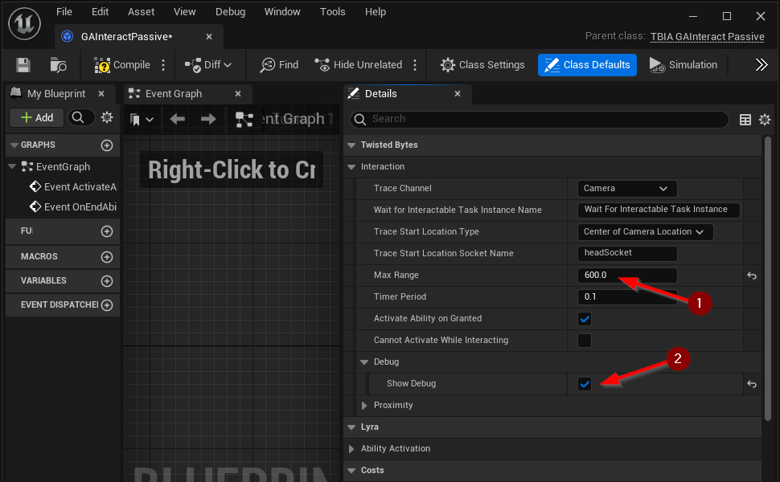

Finally, we need to tell Lyra about our new *Gameplay Ability*, so it will be granted to our player character.

- In the *Content Browser* panel, go to `Plugins/Shooter Core Content/Game` and open the asset `AbilitySet_ShooterHero` <Step text="1" />.

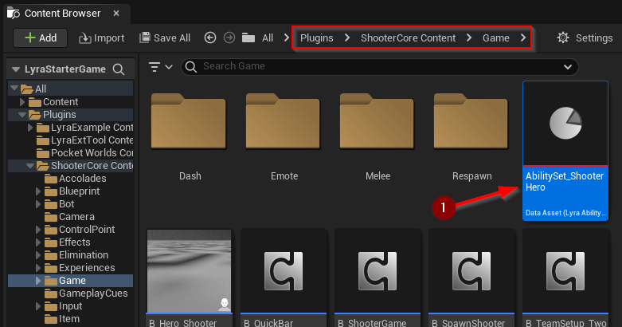

- In the *Details* panel, navigate to `Granted Gameplay Abilities` and click on the `+` <Step text="1" /> button.
- For the new element at the end of the list, set `Ability` <Step text="2" /> to our `GAInteractivePassive` *Gameplay Ability*.

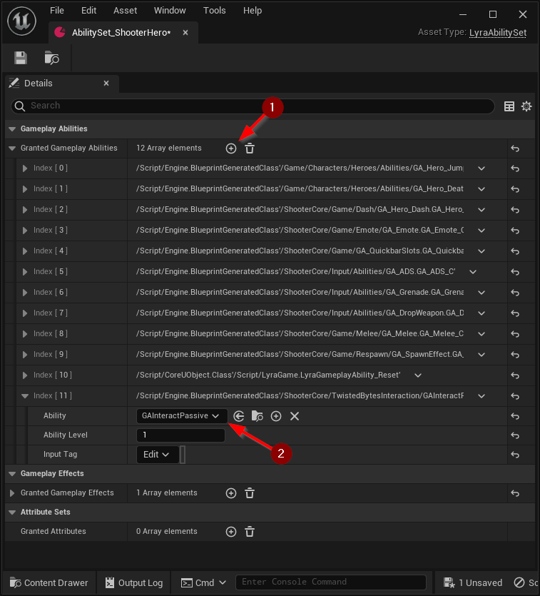

All done! Press *Play* in the editor and test it out.

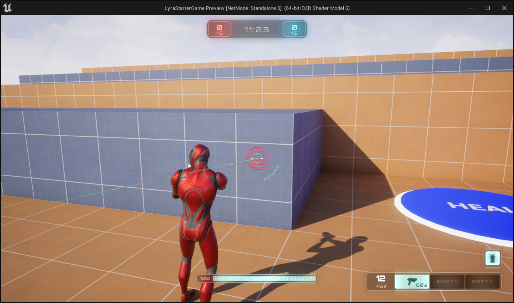

## Video Tutorial

We also provide a video tutorial to guide you through the integration process.

<ReactPlayer controls url='https://www.youtube.com/watch?v=6rLD3BFVaKU' />
