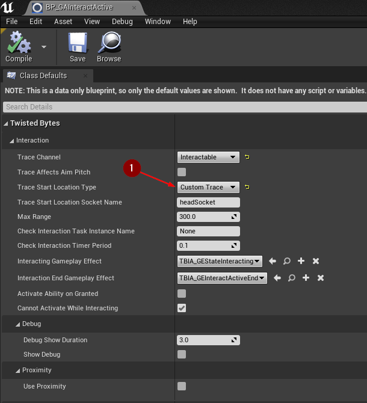
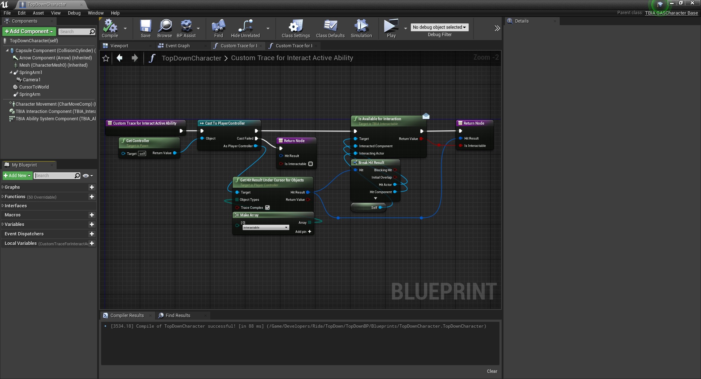

import {Step, UE} from '@site/src/lib/utils.mdx'

:::info
This page is a follow-up guide to [Custom Trace In Passive Ability](/docs/features/passive-custom-trace). We recommend you to read it before continuing here.
:::

## Active Ability Setup

Open your *Interact Active* ability *Blueprint* which is inherited from `TBIA_GAInteractActive`.
In the *Class Defaults* panel, set `Trace Start Location Type` to `Custom Trace` <Step text="1"/> as shown in the image below.

## Character Setup

Now open your *Player Character* class which should inherit from `TBIA_GASCharacter`.

In the *MyBlueprint* panel on the left side <Step text="1"/>, search for *Custom Trace for Interact Active Ability*.
You can find it under `Twisted Bytes | Interaction | Events` <Step text="2"/>.
Right-click on the function name and select *Implement Event* <Step text="3"/>.

A new *Blueprint* graph will open to implement the custom logic for this function.

Here we will copy the same logic from what we did previously in [*Custom Trace In Passive Ability*](/docs/features/passive-custom-trace#character-setup).

## Play

Click on *Play* and hover your mouse over the *Interactable Actors* in the leve.

Press the interaction button which you chose to bind to trigger the *Active ability*.

You will see that the *Interactable Actors* can be picked up as expected.

