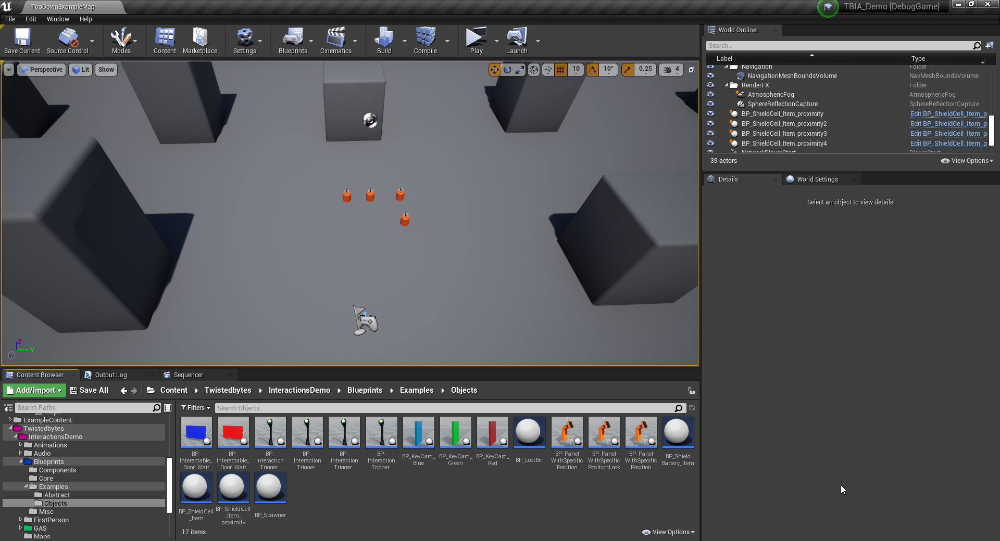

import {Step, UE} from '@site/src/lib/utils.mdx'

## Project Setup

In order to show a use-case for the custom trace functionality, we will create a new project based on Unreal Engine's *Top Down Template*.

:::info
To shorten this guide, you can refer to the *Quick Start* guide for initial setup [here](/docs/quick-start/using-passive).
:::

## Passive Ability Setup

Open your *Passive Interact* ability *Blueprint* inherited from `TBIA_GAInteractPassive`.

In the *Class Defaults* panel, set `Trace Start Location Type` to `Custom Trace`<Step text="1"/> as shown in the image below.

## Character Setup

Now open your *Player Character* class that should be inherited from *TBIA_GASCharacter*.

:::note
If you are using GASCompanion, [this guide](/docs/integration_guides/gas-companion) will help you with integration.
Or, take a look at [this guide](/docs/integration_guides/unreal-engine-5-plugins) which works with UE5 only.
:::

In the *MyBlueprint* panel on the left side <Step text="1"/>, search for *Custom Trace for Interact Passive Ability*.
You can find it under `Twisted Bytes | Interaction | Events` <Step text="2"/>.
Right-click on the function name and select *Implement Event* <Step text="3"/>.

A new *Blueprint* graph will open to implement the custom logic for this function.

In this example we will trace for *Interactable Actors* under the player's cursor by querying the object type `Interactable`.

The function *Get Hit Result Under Cursor for Objects* returns us a *Hit Result* that we want to return at the end of our function.
We also need to return a boolean value whether this object is currently available for interaction or not. In order to get this
information we make use of the handy function *Is Available for Interaction*.

The completed logic in *Blueprints* is shown in the image below.

## Interactable Actor

Here we will use *BP_ShieldCell_item* from our [demo project](https://static.twistedbytes.net/downloads/7a42299c-6047-e1e8-5b98-c16ab1868b89/TBIA%20Demo%20Project/)
which is inherited from `TBIA_GASActorBase`. Just place a couple of these *Actors* in your level to test interactions.

## Play

Click on *Play* and hover your mouse over the *Interactable Actors* in the map.

You will see that the custom trace implementation works as intended.

