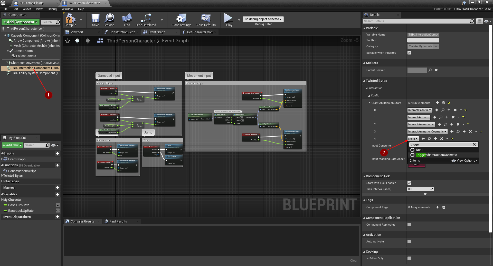

import {Step} from '@site/src/lib/utils.mdx'

## Creating Triggered Interaction Cosmetic Ability

To create a *Triggered Interaction Cosmetic* ability, simply right-click in the *Content Browser*
and select `TwistedBytes | Abilities | Triggered Interaction Cosmetic` as shown in the image below.

Name the newly created asset `TriggeredInteractionCosmetic`.

## Setting up the Player Character

Open `ThirdPersonCharacter`, select `TBIA Interaction Component`. In the *Details* panel, add
`TriggeredInteractionCosmetic` to the array named *Grant Abilities on Start*.

:::note
This will grant the ability to the `ThirdPersonCharacter` so it can be activated later on.
:::

## Creating the Interactable Actor

For an easier implementation, we are going to duplicate the `GASActorBase` that we created earlier in
[Using Interact Passive](/docs/quick-start/using-passive) to make use of what we set up before. To do that, navigate
to `GASActorBase` <Step text="1"/>, right-click it and select *Duplicate* <Step text="2"/>.

Name this newly created asset `GASActor_Pickup`.

:::note
We are going to create an item pickup object a player just needs to walk over in order to pick it up. Thus, when a
player overlaps with `GASActor_Pickup`, it will activate the `TriggeredInteractionCosmetic` *Gameplay Ability* on
that *Player Character*.
:::

Open the newly created asset `GASActor_Pickup`. In the *Components* panel, click on *Add Component* <Step text="1"/>
and add a *Sphere Collision* component <Step text="2"/> named `Sphere`.

After that, go to the *Details* panel of the `Sphere` and increase the value of the *Sphere Radius*
property <Step text="3"/> to something around `150`.

Now, right-click on the `Sphere` component <Step text="1"/>, select `Add Event` <Step text="2"/> and choose
`Add OnComponentBeginOverlap` <Step text="3"/> to add this event handler to the *Event Graph*.

In the *Event Graph* you should now see the event handler `OnComponentBeginOverlap`.
First, we want to cast the `Other Actor` variable to `ThirdPersonCharacter` and get the reference of its
`TBIA Interaction Component`. From the component's reference we than need to get the `ASCOwner` reference.

Before continuing, we check if the actor is valid and then call `Send Gameplay Event to Interacting Actor` passing the
following parameters:
- Interacted Actor : `ASCOwner` <Step text="1"/>
- Event Tag : `TBIA.Interaction.Triggered.Cosmetic` <Step text="2"/>
- Interacting Actor : *Blueprint* `Self` reference.

:::note
`ASCOwner` is a reference to the actor holding `TBIA Ability System Component` which might be the *Player Character* or
*Player State* depending on your project.

In our *Demo Project* we show how to get the `ASCOwner` reference using a *BluePrint Interface* which is a better
(read: more performant) approach than casting. However, for keeping this tutorial concise and to the point we are
using this shortcut instead.
:::

From `Event On End Interaction` check if the interaction ended in normal execution, or it is being cancelled, then call `Switch Has Authority`
and only if true we destroy `GASActor_Pickup`.

## Testing the Interactable Actor

To test this interaction, place a couple of `GASActor_Pickup` in the level.

Press the *Play* button and let your player character overlap with `GASActor_Pickup`.
You should see the pickup object getting destroyed.

:::note
As you can see, the `ThirdPersonCharacter` character played the *Grab Montage* that we set up earlier in
[Using Animation Cosmetic](/docs/quick-start/using-animation-cosmetic) because we are using the same
*Interaction Context* from `GASActorBase`.
:::

