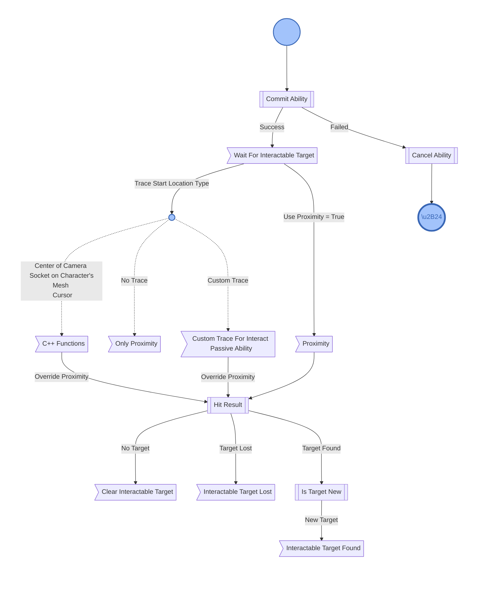

## Event ActivateAbility 

```mermaid
flowchart TD

    START(("\u2B24"))
    STOP(("\u2B24"))

    CANCEL_ABILITY[[Cancel Ability]]

    Enum((" "))

    B[[Commit Ability]]
    C>Wait For Interactable Target]
    D>C++ Functions]
    E>Custom Trace For Interact Passive Ability]
    L>Only Proximity]
    F>Proximity]
    G[[Hit Result]]
    H>Clear Interactable Target]
    I>Interactable Target Lost]
    J[[Is Target New]]
    K>Interactable Target Found]

    START --> B

    B --> |Success| C
    B --> |Failed| CANCEL_ABILITY
    C --> |Use Proximity = True| F
    C --> |Trace Start Location Type| Enum
    Enum -.-> |No Trace|L
    Enum -.-> |Center of Camera <br/> Socket on Character's Mesh <br/> Cursor| D
    Enum -.-> |Custom Trace|E
    D --> |Override Proximity|G
    E --> |Override Proximity|G
    F --> G
    G --> |No Target| H
    G --> |Target Lost| I
    G --> |Target Found| J
    J --> |New Target| K
    
    CANCEL_ABILITY --> STOP
    
    subgraph sub_container [ ]
        direction TB
        START

        subgraph sub_main [ ]
        direction TB

            B
            C
            Enum

        end

        subgraph sub_functions [ ]
        direction TB
            
            
            D
            L
            E
            F
            G

        end

        subgraph sub_result [ ]
        direction TB
            
            H
            I
            J
            K

        end

        CANCEL_ABILITY
        STOP
    end

    classDef sty_start fill:#A2C3FB,color:#A2C3FB,stroke-width:2px,stroke:#3866B5;
    classDef sty_stop fill:#A2C3FB,color:#3866B5,stroke-width:4px,stroke:#3866B5;
    classDef sty_subgraph_transparent fill:#0000,stroke:#0000;
    classDef sty_enum fill:#A2C3FB,color:#A2C3FB,stroke-width:2px,stroke:#3866B5;
    
    class START sty_start;
    class STOP sty_stop;
    class Enum sty_enum;
    class sub_container sty_subgraph_transparent;
    class sub_main sty_subgraph_transparent;
    class sub_functions sty_subgraph_transparent;
    class sub_result sty_subgraph_transparent;

```
